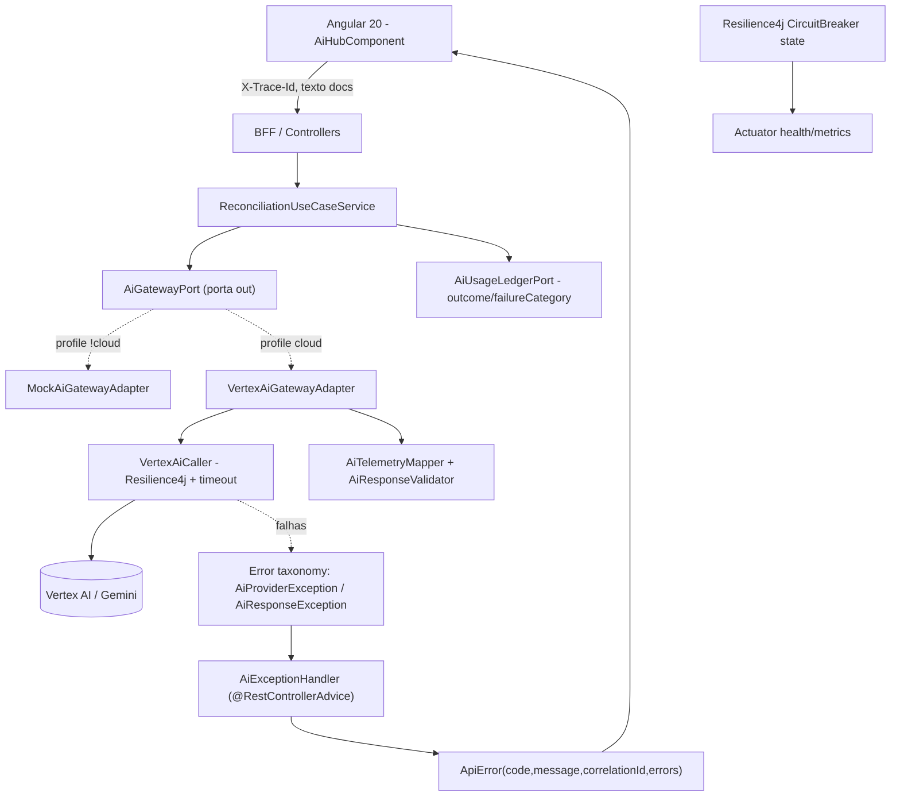
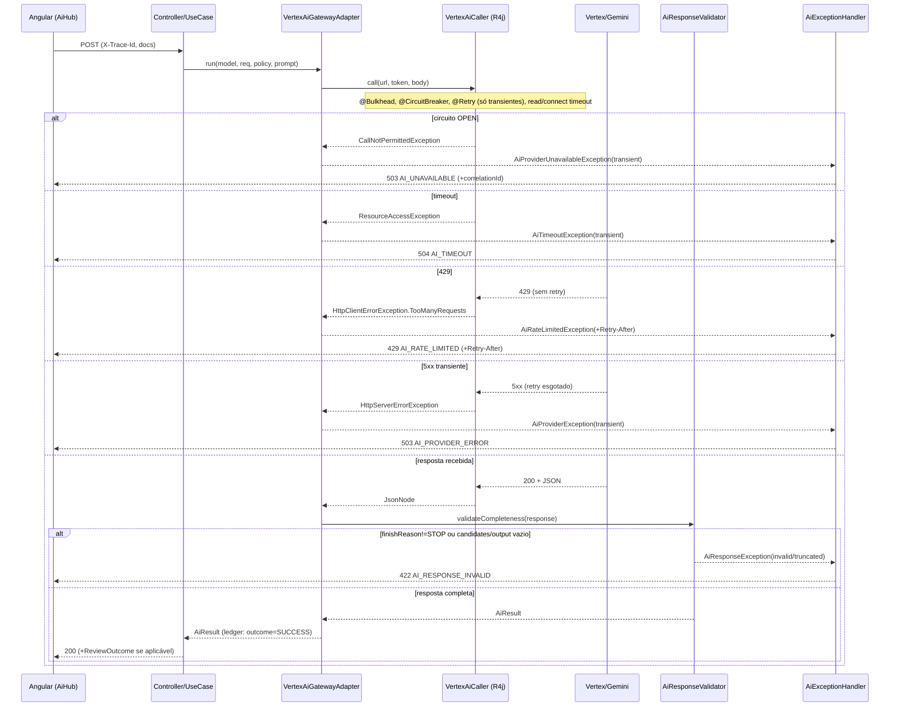
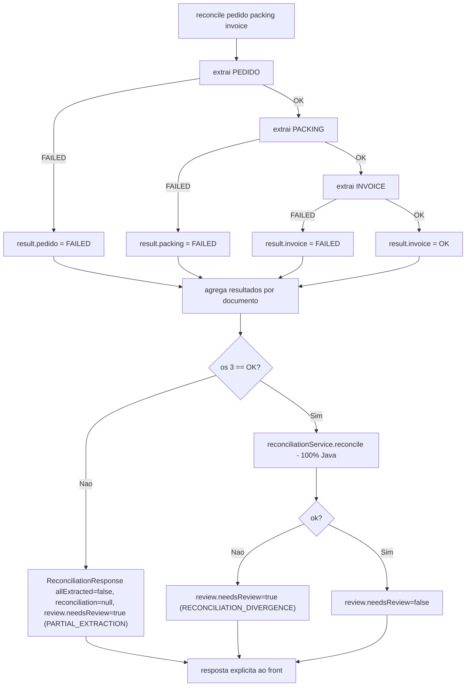

# Design Document: AI Resilience Hardening

## Overview

Esta spec endurece a integração de IA do EIP (Vertex AI / Gemini) para produção. O objetivo **não é adicionar funcionalidades**, e sim fazer o caminho de IA **falhar de forma segura e recuperável**: toda falha real do provedor é tratada e **exposta como falha** (nunca mascarada por mock ou persistida silenciosamente), com um status HTTP específico, uma mensagem pt-BR compreensível no front, observabilidade ponta a ponta e, quando o resultado for ambíguo, um encaminhamento determinístico para revisão humana.

O caminho feliz (UI → BFF → Vertex → ledger) **já está validado**. O backend é Java 21 / Spring Boot 3.5.6, arquitetura hexagonal com Spring Modulith; o front é Angular 20. O trabalho aqui é construir **sobre** peças que já existem — `VertexAiCaller` (Resilience4j `@Retry`/`@CircuitBreaker`/`@Bulkhead` + timeout de RestClient), `GlobalExceptionHandler`, `AiExceptionHandler`, `ReconciliationUseCaseService`/`ExtractionResultValidator`, `AiTelemetryMapper`, `AiUsageLedgerPort` e os interceptors/`AiHubComponent` do front — fechando as lacunas de borda.

Escopo central: converter falhas de transporte e de resposta do provedor em uma **taxonomia de erro de domínio** com flag `transient` e mapeamento HTTP determinístico; detectar `finishReason != STOP` e saídas vazias/truncadas como falha; um **modelo de revisão humana** guiado por sinais determinísticos (sem inventar score de confiança); um **modelo de resultado por documento** para a reconciliação parcial; propagação de `traceId` UI → BFF → chamada de IA e campos de desfecho no ledger; e a UX de erro no front (guarda contra double-submit, retry manual, preservação de input).

### Hard Constraints (valem para todo o design)

1. **Sem fallback silencioso para mock.** No modo real (profile `cloud`), uma falha real é tratada e **surge como falha**. O mock nunca "cobre" uma falha real.
2. **Mock é um modo explícito e selecionável** (profile `!cloud` / flag), nunca o default do caminho real.
3. **Config-driven por ambiente.** Timeouts, retry, breaker e rate-limit vêm de `application-*.yml`/env vars — nada hardcoded.
4. **Nunca logar credenciais nem conteúdo integral de documento sensível.** Política de redação obrigatória.
5. **Testes usam um provedor FAKE/STUB** para disparar deterministicamente timeout/429/5xx/JSON inválido/schema inválido — sem gasto nem outage reais do Vertex. **Nota de ambiente:** o ambiente do agente **não tem Maven local**; os testes com stub serão **escritos** mas **executados em CI / ambiente com Maven**. O único check com provedor real é o smoke do caminho feliz.

---

## Existing vs Gap Reconciliation (as 10 preocupações)

Legenda: ✅ DONE (já existe no código) · ⚠️ PARTIAL (existe base, falta endurecer) · 🔴 GAP (novo).

### 1. Timeout
- ✅ **DONE:** `VertexAiCaller` constrói o `RestClient` com `SimpleClientHttpRequestFactory` com connect/read timeout de 30s; o request não fica pendurado.
- 🔴 **GAP:** hoje um read-timeout vira `ResourceAccessException` e, não sendo mapeado, cai no `Exception → 500 INTERNAL_ERROR` genérico. Precisamos traduzi-lo em um erro de domínio dedicado → **504 Gateway Timeout** (transient), com mensagem pt-BR específica. Timeout passa a ser configurável por ambiente (`eip.ai.vertex.timeout.*`).

### 2. Respostas de IA inválidas
- ✅ **DONE (extração):** `ReconciliationUseCaseService.extract(...)` faz `objectMapper.readValue` + Bean Validation; parse ou validação inválida lança `BusinessRuleException` → **422** (provado: input inválido retornou 422, não persistiu). O `ExtractionResultValidator` consolida essa validação.
- 🔴 **GAP:** `AiTelemetryMapper` lê `candidates[0].finishReason` e tokens, mas **não trata** `finishReason != STOP` (ex.: `MAX_TOKENS`, `SAFETY`), `candidates` vazio, nem `output` vazio/truncado como falha. Precisamos de uma verificação de completude da resposta **antes** do parse de negócio, lançando `AiResponseException` (invalid/empty/truncated) → **422**. Nunca persistir resultado inválido silenciosamente.

### 3. Retry
- ✅ **DONE:** `@Retry(name="vertex")` com `max-attempts=2` (≤1 retry), `wait-duration=500ms`, `retry-exceptions = IOException / ResourceAccessException / HttpServerErrorException`. 4xx (`HttpClientErrorException`) **não** está na allow-list ⇒ não há retry em erro funcional.
- ⚠️ **PARTIAL / a documentar:** falta explicitar o raciocínio de **idempotência / não-duplicação de efeito** no retry. Hoje o `ledger.record(...)` é chamado **uma vez por sucesso** (depois do `caller.call`), então um retry interno do Resilience4j **não** gera linhas extras no ledger — bom. Documentar: o retry acontece **dentro** de `caller.call`, antes de qualquer efeito colateral persistente, e cada tentativa reusa o mesmo corpo (sem efeito duplicado, custo de tokens só nas tentativas que o provedor efetivamente cobra). Confirmar exclusão de 4xx e **adicionar backoff** (exponencial com jitter, config-driven) para não martelar o provedor.

### 4. Circuit breaker
- ✅ **DONE:** `@CircuitBreaker(name="vertex")`, `sliding-window-size=20`, `failure-rate-threshold=50`, `wait-duration-in-open-state=30s`, half-open com 3 chamadas. Estados CLOSED/OPEN/HALF_OPEN existem no Resilience4j.
- 🔴 **GAP:** quando o circuito está OPEN, o Resilience4j lança `CallNotPermittedException`, que hoje cai no 500 genérico. Mapear para **503 Service Unavailable** (transient) com mensagem "serviço de IA temporariamente indisponível". Expor o estado via **actuator health/metrics** (`resilience4j.circuitbreaker` + health indicator) para observabilidade.

### 5. Rate limit / 429
- 🔴 **GAP:** 429 chega como `HttpClientError.TooManyRequests` (subtipo de `HttpClientErrorException`), portanto **não é retentado** (correto para não piorar) e hoje vira genérico. Criar mapeamento dedicado → **429** preservando o status, com `code = AI_RATE_LIMITED` e mensagem pt-BR. **Opcional, config-driven:** honrar `Retry-After` do provedor quando presente, propagando-o no header da resposta do BFF para o front orientar o retry manual.

### 6. Falhas 5xx do provedor
- ⚠️ **PARTIAL:** 5xx (`HttpServerErrorException`) **é** retentado (está na allow-list). Mas, esgotado o retry, cai no 500 genérico.
- 🔴 **GAP:** introduzir a hierarquia `AiProviderException` com flag `transient`. 5xx transiente (500/502/503/504 do provedor) → **503**; distinguir de definitivo. Hoje um 5xx vira 500 do nosso lado (ambíguo entre "nós falhamos" e "o provedor falhou") — passamos a sinalizar claramente "falha do provedor de IA".

### 7. Confiança & revisão humana
- 🔴 **NEW:** não existe o conceito de "needs human review". **Não** inventaremos score de confiança (o Gemini não fornece um confiável aqui). O encaminhamento para revisão é dirigido por **sinais determinísticos**: (a) `finishReason != STOP`; (b) re-validação do DTO que passou no schema mas falha em regra de negócio determinística; (c) divergências de reconciliação (`ReconciliationResult.ok() == false`); (d) qualquer documento com status `FAILED` na reconciliação. Produzimos um `ReviewOutcome` com `needsReview`, `reasons[]` e `signalSource` — nunca um número fabricado.

### 8. Falha parcial de reconciliação
- ⚠️ **PARTIAL (hoje é tudo-ou-nada ruim):** `ReconciliationUseCaseService.reconcile` extrai pedido → packing → invoice **sequencialmente**; se uma extração falha, lança e **a requisição inteira falha sem indicar QUAL documento** falhou e sem preservar os bem-sucedidos.
- 🔴 **NEW:** modelo de resultado **por documento** — cada um de `pedido|packing|invoice` tem `status = OK|FAILED` com `error`. A reconciliação determinística só roda quando os **três** estão OK. Quando algum falha, a resposta é **explícita** (quais OK, qual FAILED, por quê), nunca uma reconciliação aparentemente válida. Extrações bem-sucedidas são preservadas (quando seguro) para permitir retry controlado só do(s) documento(s) que faltam.

### 9. Observabilidade
- ⚠️ **PARTIAL:** `correlationId` já existe via MDC e já aparece no `ApiError`. `AiResult` já carrega `finishReason`, tokens e `latencyMs`. O ledger grava 1 linha por chamada bem-sucedida.
- 🔴 **GAP:** (a) propagar um **traceId** vindo de um header da UI através do BFF até a chamada de IA e até o ledger; (b) o ledger hoje **não distingue** attempt vs success vs failure vs retry — adicionar `outcome` e `failureCategory`; (c) log estruturado por chamada: operação, modelo, tokens, latência, resultado, categoria de falha — **com redação** (sem credenciais, sem conteúdo integral do documento).

### 10. Frontend
- ⚠️ **PARTIAL:** `errorInterceptor` normaliza `HttpErrorResponse → Error` com `.status/.message/.code/.correlationId`; `AiHubComponent` mapeia status → mensagem pt-BR (401/403/422/400/429/5xx). Existem `credentialsInterceptor` + `csrfInterceptor`.
- 🔴 **GAP:** (a) **guarda contra double-submit** (desabilitar envio enquanto in-flight); (b) afordância de **retry manual** onde apropriado (timeout/unavailable/rate-limit), respeitando `Retry-After`; (c) **preservar o input** do usuário após erro (não limpar os textos); (d) completar o mapa de mensagens para timeout(504)/unavailable(503)/sessão expirada(401), incluindo o `correlationId` para suporte.

---

## Architecture



### Hardened call flow (sequência)



---

## Components and Interfaces

### Component 1: Error taxonomy (novo pacote `com.eip.modules.ai.domain.error`)

**Purpose:** classificar falhas de transporte e de resposta do provedor em exceções de domínio com flag `transient`, para mapeamento HTTP determinístico e sem ambiguidade com o 500 genérico.

```java
// Base para falhas do provedor de IA (transporte / disponibilidade).
public abstract class AiProviderException extends RuntimeException {
    private final String code;        // ex.: AI_TIMEOUT, AI_UNAVAILABLE, AI_RATE_LIMITED
    private final boolean transientFailure; // true => passível de retry/espera
    protected AiProviderException(String code, String message, boolean transientFailure, Throwable cause) { /* ... */ }
    public String code();            public boolean isTransient();
}

public final class AiTimeoutException extends AiProviderException {}          // transient=true  -> 504
public final class AiProviderUnavailableException extends AiProviderException {} // transient=true -> 503 (circuito OPEN)
public final class AiRateLimitedException extends AiProviderException {        // transient=true -> 429
    private final Duration retryAfter; // opcional, do header Retry-After
}
public final class AiTransientProviderException extends AiProviderException {} // transient=true  -> 503 (5xx)
public final class AiDefinitiveProviderException extends AiProviderException {} // transient=false -> 502

// Falha de CONTEÚDO da resposta (não de transporte): nunca transiente.
public final class AiResponseException extends RuntimeException {
    public enum Kind { MALFORMED_JSON, SCHEMA_INVALID, MISSING_FIELDS, WRONG_TYPES, EMPTY_OUTPUT, TRUNCATED, BLOCKED_SAFETY }
    private final Kind kind;         // -> 422 AI_RESPONSE_INVALID
}
```

**Responsibilities:**
- Carregar `code` + `transient` + (opcional) `Retry-After`.
- Não conhecer HTTP (o mapeamento vive no handler).

### Component 2: `AiProviderExceptionTranslator` (adapter out, profile `cloud`)

**Purpose:** traduzir exceções de infraestrutura (Resilience4j / RestClient) na taxonomia de domínio, no limite do `VertexAiGatewayAdapter`.

```java
interface AiProviderExceptionTranslator {
    // Converte a exceção crua do caller numa AiProviderException de domínio.
    RuntimeException translate(RuntimeException raw);
}
```

Mapeamento (determinístico):
- `CallNotPermittedException` → `AiProviderUnavailableException` (transient)
- `ResourceAccessException` (read/connect timeout) → `AiTimeoutException` (transient)
- `HttpClientErrorException.TooManyRequests` (429) → `AiRateLimitedException` (+Retry-After)
- outros `HttpClientErrorException` (4xx) → mantém como falha funcional (não traduz; segue regra de negócio/validação → 422/400)
- `HttpServerErrorException` (5xx) → `AiTransientProviderException` (transient)
- `IOException` → `AiTimeoutException`/`AiTransientProviderException` conforme natureza

### Component 3: `AiResponseValidator` (adapter out — endurece `AiTelemetryMapper`)

**Purpose:** verificar **completude** da resposta do provedor antes do mapeamento de negócio.

```java
@Component
public class AiResponseValidator {
    // Lança AiResponseException quando a resposta não é utilizável.
    void validateCompleteness(JsonNode response); // candidates não-vazio; finishReason==STOP; output não-vazio
}
```

**Responsibilities:**
- `candidates` ausente/vazio → `EMPTY_OUTPUT`.
- `finishReason == MAX_TOKENS` → `TRUNCATED`; `== SAFETY/RECITATION` → `BLOCKED_SAFETY`; qualquer `!= STOP` → `TRUNCATED`.
- `output` concatenado vazio → `EMPTY_OUTPUT`.
- Não valida schema de negócio (isso continua no `ExtractionResultValidator`/Bean Validation → 422).

### Component 4: `AiExceptionHandler` (estender o advice já existente)

**Purpose:** mapear a taxonomia para HTTP, reusando `ApiError(code,message,correlationId,errors)` e o `correlationId` do MDC.

| Exceção | HTTP | code |
|---|---|---|
| `AiTimeoutException` | 504 | `AI_TIMEOUT` |
| `AiProviderUnavailableException` (circuito OPEN) | 503 | `AI_UNAVAILABLE` |
| `AiRateLimitedException` | 429 | `AI_RATE_LIMITED` (+ header `Retry-After`) |
| `AiTransientProviderException` (5xx transiente) | 503 | `AI_PROVIDER_ERROR` |
| `AiDefinitiveProviderException` | 502 | `AI_PROVIDER_ERROR` |
| `AiResponseException` (invalid/empty/truncated) | 422 | `AI_RESPONSE_INVALID` |
| `AiQuotaExceededException` (já existe) | 402 | `AI_QUOTA_EXCEEDED` |

Falhas funcionais seguem o `GlobalExceptionHandler` existente (400/422/403/404/500).

### Component 5: Observabilidade — Trace propagation + Ledger outcome

**Purpose:** propagar `traceId` da UI ao ledger e distinguir desfechos.

```java
// Filtro já alinhado ao correlationId do MDC; adiciona traceId do header X-Trace-Id.
public final class AiTraceContextFilter { /* popula MDC: correlationId, traceId */ }

// Extensão da porta do ledger (compatível) para registrar desfecho e categoria.
public interface AiUsageLedgerPort {
    void record(UUID org, UUID userId, AiTask task, AiResult result, String requestId, BigDecimal providerCost); // mantido
    void recordOutcome(AiLedgerEntry entry); // novo: outcome + failureCategory + traceId
}

public record AiLedgerEntry(
    UUID org, UUID userId, AiTask task, String requestId, String traceId,
    AiOutcome outcome,              // ATTEMPT | SUCCESS | FAILURE | RETRY
    String failureCategory,         // null quando SUCCESS; ex.: TIMEOUT, RATE_LIMITED, PROVIDER_5XX, RESPONSE_INVALID
    AiResult result,                // null em FAILURE sem telemetria
    BigDecimal providerCost) {}
```

**Responsibilities:** nunca registrar token/credencial nem conteúdo integral do documento; `AiResult.output` **não** é persistido no ledger (apenas telemetria agregada).

### Component 6: Frontend hardening (`AiHubComponent` + serviços)

**Purpose:** UX de erro recuperável.

```typescript
// Estado de submissão para guarda contra double-submit.
submitting = signal(false);
lastError = signal<AiFriendlyError | null>(null);
preservedInput = signal<ReconcileInput | null>(null); // mantém textos após erro

interface AiFriendlyError {
  status: number; code?: string; message: string;   // pt-BR
  correlationId?: string; retryAfterSeconds?: number;
  retryable: boolean; // true p/ 503/504/429
}
```

**Responsibilities:** desabilitar envio enquanto `submitting()`; exibir botão "Tentar novamente" quando `retryable`; preservar input; mostrar `correlationId` para suporte.

---

## Data Models

### Modelo de resultado por documento (reconciliação parcial)

```java
public enum DocExtractionStatus { OK, FAILED }

public record DocumentExtractionResult<T>(
    DocKind kind,                 // PEDIDO | PACKING | INVOICE
    DocExtractionStatus status,
    T dto,                        // presente só quando OK
    AiResponseException.Kind failureKind, // presente só quando FAILED
    String failureDetail) {       // mensagem legível, redigida
    public static <T> DocumentExtractionResult<T> ok(DocKind k, T dto) { /* ... */ }
    public static <T> DocumentExtractionResult<T> failed(DocKind k, AiResponseException ex) { /* ... */ }
}

// Resposta agregada EXPLÍCITA: reconciliação só quando os 3 OK.
public record ReconciliationResponse(
    DocumentExtractionResult<PedidoDto> pedido,
    DocumentExtractionResult<PackingListDto> packing,
    DocumentExtractionResult<CommercialInvoiceDto> invoice,
    boolean allExtracted,                 // true sse os 3 == OK
    ReconciliationView reconciliation,    // null quando !allExtracted
    ReviewOutcome review) {}              // ver abaixo
```

**Validation Rules:**
- `allExtracted == true` ⟺ os três `status == OK`.
- `reconciliation != null` ⟹ `allExtracted == true` (nunca reconciliação aparentemente válida com documento FAILED).
- `kind == OK` ⟹ `dto != null`; `kind == FAILED` ⟹ `failureKind != null`.

### Modelo de revisão humana (sinais determinísticos, sem score fabricado)

```java
public enum ReviewReason {
    FINISH_REASON_NOT_STOP,   // truncado/safety
    REVALIDATION_FAILED,      // schema-ok mas regra de negócio determinística falhou
    RECONCILIATION_DIVERGENCE,// ReconciliationResult.ok()==false
    PARTIAL_EXTRACTION        // ao menos um documento FAILED
}

public record ReviewOutcome(
    boolean needsReview,
    List<ReviewReason> reasons,   // vazio sse needsReview==false
    String signalSource) {        // "deterministic" — nunca "confidence-score"
    public static ReviewOutcome none() { return new ReviewOutcome(false, List.of(), "deterministic"); }
}
```

**Validation Rules:**
- `needsReview == true` ⟺ `reasons` não-vazio.
- Nenhum campo numérico de "confiança" é produzido ou armazenado.

### Config por ambiente (não hardcoded)

```yaml
eip:
  ai:
    vertex:
      timeout:
        connect: ${VERTEX_CONNECT_TIMEOUT:30s}
        read: ${VERTEX_READ_TIMEOUT:30s}
    rate-limit:
      honor-retry-after: ${AI_HONOR_RETRY_AFTER:true}
resilience4j:
  retry:
    instances:
      vertex:
        max-attempts: 2
        wait-duration: 500ms
        enable-exponential-backoff: true     # backoff + jitter (novo, config-driven)
        exponential-backoff-multiplier: 2
        # retry-exceptions inalterado (IOException/ResourceAccessException/HttpServerErrorException)
management:
  endpoints:
    web:
      exposure:
        include: health,metrics,circuitbreakers   # expõe estado do breaker
  health:
    circuitbreakers:
      enabled: true
```

---

## Reconciliation partial-failure flow



Nota: as três extrações continuam sequenciais (como hoje), mas cada falha é **capturada** em `DocumentExtractionResult.failed(...)` em vez de abortar tudo. Extrações OK são preservadas na resposta para permitir retry controlado só dos documentos FAILED. Falhas de **transporte** (timeout/503/429) continuam propagando como `AiProviderException` (a requisição inteira falha com status transiente) — a captura por-documento cobre falhas de **conteúdo/validação** (`AiResponseException` / `BusinessRuleException`), que são específicas de um documento.

---

## Error Handling

### Cenário 1: Timeout de leitura
**Condition:** `RestClient` estoura read-timeout. **Response:** `ResourceAccessException` → `AiTimeoutException(transient)` → **504 `AI_TIMEOUT`**. **Recovery:** front mostra "demorou mais que o esperado" + retry manual; ledger grava `outcome=FAILURE, failureCategory=TIMEOUT`.

### Cenário 2: Circuito OPEN
**Condition:** falhas ≥ 50% na janela ⇒ breaker OPEN. **Response:** `CallNotPermittedException` → `AiProviderUnavailableException` → **503 `AI_UNAVAILABLE`** (fail-fast, não toca o provedor). **Recovery:** `wait-duration-in-open-state=30s`; actuator expõe estado; front sugere aguardar.

### Cenário 3: 429 rate limit
**Condition:** provedor retorna 429 (não retentado). **Response:** `AiRateLimitedException` → **429 `AI_RATE_LIMITED`**; se `honor-retry-after`, propaga header `Retry-After`. **Recovery:** front agenda retry respeitando `Retry-After`.

### Cenário 4: 5xx do provedor
**Condition:** 5xx após retry esgotado. **Response:** `AiTransientProviderException` → **503 `AI_PROVIDER_ERROR`**. **Recovery:** retry manual; distinção clara "falha do provedor" vs "falha nossa (500)".

### Cenário 5: Resposta inválida/truncada
**Condition:** `finishReason != STOP`, `candidates` vazio ou `output` vazio, ou JSON/schema inválido. **Response:** `AiResponseException`/`BusinessRuleException` → **422 `AI_RESPONSE_INVALID`**. **Recovery:** **nunca persiste**; marca `needsReview` quando aplicável.

### Cenário 6: Falha parcial de reconciliação
**Condition:** um documento falha validação. **Response:** `ReconciliationResponse` explícito (`allExtracted=false`, `reconciliation=null`). **Recovery:** retry só do documento FAILED; os OK são preservados.

### Redação (aplicável a todos)
Logs e ledger **nunca** incluem bearer token nem o texto integral do documento. Permitidos: `task`, `model`, `provider`, tokens agregados, `latencyMs`, `finishReason`, `outcome`, `failureCategory`, `correlationId`, `traceId`. Trechos de documento, se logados para debug, são truncados/mascarados.

---

## Testing Strategy

### Unit testing
- `AiResponseValidator`: STOP vs MAX_TOKENS/SAFETY, candidates vazio, output vazio.
- `AiProviderExceptionTranslator`: cada exceção crua → exceção de domínio correta + flag transient + Retry-After.
- `AiExceptionHandler`: cada exceção → status + `code` + `correlationId` corretos.
- Montagem de `ReconciliationResponse` (invariantes de `allExtracted`/`reconciliation`/`review`).

### Property-based testing (ver Correctness Properties)
- **Library:** jqwik (JUnit 5) no backend; fast-check no front se aplicável.
- Foco: invariantes universais (nunca persistir inválido, 4xx nunca retentado, parcial nunca reporta ok, mapeamento transient→status).

### Integration / stub provider
- **FAKE/STUB `AiGatewayPort`** (profile de teste) que dispara deterministicamente: timeout, 429, 5xx, JSON malformado, schema inválido, `finishReason=MAX_TOKENS`, candidates vazio.
- **Nota de ambiente:** sem Maven local no ambiente do agente ⇒ testes de stub são **escritos** e executados em **CI / ambiente com Maven**. O único teste com Vertex real é o **smoke do caminho feliz**.
- Nunca usar Vertex real para simular falha (sem gasto/outage reais).

---

## Correctness Properties

*A property is a characteristic that should hold across all valid executions of the system — a formal statement about what the system should do.*

### Property 1: Nenhum resultado inválido é persistido
*Para toda* resposta de IA inválida (JSON malformado, schema inválido, campos ausentes/tipos errados, output vazio ou `finishReason != STOP`), o sistema **não** grava DTO de negócio nem resultado de reconciliação, e responde 422.

**Validates: Requirements 2.1, 2.2, 2.3, 2.4, 2.5, 2.6, 2.7, 2.8**

### Property 2: 4xx funcional nunca é retentado
*Para toda* resposta 4xx do provedor (incluindo 429), o número de chamadas efetivas ao provedor é exatamente 1 (sem retry).

**Validates: Requirements 3.1, 3.5, 5.1**

### Property 3: Circuito OPEN falha rápido
*Para toda* chamada enquanto o circuito está OPEN, nenhuma requisição é enviada ao provedor e o sistema responde 503 em tempo O(1) (sem esperar timeout).

**Validates: Requirements 4.2, 4.3, 4.4**

### Property 4: Falha parcial nunca reporta ok
*Para todo* conjunto de três extrações onde ao menos uma tem `status=FAILED`, a `ReconciliationResponse` tem `allExtracted=false`, `reconciliation=null` e `review.needsReview=true`.

**Validates: Requirements 7.5, 7.6, 8.3, 8.4, 8.5**

### Property 5: Mapeamento transient → status é determinístico
*Para toda* `AiProviderException`, o status HTTP é função apenas do seu tipo: timeout→504, circuito aberto→503, 429→429, 5xx transiente→503, definitivo→502; e `AiResponseException`→422.

**Validates: Requirements 1.3, 2.7, 4.4, 5.2, 6.2, 6.3**

### Property 6: Idempotência de efeito sob retry
*Para toda* chamada que sofre ≤1 retry transiente antes de sucesso, exatamente **um** evento de ledger `SUCCESS` é gravado (nenhum efeito persistente duplicado).

**Validates: Requirements 3.6, 9.2**

### Property 7: Sem fallback silencioso para mock
*Para toda* falha real no profile `cloud`, a resposta é um erro (4xx/5xx apropriado) — nunca um resultado produzido pelo mock.

**Validates: Requirements 11.1, 11.2**

### Property 8: Redação de dados sensíveis
*Para todo* registro de log/ledger emitido pelo caminho de IA, o conteúdo não contém o bearer token nem o texto integral do documento.

**Validates: Requirements 9.4, 9.5, 9.6, 11.4**

### Property 9: `needsReview` ⟺ sinais determinísticos
*Para todo* `ReviewOutcome`, `needsReview==true` se e somente se `reasons` é não-vazio, e nenhum campo numérico de confiança é produzido.

**Validates: Requirements 7.1, 7.6, 7.7**

### Property 10: Round-trip da resposta explícita por documento
*Para toda* `ReconciliationResponse`, serializar e desserializar preserva os status por documento e os campos de review (round-trip de serialização do contrato BFF↔front).

**Validates: Requirements 8.7, 10.1**

---

## Phased Delivery

Cada fase termina com um **checkpoint build-green** (compila + testes relevantes passam em CI, já que não há Maven local).

### Fase 1 — Error taxonomy (fundação)
- Pacote `com.eip.modules.ai.domain.error` com `AiProviderException` + subtipos e `AiResponseException`.
- `AiProviderExceptionTranslator` no `VertexAiGatewayAdapter`.
- `AiExceptionHandler` estendido com o mapeamento HTTP (504/503/429/503/502/422).
- **Checkpoint:** unit tests do translator + handler verdes.

### Fase 2 — Response-validation hardening
- `AiResponseValidator` (finishReason != STOP, candidates/output vazio) integrado antes do `AiTelemetryMapper`/parse.
- Garantir "nunca persistir inválido".
- **Checkpoint:** property tests 1, 2, 5 verdes com stub.

### Fase 3 — Review outcome + reconciliação parcial
- `DocumentExtractionResult`, `ReconciliationResponse`, `ReviewOutcome`.
- `ReconciliationUseCaseService` captura falha por documento (sem abortar tudo) e computa review por sinais determinísticos.
- **Checkpoint:** property tests 4, 9, 10 verdes.

### Fase 4 — Observabilidade
- `AiTraceContextFilter` (X-Trace-Id → MDC); `recordOutcome` no ledger com `outcome`/`failureCategory`/`traceId`; log estruturado + redação; actuator `circuitbreakers`/health.
- **Checkpoint:** property tests 6, 8 verdes; health do breaker exposto.

### Fase 5 — Frontend UX
- Guarda double-submit, retry manual (respeitando `Retry-After`), preservação de input, mapa completo de mensagens (504/503/401), exibição de `correlationId`.
- **Checkpoint:** testes de componente/serviço verdes; property test 10 (contrato) verde.

---

## Dependencies

- **Backend:** Spring Boot 3.5.6, Spring Modulith, Resilience4j (já em uso), Spring Boot Actuator (health/metrics), Jackson, Jakarta Bean Validation, jqwik (property tests).
- **Frontend:** Angular 20 (HTTP interceptors já existentes), opcional fast-check para property tests do contrato.
- **Teste:** provedor FAKE/STUB (`AiGatewayPort`) em profile de teste; execução em CI com Maven (ambiente do agente não tem Maven local).
