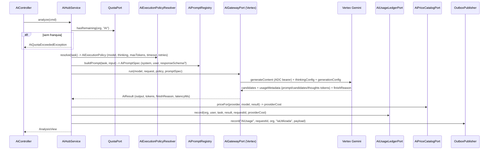
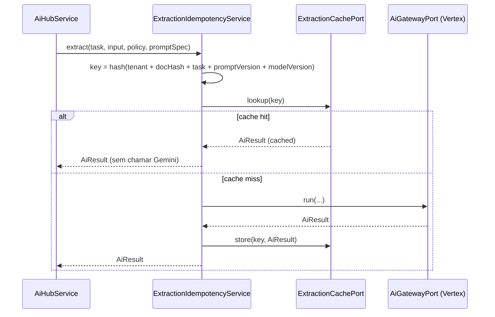

# Design Document: AI Vertex Integration

## Overview

O AI Hub do backend EIP (Java 21 / Spring Boot, monólito modular hexagonal com Spring Modulith) já possui toda a espinha dorsal de domínio: modelo de requisição/resultado, roteador de modelos sobre `ai_model_config`, ledger de uso em `ai_usage_event`, quota/franquia, outbox de eventos e um worker assíncrono multi-tenant RLS-safe. O que falta é o braço "real" do provedor: hoje existe apenas o `MockAiGatewayAdapter` determinístico (`@Profile("!cloud")`).

Este design adiciona um `VertexAiGatewayAdapter` (`@Profile("cloud")`) que chama o Gemini via REST `generateContent` da Vertex AI usando ADC (Application Default Credentials), sem `key.json` e sem segredos em código/YAML. Em volta disso, o design evolui o contrato `AiResult` para telemetria real de tokens (metering de verdade em vez de `text.length()`), introduz um nível de "thinking" de primeira classe derivado da prioridade/config, uma `AiExecutionPolicy` resolvida fora dos controllers e fora do adapter Google, um `PromptRegistry` que tira a construção de prompt do adapter, extração estruturada (JSON schema → DTO tipado → Bean Validation) para `DOCUMENT_EXTRACTION`, reconciliação determinística de documentos (Pedido × Packing List × Commercial Invoice) e resiliência (timeout + no máximo 1 retry em falhas transitórias + circuit breaker + bulkhead), além de cache de idempotência e preço versionado (FinOps).

**Princípio norteador:** o mock permanece o padrão (demo roda em mock), toda mudança de contrato é refletida em TODOS os call sites para manter o build verde, e tudo que é específico de ambiente (project, location, model id, thinking level, preço) é **configuração** (`ai_model_config` + `application-cloud.yml` + variáveis de ambiente), **nunca** hardcoded em Java. Assim, se o alias/modelo mudar (ex.: `gemini-3.8-flash`, location `global`), não há recompilação.

---

## Reconciliation with Existing Code

Esta seção é obrigatória: o design é ancorado no código REAL do backend (verificado em `backend/src/main/java/com/eip/modules/ai/**` e `backend/src/main/resources/db/migration/**`), e **não** em qualquer ZIP externo.

### O que JÁ EXISTE (não reinventar)

| Elemento | Arquivo real | Fato confirmado |
|---|---|---|
| Contrato de modelo | `domain/model/AiModel.java` | `record AiModel(String provider, String model, AiTask task, AiPriority priority, String costClass)`. Ids vêm de config. |
| Contrato de requisição | `domain/model/AiRequest.java` | `record AiRequest(AiTask task, String input, UUID organizationId, UUID userId)`. |
| Contrato de resultado | `domain/model/AiResult.java` | `record AiResult(String output, String provider, String model, long inputUnits, long outputUnits, int ocrPages)`. |
| Tarefas | `domain/model/AiTask.java` | enum `NCM_CLASSIFICATION, DOCUMENT_SUMMARY, TRANSLATION, RISK_ANALYSIS, DOCUMENT_EXTRACTION, CHAT`. |
| Tiers de prioridade | `domain/model/AiPriority.java` | enum `FAST, STANDARD, DEEP` — já mapeiam conceitualmente para LOW/MEDIUM/HIGH. |
| Porta de saída do gateway | `domain/port/out/AiGatewayPort.java` | `interface { AiResult run(AiModel model, AiRequest request); }`. |
| Mock determinístico | `adapter/out/ai/MockAiGatewayAdapter.java` | `@Component @Profile("!cloud")`. **Padrão da demo.** |
| Serviço de aplicação | `application/AiHubService.java` | `analyze()` = router → `quota.hasRemaining` → `gateway.run` → `ledger.record` → `outbox.record`, tudo `@Transactional`. `analyzeAsync()` enfileira `ai_job`. Também `routerConfig()/currentUsage()/jobStatus()`. |
| Roteador | `adapter/out/persistence/ModelRouterAdapter.java` | resolve `(task → defaultPriority)` sobre `ai_model_config`, com fallback para qualquer linha habilitada; `all()` lista habilitados. |
| Worker RLS-safe | `adapter/in/worker/AiJobProcessor.java` + `AiJobWorker` | o worker vincula `OrganizationContextHolder` à org do job ANTES de `processor.complete()`; `RlsAspect` da plataforma vincula `app.current_organization` `@Before` cada unidade `@Transactional`. **Concern de RLS do worker JÁ RESOLVIDO.** |
| Ledger de uso | `adapter/out/persistence/AiUsageEventEntity.java` → `ai_usage_event` | colunas: `id, organization_id, user_id, operation, provider, model, input_units, output_units, ocr_pages, provider_cost(18,6), eip_credits(18,2), request_id, idempotency_key, created_at`. **`idempotency_key` e `provider_cost` JÁ EXISTEM.** |
| Catálogo global | `ai_model_config` (V8) | GLOBAL, sem RLS, `unique(task, priority)`; seed usa provider `vertex-ai` com nomes ilustrativos (`gemini-flash/standard/pro`) que o comentário de V8 declara serem config ajustável. |
| Migração mais recente | `V18__event_publication.sql` | próxima migração é **V19**. |

### O que é GENUINAMENTE NOVO (entregue por esta spec)

1. `VertexAiGatewayAdapter` (`@Profile("cloud")`) — chama Gemini `generateContent` via ADC.
2. Telemetria rica em `AiResult` — `promptTokens, outputTokens, thinkingTokens, totalTokens, finishReason, latencyMs`.
3. Nível de thinking explícito (`AiThinkingLevel`) derivado de prioridade/config.
4. `AiExecutionPolicy` (model, thinkingLevel, maxOutputTokens, timeout, maxRetries) resolvida por um componente de policy.
5. `AiPromptRegistry` — construção de prompt/system instruction/response schema fora do adapter.
6. Extração estruturada (JSON schema) para `DOCUMENT_EXTRACTION` → DTO tipado → Bean Validation.
7. Reconciliação determinística de documentos (Pedido × Packing List × Commercial Invoice).
8. Resiliência Resilience4j (timeout + ≤1 retry transitório + circuit breaker + bulkhead).
9. Cache de idempotência de extração (tenantId + documentHash + task + promptVersion + modelVersion).
10. Tabela/config de preço versionada para FinOps (`provider_cost`), fora do adapter.
11. Estratégia de profiles (`!cloud` mock como padrão; futuro split `local` / `cloud-dev` / `cloud-prod`).
12. ADC local (`gcloud auth application-default login`) e Workload Identity / service account no Cloud Run — zero `key.json`.

### Corrections to the external ZIP's assumptions

> O usuário recebeu um ZIP de um assistente externo. Tratamos o ZIP como **referência não confiável**. As correções abaixo prevalecem porque foram validadas contra o código real.

- **(a) O concern de RLS do worker `ai_job` JÁ ESTÁ RESOLVIDO — NÃO mexer.** `AiJobWorker` vincula `OrganizationContextHolder` à org do job antes de `processor.complete()`, e o `RlsAspect` vincula `app.current_organization` em cada `@Transactional`. **Não** propor remover/alterar `ai_job ... FORCE ROW LEVEL SECURITY`: isso é correto e mudá-lo arrisca um bypass multi-tenant.
- **(b) `idempotency_key` e `provider_cost` JÁ EXISTEM** em `ai_usage_event` (V8). A migração V19 **não** deve recriá-los; só adiciona colunas realmente novas.
- **(c) Model id, location, project e thinking level devem ser CONFIG, não hardcoded.** O orquestrador não reconhece `gemini-3.8-flash`/location `global` como valores padrão de Vertex; portanto eles vivem em `ai_model_config` + `application-cloud.yml` + env vars. Se o alias mudar, não há recompile.

---

## Architecture

```mermaid
graph TD
    subgraph in[Adapters IN]
        CTRL[AiController / REST]
        WRK[AiJobWorker + AiJobProcessor<br/>RLS-safe, ja existente]
    end

    subgraph app[Application Layer]
        SVC[AiHubService<br/>analyze / analyzeAsync]
        POL[AiExecutionPolicyResolver<br/>NOVO]
        REG[AiPromptRegistry<br/>NOVO]
        REC[DocumentReconciliationService<br/>NOVO - deterministico]
        IDEM[ExtractionIdempotencyService<br/>NOVO]
    end

    subgraph domain[Domain]
        PORTS[Ports OUT:<br/>AiGatewayPort, ModelRouterPort,<br/>AiUsageLedgerPort, QuotaPort, AiJobPort,<br/>AiPriceCatalogPort NOVO, ExtractionCachePort NOVO]
        MODEL[Models: AiModel, AiRequest,<br/>AiResult*, AiTask, AiPriority,<br/>AiThinkingLevel NOVO, AiExecutionPolicy NOVO]
    end

    subgraph out[Adapters OUT]
        MOCK[MockAiGatewayAdapter<br/>@Profile '!cloud' - PADRAO]
        VERTEX[VertexAiGatewayAdapter<br/>@Profile 'cloud' - NOVO]
        ROUTER[ModelRouterAdapter<br/>ai_model_config]
        LEDGER[AiUsageLedgerAdapter<br/>ai_usage_event]
        PRICE[AiPriceCatalogAdapter<br/>price config NOVO]
        CACHE[ExtractionCacheAdapter<br/>NOVO]
    end

    subgraph ext[Externo / GCP]
        GEMINI[Vertex AI Gemini<br/>generateContent REST v1]
        ADC[ADC / Workload Identity]
    end

    CTRL --> SVC
    WRK --> SVC
    SVC --> POL
    SVC --> REG
    SVC --> PORTS
    SVC --> REC
    SVC --> IDEM
    POL --> ROUTER
    POL --> PRICE
    PORTS -. implementada por .-> MOCK
    PORTS -. implementada por .-> VERTEX
    PORTS -. implementada por .-> ROUTER
    PORTS -. implementada por .-> LEDGER
    PORTS -. implementada por .-> PRICE
    PORTS -. implementada por .-> CACHE
    IDEM --> CACHE
    VERTEX --> GEMINI
    VERTEX --> ADC
```

**Fronteiras hexagonais:** controllers e worker (adapters IN) chamam apenas o `AiHubService` (application). O serviço depende somente de **portas** do domínio. O `VertexAiGatewayAdapter` é um adapter OUT que não conhece domínio de negócio (não sabe o que é NCM); ele recebe prompt/schema já construídos pelo `AiPromptRegistry` e política pelo `AiExecutionPolicyResolver`. A construção de prompt e a resolução de policy ficam na camada de aplicação/domínio.

---

## Sequence Diagrams

### Fluxo síncrono `analyze()` com Vertex (profile cloud)



### Fluxo de extração com cache de idempotência



---

## Components and Interfaces

### Component 1: AiGatewayPort (porta existente — assinatura evolui)

**Propósito:** abstrair o provedor de IA. Hoje: `AiResult run(AiModel, AiRequest)`.

**Decisão:** para expor policy e prompt ao adapter sem acoplar o adapter ao domínio de negócio, a porta ganha uma sobrecarga que recebe `AiExecutionPolicy` e `AiPromptSpec`. A assinatura antiga é **mantida** como default method que delega, preservando compatibilidade com o mock e com qualquer call site atual.

```java
public interface AiGatewayPort {

    /** Assinatura legada — mantida para compatibilidade (mock e call sites atuais). */
    default AiResult run(AiModel model, AiRequest request) {
        return run(model, request, AiExecutionPolicy.defaults(model), AiPromptSpec.passthrough(request));
    }

    /** Nova assinatura: policy e prompt resolvidos na camada de aplicacao. */
    AiResult run(AiModel model, AiRequest request, AiExecutionPolicy policy, AiPromptSpec prompt);
}
```

**Responsabilidades:**
- Chamar o provedor (ou mockar) e devolver `AiResult` com telemetria.
- NÃO construir prompt de negócio; NÃO calcular preço; NÃO decidir igualdade numérica.

### Component 2: VertexAiGatewayAdapter (NOVO, `@Profile("cloud")`)

**Propósito:** implementação real contra Gemini via `generateContent` REST v1, autenticando por ADC.

```java
@Component
@Profile("cloud")
@RequiredArgsConstructor
public class VertexAiGatewayAdapter implements AiGatewayPort {

    private final VertexAiProperties props;      // project, location, endpoint, apiVersion (CONFIG)
    private final GoogleCredentialsProvider adc; // google-auth-library (ADC) - sem key.json
    private final RestClient restClient;         // ou WebClient
    private final AiTelemetryMapper telemetry;   // usageMetadata -> AiResult fields

    @Override
    @TimeLimiter(name = "vertex") @Retry(name = "vertex")
    @CircuitBreaker(name = "vertex") @Bulkhead(name = "vertex")
    public AiResult run(AiModel model, AiRequest request,
                        AiExecutionPolicy policy, AiPromptSpec prompt) {
        // 1. monta GenerateContentRequest a partir de promptSpec + policy
        //    (thinkingConfig.thinkingLevel/budget, generationConfig.maxOutputTokens,
        //     responseMimeType=application/json + responseSchema se prompt.schema presente)
        // 2. obtem bearer token via ADC (adc.getAccessToken())
        // 3. POST {endpoint}/v1/projects/{project}/locations/{location}/publishers/google/models/{model}:generateContent
        // 4. mapeia usageMetadata -> promptTokens/outputTokens/thinkingTokens/totalTokens, finishReason, latencyMs
        return telemetry.toResult(model, response, elapsedMs);
    }
}
```

**Responsabilidades:**
- Transporte HTTP + autenticação ADC. Tudo (project/location/model/thinking) vem de config.
- Mapear `usageMetadata` do Gemini para a telemetria de `AiResult`.
- NÃO conhecer NCM/Invoice/Pedido — recebe `AiPromptSpec` pronto.

### Component 3: AiExecutionPolicyResolver (NOVO, application)

**Propósito:** resolver model + thinking + limites de execução em um só lugar (nem controller, nem adapter).

```java
public interface AiExecutionPolicyResolver {
    AiExecutionPolicy resolve(AiTask task);
}
```

**Responsabilidades:**
- Usar `ModelRouterPort.resolve(task)` para obter `AiModel`.
- Derivar `AiThinkingLevel` da `AiPriority`/config e `maxOutputTokens`/timeout/retries de config.

### Component 4: AiPromptRegistry (NOVO, application/domain)

**Propósito:** tirar a construção de prompt do adapter.

```java
public interface AiPromptRegistry {
    AiPromptSpec specFor(AiTask task, String input);
    String promptVersion(AiTask task); // versiona cache/idempotencia
}
```

**Responsabilidades:**
- Guardar system instruction, template de user prompt e `responseSchema` (JSON) por tarefa.
- Expor `promptVersion` para a chave de idempotência.

### Component 5: DocumentReconciliationService (NOVO, application — determinístico)

**Propósito:** comparar Pedido × Packing List × Commercial Invoice em Java puro.

```java
public interface DocumentReconciliationService {
    ReconciliationResult reconcile(PedidoDto pedido, PackingListDto packing, CommercialInvoiceDto invoice);
}
```

**Responsabilidades:**
- Comparar weight/qty/currency/SKU/total/Incoterm **deterministicamente**.
- A IA apenas EXTRAI (DTOs) e, depois, EXPLICA divergências (thinking LOW). **A IA NÃO decide igualdade numérica.**

### Component 6: Ports novas de FinOps e cache

```java
public interface AiPriceCatalogPort {         // preço versionado, fora do adapter
    BigDecimal providerCost(String provider, String model, AiResult result);
}

public interface ExtractionCachePort {         // idempotencia de extracao
    Optional<AiResult> lookup(String key);
    void store(String key, AiResult result);
}
```

---

## Data Models

### Model 1: AiResult (EVOLUÍDO — mudança de contrato)

**Antes (real):** `record AiResult(String output, String provider, String model, long inputUnits, long outputUnits, int ocrPages)`.

**Depois (novo):**

```java
public record AiResult(
        String output,
        String provider,
        String model,
        long inputUnits,     // mantido = promptTokens (compat com ledger input_units)
        long outputUnits,    // mantido = outputTokens (compat com ledger output_units)
        int ocrPages,
        long promptTokens,
        long outputTokens,
        long thinkingTokens,
        long totalTokens,
        String finishReason,
        long latencyMs) {

    /** Factory de compatibilidade: deriva campos antigos dos tokens. */
    public static AiResult of(String output, String provider, String model, int ocrPages,
                              long promptTokens, long outputTokens, long thinkingTokens,
                              long totalTokens, String finishReason, long latencyMs) {
        return new AiResult(output, provider, model, promptTokens, outputTokens, ocrPages,
                promptTokens, outputTokens, thinkingTokens, totalTokens, finishReason, latencyMs);
    }
}
```

**Regras de validação / mapeamento:**
- `inputUnits == promptTokens` e `outputUnits == outputTokens` (invariante de compatibilidade com o ledger).
- `totalTokens >= promptTokens + outputTokens` (pode incluir thinking).
- Todos os call sites (`AiHubService`, `AiUsageLedgerAdapter`, `MockAiGatewayAdapter`, `usagePayload`) são atualizados para compilar.

### Model 2: AiThinkingLevel (NOVO)

```java
public enum AiThinkingLevel { LOW, MEDIUM, HIGH }
```

**Mapeamento (config-driven, com default derivado da prioridade):** `FAST → LOW`, `STANDARD → MEDIUM`, `DEEP → HIGH`. O valor efetivo pode ser sobrescrito por `ai_model_config` (ver migração V19) ou YAML.

**Decisão (requisito 1 — "least invasive"):** **não** alterar o record `AiModel`. Em vez disso, `AiThinkingLevel` é carregado dentro de `AiExecutionPolicy`, resolvido pelo `AiExecutionPolicyResolver` a partir de `AiPriority` + config. Justificativa: `AiModel` é um record amplamente referenciado (router, ledger, views); adicionar campo quebraria vários construtores. A policy é o lugar natural para expor thinking ao adapter sem poluir o modelo de catálogo.

### Model 3: AiExecutionPolicy (NOVO)

```java
public record AiExecutionPolicy(
        AiModel model,
        AiThinkingLevel thinkingLevel,
        int maxOutputTokens,
        Duration timeout,
        int maxRetries) {

    public static AiExecutionPolicy defaults(AiModel model) {
        return new AiExecutionPolicy(model, AiThinkingLevel.MEDIUM, 1024,
                Duration.ofSeconds(30), 1);
    }
}
```

### Model 4: AiPromptSpec (NOVO)

```java
public record AiPromptSpec(
        String systemInstruction,
        String userPrompt,
        String responseSchemaJson, // null quando saida e texto livre
        String promptVersion) {

    public static AiPromptSpec passthrough(AiRequest request) {
        return new AiPromptSpec(null, request.input(), null, "v0-passthrough");
    }
}
```

### Model 5: DTOs de extração estruturada (NOVO)

```java
public record CommercialInvoiceDto(
        @NotBlank String invoiceNumber,
        @NotNull BigDecimal totalAmount,
        @NotBlank String currency,
        @NotBlank String incoterm,
        @NotEmpty List<InvoiceLineDto> lines) {}

public record InvoiceLineDto(
        @NotBlank String sku,
        @NotNull @Positive BigDecimal quantity,
        @NotNull BigDecimal unitPrice) {}
// PackingListDto e PedidoDto seguem o mesmo padrao (SKU, qty, peso).
```

**Regra:** o `responseSchemaJson` do `AiPromptSpec` para `DOCUMENT_EXTRACTION` espelha esses DTOs; após o parse JSON → DTO, aplica-se Bean Validation antes de usar o resultado.

### Model 6: ai_usage_event (EXISTENTE + colunas novas via V19)

Colunas existentes (V8): `id, organization_id, user_id, operation, provider, model, input_units, output_units, ocr_pages, provider_cost, eip_credits, request_id, idempotency_key, created_at`.

Novas (V19): `thinking_tokens bigint`, `total_tokens bigint`, `finish_reason text`, `latency_ms bigint`.

---

## Migration Plan

**Próximo número: V19** (a migração mais recente é `V18__event_publication.sql`).

`V19__ai_telemetry.sql` adiciona **apenas colunas genuinamente novas** ao `ai_usage_event` — **sem** recriar `idempotency_key`/`provider_cost` (já existem em V8):

```sql
-- V19__ai_telemetry.sql
-- Telemetria real de tokens para o AI Hub (Vertex). NAO recria idempotency_key
-- nem provider_cost: ambos ja existem desde V8__ai_hub.sql.
ALTER TABLE ai_usage_event ADD COLUMN thinking_tokens bigint NOT NULL DEFAULT 0;
ALTER TABLE ai_usage_event ADD COLUMN total_tokens    bigint NOT NULL DEFAULT 0;
ALTER TABLE ai_usage_event ADD COLUMN finish_reason   text;
ALTER TABLE ai_usage_event ADD COLUMN latency_ms      bigint;

-- Opcional (requisito 1): thinking_level/max_output_tokens por slot de router.
-- Mantem ai_model_config GLOBAL (sem RLS) e a unique(task, priority) de V8.
ALTER TABLE ai_model_config ADD COLUMN thinking_level    text;
ALTER TABLE ai_model_config ADD COLUMN max_output_tokens int;
```

> Nota RLS: `ai_usage_event` permanece `FORCE ROW LEVEL SECURITY` (V8). `ALTER TABLE ADD COLUMN` não altera políticas. **Não** se mexe no RLS de `ai_job`.

Tabela/config de preço (FinOps, requisito 10): preço versionado fica em config/tabela própria (ex.: `ai_price_config` versionada ou arquivo de propriedades versionado), consultada por `AiPriceCatalogPort`. A decisão entre tabela vs. properties será fechada na fase de requirements; o importante do design é que **o cálculo de custo fica fora do adapter** e preço é dado versionado (mudança de preço do Google não exige deploy).

---

## Algorithmic Pseudocode

### Resolução de policy

```java
// AiExecutionPolicyResolver.resolve
AiExecutionPolicy resolve(AiTask task) {
    AiModel model = router.resolve(task);                 // ai_model_config (existente)
    AiThinkingLevel thinking = thinkingFrom(model);       // config override OU map(priority)
    int maxTokens = maxTokensFrom(model);                 // config OU default
    Duration timeout = cfg.timeoutFor(task);              // application-cloud.yml
    int retries = cfg.maxRetriesFor(task);                // <= 1 (apenas transitorias)
    return new AiExecutionPolicy(model, thinking, maxTokens, timeout, retries);
}
```

**Preconditions:** `task != null`; existe pelo menos uma linha habilitada em `ai_model_config` (fallback garantido pelo router existente).
**Postconditions:** retorna policy não-nula com `maxRetries <= 1`.

### Reconciliação determinística

```java
ReconciliationResult reconcile(PedidoDto p, PackingListDto pk, CommercialInvoiceDto inv) {
    List<Divergence> divs = new ArrayList<>();
    // comparacoes exatas/tolerancia em Java puro — IA nao participa aqui
    if (!currencyEquals(p.currency(), inv.currency())) divs.add(Divergence.currency(...));
    if (!incotermEquals(p.incoterm(), inv.incoterm())) divs.add(Divergence.incoterm(...));
    for (String sku : union(p.skus(), pk.skus(), inv.skus())) {
        BigDecimal qp = qty(p, sku), qk = qty(pk, sku), qi = qty(inv, sku);
        if (!withinTolerance(qp, qk, qi)) divs.add(Divergence.qty(sku, qp, qk, qi));
    }
    if (!totalWithinTolerance(p.total(), inv.total())) divs.add(Divergence.total(...));
    return new ReconciliationResult(divs.isEmpty(), divs);
    // IA so entra DEPOIS (thinking LOW) para EXPLICAR as divergencias ja detectadas.
}
```

**Preconditions:** DTOs já validados por Bean Validation.
**Postconditions:** `result.ok() == divs.isEmpty()`; conjunto de divergências é função pura das entradas (determinístico). **Loop invariant:** todo SKU já visitado teve sua divergência registrada se e somente se estava fora da tolerância.

### Idempotência de extração

```java
AiResult extract(AiTask task, String input, AiExecutionPolicy policy, AiPromptSpec prompt) {
    String key = sha256(tenantId + "|" + sha256(input) + "|" + task
                        + "|" + prompt.promptVersion() + "|" + policy.model().model());
    return cache.lookup(key).orElseGet(() -> {
        AiResult r = gateway.run(policy.model(), request, policy, prompt);
        cache.store(key, r);
        return r;
    });
}
```

**Preconditions:** `task == DOCUMENT_EXTRACTION`; `input != null`.
**Postconditions:** mesma chave ⇒ Gemini não é chamado novamente (cache hit retorna resultado equivalente). **Idempotente.**

---

## Example Usage

```java
// AiHubService.analyze (evoluido) — mantem o mesmo contorno transacional existente
@Transactional
public AnalysisView analyze(AnalyzeCommand cmd) {
    OrganizationContext context = ctx();
    UUID org = context.organizationId().value();
    UUID userId = context.userId();
    AiTask task = parseTask(cmd.task());

    if (!quota.hasRemaining(org, AI_FEATURE)) {
        throw new AiQuotaExceededException("Franquia de IA esgotada...");
    }

    AiExecutionPolicy policy = policyResolver.resolve(task);           // NOVO
    AiPromptSpec prompt = promptRegistry.specFor(task, cmd.input());   // NOVO
    AiRequest request = new AiRequest(task, cmd.input(), org, userId);

    AiResult result = (task == AiTask.DOCUMENT_EXTRACTION)
            ? idempotency.extract(task, cmd.input(), policy, prompt)   // cache
            : gateway.run(policy.model(), request, policy, prompt);

    String requestId = UUID.randomUUID().toString();
    BigDecimal cost = priceCatalog.providerCost(result.provider(), result.model(), result); // FinOps
    ledger.record(org, userId, task, result, requestId, cost);        // assinatura evoluida
    outbox.record(AGGREGATE_TYPE, requestId, org, "IaUtilizada", usagePayload(task, result));

    return new AnalysisView(task.name(), result.output(), result.provider(),
            result.model(), result.inputUnits(), result.outputUnits(), result.ocrPages());
}
```

```java
// MockAiGatewayAdapter atualizado para o novo AiResult (continua determinístico, padrão da demo)
@Override
public AiResult run(AiModel model, AiRequest request, AiExecutionPolicy policy, AiPromptSpec prompt) {
    String input = request.input() != null ? request.input() : "";
    long promptTokens = Math.max(1, input.length());
    String output = switch (request.task()) { /* ...mesmos outputs determinísticos... */ };
    long outputTokens = Math.max(1, output.length());
    return AiResult.of(output, model.provider(), model.model(), 0,
            promptTokens, outputTokens, 0, promptTokens + outputTokens, "STOP", 0);
}
```

---

## Correctness Properties

*A property is a characteristic or behavior that should hold true across all valid executions of a system-essentially, a formal statement about what the system should do. Properties serve as the bridge between human-readable specifications and machine-verifiable correctness guarantees.*

### Property 1: Compatibilidade de metering no ledger
*Para todo* `AiResult`, deve valer `inputUnits == promptTokens` e `outputUnits == outputTokens`, e `totalTokens >= promptTokens + outputTokens`, de modo que o ledger `ai_usage_event` registre em `input_units`/`output_units` exatamente os tokens reais.
**Validates: Requirements 3.2, 3.3, 15.2**

### Property 2: Round-trip de extração estruturada
*Para todo* documento extraído em DTO válido, serializar o DTO conforme o `responseSchema` e re-parsear produz um DTO equivalente (parser/serializer de JSON de extração).
**Validates: Requirements 7.1, 7.2, 7.3**

### Property 3: Reconciliação é determinística e pura
*Para todo* trio (Pedido, Packing List, Commercial Invoice), `reconcile` produz o mesmo conjunto de divergências em qualquer execução, e `ok()` é verdadeiro se e somente se não há divergências — sem participação da IA na decisão numérica.
**Validates: Requirements 8.2, 8.3, 8.5**

### Property 4: Idempotência de extração
*Para toda* chave `tenant+docHash+task+promptVersion+modelVersion`, duas chamadas de extração consecutivas resultam em no máximo uma chamada ao Gemini (a segunda é cache hit equivalente).
**Validates: Requirements 10.1, 10.2, 10.4**

### Property 5: Mock permanece default fora do profile cloud
*Para todo* profile que não seja `cloud`, o bean ativo de `AiGatewayPort` é o `MockAiGatewayAdapter`, preservando a demo.
**Validates: Requirements 1.2, 13.1**

### Property 6: Sem segredos / sem decisão de equidade pela IA
*Para toda* execução do `VertexAiGatewayAdapter`, a autenticação usa ADC (sem `key.json`), e nenhuma decisão de igualdade numérica de reconciliação é delegada à IA.
**Validates: Requirements 1.4, 1.5, 14.3, 8.5**

---

## Error Handling

### Cenário 1: Falha transitória do provedor (timeout/5xx/connection reset)
**Condição:** erro claramente transitório durante `generateContent`.
**Resposta:** Resilience4j `@TimeLimiter` + `@Retry` (**no máximo 1 retry**, apenas em exceções transitórias allow-listed) + `@CircuitBreaker` + `@Bulkhead`.
**Recuperação:** se persistir, abre o circuito e falha rápido; evita retry storm. Erro é propagado como exceção de negócio tratável.

### Cenário 2: Franquia de IA esgotada
**Condição:** `quota.hasRemaining(org, "AI")` falso.
**Resposta:** `AiQuotaExceededException` (comportamento existente, preservado).
**Recuperação:** usuário adquire créditos.

### Cenário 3: Saída de extração inválida (não bate com schema/Bean Validation)
**Condição:** JSON do Gemini falha parse ou Bean Validation.
**Resposta:** erro de validação; não grava DTO inválido; registra o uso com `finish_reason` apropriado.
**Recuperação:** retorna erro descritivo; opcionalmente 1 reparse determinístico, sem novo custo de IA.

### Cenário 4: ADC indisponível / credenciais ausentes
**Condição:** sem ADC no ambiente (ex.: dev sem `gcloud auth application-default login`).
**Resposta:** o profile cloud não sobe o adapter sem credenciais; em dev o default é mock. Falha é explícita no startup/cloud.
**Recuperação:** configurar ADC/Workload Identity.

---

## Testing Strategy

### Unit Testing Approach
- `MockAiGatewayAdapter` atualizado: outputs determinísticos por tarefa + telemetria coerente.
- `DocumentReconciliationService`: exemplos de divergência/igualdade (qty, total, currency, Incoterm, SKU).
- `AiExecutionPolicyResolver`: mapeamento `AiPriority → AiThinkingLevel` e overrides de config.
- `AiTelemetryMapper`: `usageMetadata` → campos de `AiResult`.

### Property-Based Testing Approach
- Round-trip de extração JSON ↔ DTO (Property 2).
- Determinismo/pureza de reconciliação (Property 3).
- Idempotência de cache de extração (Property 4).
- Invariante de metering `inputUnits==promptTokens` (Property 1).

**Property Test Library:** jqwik (padrão JVM para PBT).

### Integration Testing Approach
- Verificar que no profile `cloud` o bean de `AiGatewayPort` resolve para `VertexAiGatewayAdapter` e no profile default para o mock (1-2 exemplos — INTEGRATION, não PBT).
- Teste de contrato do mapeamento REST do Gemini com um stub HTTP (sem chamar GCP real nos testes de CI).

---

## Security Considerations

- **ADC em todo lugar, zero `key.json`:** local via `gcloud auth application-default login`; Cloud Run via Workload Identity / service account anexada. Tokens obtidos pela google-auth-library em runtime.
- **Sem segredos em código/YAML:** project/location/model/thinking são config (env vars/`application-cloud.yml`); nenhuma credencial versionada.
- **Multi-tenant RLS intacto:** `ai_usage_event` e `ai_job` continuam `FORCE ROW LEVEL SECURITY`; o worker RLS-safe existente **não é alterado**.
- **IA não decide equidade:** reconciliação numérica é determinística em Java; a IA só extrai e explica.

---

## Performance Considerations

- **Thinking level** controla custo/latência (ex.: LOW ~19 tokens vs. DEFAULT ~142 observado pelo usuário); mapeado de prioridade/config.
- **Bulkhead** limita concorrência contra o provedor; **circuit breaker** protege sob degradação.
- **Cache de idempotência** evita reprocessar documentos idênticos (economia direta de tokens).
- Tasks pesadas continuam assíncronas via `ai_job` (fluxo existente).

---

## Dependencies

- **google-auth-library** (ADC) — autenticação sem key.json.
- **Resilience4j** (TimeLimiter, Retry, CircuitBreaker, Bulkhead) — resiliência da chamada Vertex.
- **Spring `RestClient`/`WebClient`** — transporte REST para `generateContent`.
- **Bean Validation (Jakarta)** — validação dos DTOs de extração.
- **jqwik** — property-based testing (dev/test).
- **Jackson** — serialização/parse do JSON de extração.
- Infra existente: Spring Modulith, JPA, Flyway (migrações), PostgreSQL com RLS.

---

## Profile Strategy

| Profile | Gateway ativo | Credenciais | Uso |
|---|---|---|---|
| default / `local` (`!cloud`) | `MockAiGatewayAdapter` | nenhuma | **demo e dev padrão (inalterado)** |
| `cloud` | `VertexAiGatewayAdapter` | ADC local ou Workload Identity | integração real |
| `cloud-dev` (futuro) | Vertex | WI → projeto `eip-ai-dev` | validação em dev GCP |
| `cloud-prod` (futuro) | Vertex | WI → projeto prod | produção |

> `cloud-dev`/`cloud-prod` são herdeiros de `cloud` (mesmo adapter, config diferente) e podem ser fasados depois. O design mantém `!cloud` como padrão para não quebrar a demo.

---

## Phased Delivery

1. **Fase 1 — Vertex + metering real (primeiro):** evoluir `AiResult` (telemetria) atualizando todos os call sites; migração V19; `AiExecutionPolicyResolver` + `AiPromptRegistry`; `VertexAiGatewayAdapter` (`@Profile("cloud")`) com ADC; verificar metering real localmente contra `eip-ai-dev` (`PROJECT=eip-ai-dev`, `LOCATION=global`, model/thinking via config). Mock permanece default.
2. **Fase 2 — Reconciliação de documentos (segundo):** DTOs + extração estruturada (JSON schema → Bean Validation); `DocumentReconciliationService` determinístico; IA explica divergências com thinking LOW; cache de idempotência.
3. **Fase 3 — FinOps + resiliência fina + split de profiles:** `AiPriceCatalogPort`/preço versionado; tuning de circuit breaker/bulkhead; profiles `cloud-dev`/`cloud-prod`.

---

## Backward Compatibility

- `MockAiGatewayAdapter` continua `@Profile("!cloud")` e permanece o bean padrão — a demo roda inalterada.
- A assinatura legada `AiGatewayPort.run(AiModel, AiRequest)` é mantida como default method; a nova sobrecarga carrega policy/prompt.
- A evolução de `AiResult` é refletida em **todos** os call sites (`AiHubService.analyze/usagePayload`, `AiUsageLedgerAdapter.record`, `MockAiGatewayAdapter`) para manter o build verde; `AnalysisView` segue expondo `inputUnits/outputUnits/ocrPages`.
- V19 só **adiciona** colunas; não recria `idempotency_key`/`provider_cost`; não altera RLS.
