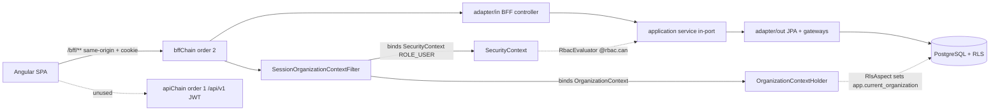

# Design Document: Backend Gateway Integration

## Overview

This spec documents an **already-built, in-progress architecture** that incrementally
migrates the Angular front end from a 100% mock-driven experience to consuming the real
Spring Boot backend-for-frontend (BFF), **module by module, without breaking the mocked
experience**. The default state stays fully mocked; each module can be flipped to the real
backend via a per-module feature flag, and flipping it back restores full mock behavior
with no component changes.

The front end is **Angular 20** (standalone components, functional HTTP interceptors) at
the repo root `c:\git\psf-digital-frontend`. The backend is **Java 21 / Spring Boot 3.5.6**,
a modular-monolith hexagonal architecture with PostgreSQL + Flyway + Row-Level Security (RLS)
and Spring Modulith, located at `c:\git\psf-digital-frontend\backend`, run via
`docker compose up --build`.

The central idea is the **gateway pattern** on the front: for every module there is an
interface, a mock adapter, an HTTP adapter, and an Angular `InjectionToken` whose provider
selects mock vs. HTTP based on environment flags. On the back, a session-based `/bff/**`
chain (cookie CSRF) coexists with a stateless `/api/v1/**` JWT chain, and every BFF request
is bound to a tenant `OrganizationContext` (for RLS) plus a Spring `SecurityContext`
(for RBAC). Where the backend does not yet expose an endpoint, the HTTP adapter delegates
that method to the mock (marked `// PARTIAL`) so screens keep working during migration.

This design reflects the **real existing implementation**, not an aspirational one. It
aligns with and references the existing operator documentation at
`docs/backend-integration.md`.

## Architecture

### Front end — the gateway pattern

Each module is wired as a **quartet**:

1. `I<Module>Service` — the interface the components depend on.
2. `<Module>MockServiceAdapter` — delegates to the pre-existing rich mock service.
3. `<Module>RealService` (HTTP adapter) — talks to the backend BFF over relative `/bff/...` paths.
4. `<MODULE>_SERVICE` `InjectionToken` + provider — picks mock vs. HTTP based on `environment.realApis.<module>`.

Components consume the module **only through the token** (e.g. `@Inject(EXPORTACAO_SERVICE)`),
never the concrete class. This indirection is what makes a flag flip transparent to screens.

```mermaid
graph TD
    C[Component] -->|@Inject MODULE_SERVICE| T[InjectionToken + provider]
    T -->|realApis.module === false| MA[Mock Adapter]
    T -->|realApis.module === true| HA[HTTP Adapter real service]
    MA --> RM[Rich Mock Service pre-existing]
    HA -->|core lifecycle methods| PX[/bff relative path/]
    HA -. "PARTIAL methods" .-> RM
    PX --> IC[HTTP Interceptors]
    IC --> PR[Dev-server proxy proxy.conf.json]
    PR --> BE[Backend BFF :8080 same-origin]
```

Key front-end facts:

- **Flags** live in `src/environments/environment.ts` as `realApis: RealApiFlags`
  (`auth`, `export`, `subscription`, `documents`, `logistics`, `finance`). The type
  intent is that all default to `false`. `useMockServices` and `bffBaseUrl` live there too.
- **Relative paths + proxy**: HTTP adapters use relative `/bff/...` paths because
  `bffBaseUrl` is `''` in dev. The Angular dev-server proxy (`proxy.conf.json`, wired in
  `angular.json` under `serve.development.proxyConfig`) forwards `/bff`, `/v3/api-docs`, and
  `/swagger-ui` to `http://localhost:8080`, making dev requests **same-origin** — no CORS,
  and the session cookie flows naturally.
- **Functional HTTP interceptors** in `src/app/http/`:
  - `credentials.interceptor` — adds `withCredentials: true` on `/bff` calls so the httpOnly
    session cookie flows.
  - `csrf.interceptor` — mirrors the `XSRF-TOKEN` cookie into the `X-XSRF-TOKEN` header for
    mutating (`POST/PUT/PATCH/DELETE`) `/bff` calls, except `/bff/auth/**`.
  - `error.interceptor` — normalizes the backend error envelope
    (`{ code, message, correlationId }`) into a pt-BR `Error`; on `401` for a non-auth
    `/bff` call (and when not already on `/login`), redirects to `/login`.

### Back end — BFF + security + tenant/RLS

- Two Spring Security filter chains:
  - **apiChain** (order 1): matches `/api/v1/**`, **stateless**, JWT-based. Not used by the SPA.
  - **bffChain** (order 2): matches `/bff/**`, `/login/**`, `/actuator/**`, `/webhooks/**`.
    Session-based with cookie CSRF.
- **permitAll / CSRF rules**: `/bff/auth/**`, `/bff/public/**`, swagger, `v3/api-docs`, and
  `actuator/health` are `permitAll`; `/bff/auth/**` is CSRF-exempt.
- **401, not 302**: unauthenticated `/bff` requests return **401** via `HttpStatusEntryPoint`
  (replacing the default `formLogin` 302 redirect), so the SPA can react programmatically.
- **Hexagonal per module**: `domain` (model + ports in/out), `application` (services
  implementing in-ports, emitting outbox events), `adapter/in` (BFF controllers, web
  controllers, workers), `adapter/out` (JPA persistence, gateways). 14 modules: `ai`, `bi`,
  `cms`, `compliance`, `crm`, `document`, `export`, `finance`, `identity`, `intelligence`,
  `logistics`, `organization`, `subscription`, `superadmin`.
- **Tenant/RLS discipline**: `SessionOrganizationContextFilter` reads `EIP_ORG`/`EIP_USER`
  from the session and binds **both** the tenant `OrganizationContext` (via
  `OrganizationContextHolder`, for RLS) **and** a Spring `SecurityContext` Authentication
  (`UsernamePasswordAuthenticationToken` with `ROLE_USER`, for `@PreAuthorize`/`@rbac.can`).
  `RlsAspect` sets `app.current_organization` per `@Transactional`. Multi-tenant isolation
  via RLS is mandatory.



## Components and Interfaces

### Per-module gateway quartet (front)

Representative wiring from the **export** module (the pattern repeats per module):

```typescript
// exportacao-service.interface.ts — the dependency surface for components
export interface IExportacaoService {
  getExportacoes(filters?: ExportacaoFilterOptions): Observable<Exportacao[]>;
  getExportacaoById(id: string): Observable<Exportacao | null>;
  createExportacao(exportacao: Partial<Exportacao>): Observable<Exportacao>;
  getDashboardData(): Observable<ExportacaoDashboard>;
  // ...plus AI, OCR, Siscomex, documents, update/delete (many PARTIAL today)
}

// exportacao-service.token.ts — the flag-driven provider
export const EXPORTACAO_SERVICE = new InjectionToken<IExportacaoService>('ExportacaoService');

export const exportacaoServiceProvider: Provider = {
  provide: EXPORTACAO_SERVICE,
  useClass: environment.realApis?.export
    ? ExportacaoRealService          // HTTP adapter
    : ExportacaoMockServiceAdapter   // mock adapter
};
```

**Responsibilities**:
- Interface — single source of truth for the module's method contract.
- Mock adapter — delegates to the pre-existing rich mock service.
- HTTP adapter — implements core lifecycle methods against `/bff/...`; delegates
  unsupported methods to the injected mock (`// PARTIAL`).
- Token + provider — selects the implementation at provider-resolution time from the flag.

**Known gotcha to respect**: some components historically injected the concrete mock
service directly and had to be switched to the token for the flag to take effect. Any
component that must honor a flag MUST consume the module through its token.

### HTTP interceptors (front)

- `credentialsInterceptor` — scopes to `/bff` calls, clones the request with
  `withCredentials: true`.
- `csrfInterceptor` — for mutating `/bff` requests except `/bff/auth/**`, reads `XSRF-TOKEN`
  cookie and sets `X-XSRF-TOKEN`. SSR-safe (guards `document`).
- `errorInterceptor` — maps the backend error envelope to a pt-BR `Error` (preserving
  `code`, `correlationId`, `status`); routes to `/login` on a `401` for a non-auth `/bff`
  call when not already on `/login`.

### SecurityConfig chains (back)

- `apiChain` (`@Order(1)`): `/api/v1/**`, `SessionCreationPolicy.STATELESS`, JWT resource server.
- `bffChain` (`@Order(2)`): `/bff/**` + `/login/**` + `/actuator/**` + `/webhooks/**`,
  session-based, cookie CSRF, `permitAll` for the public set above, `HttpStatusEntryPoint(401)`.

### SessionOrganizationContextFilter (back)

Reads `EIP_ORG`/`EIP_USER` from the session; binds the tenant `OrganizationContext` and a
`UsernamePasswordAuthenticationToken(ROLE_USER)` into the `SecurityContext` for the duration
of the request. This is the bridge that lets RLS and RBAC both work off the session.

### RbacEvaluator (back)

Exposed as `@rbac` for `@PreAuthorize("@rbac.can(...)")`. **Currently returns `true` for any
authenticated principal** (mock-permissive). It is a deliberate placeholder for a future
per-org permission matrix. Documented as an open question below.

## Data Flow — Login + Protected Dashboard GET

### Stepped auth flow (BFF)

`POST /bff/auth/identify` → `/login` (password) → `/mfa/verify` → optional
`/select-organization`. Session attributes `EIP_USER`/`EIP_ORG` are bound when the flow
reaches `AUTHENTICATED`. Dev seed user: `alan@eip.exemplo` / `senha123`; MFA accepts any
6 digits; single-org users auto-select (session bound in `verifyMfa` on that path).

```mermaid
sequenceDiagram
    participant U as User
    participant SPA as Angular SPA
    participant IC as Interceptors
    participant PX as Dev proxy
    participant BFF as Backend bffChain
    participant F as SessionOrgContextFilter
    participant DB as PostgreSQL + RLS

    U->>SPA: enter identifier
    SPA->>IC: POST /bff/auth/identify (credentials IC adds withCredentials; CSRF-exempt)
    IC->>PX: /bff/auth/identify
    PX->>BFF: forward (same-origin)
    BFF-->>SPA: 200 (step: PASSWORD) + session cookie
    SPA->>BFF: POST /bff/auth/login (senha123)
    BFF-->>SPA: 200 (step: MFA)
    SPA->>BFF: POST /bff/auth/mfa/verify (any 6 digits)
    BFF-->>SPA: 200 AUTHENTICATED (single-org auto-select; EIP_USER/EIP_ORG bound)

    Note over SPA,DB: Later — protected dashboard GET
    SPA->>IC: GET /bff/exportacoes/dashboard
    IC->>PX: withCredentials (session cookie attached)
    PX->>BFF: forward
    BFF->>F: filter reads EIP_ORG/EIP_USER
    F->>F: bind OrganizationContext + SecurityContext (ROLE_USER)
    F->>BFF: controller -> service (@rbac.can -> true today)
    BFF->>DB: @Transactional (RlsAspect sets app.current_organization)
    DB-->>BFF: tenant-scoped rows
    BFF-->>SPA: 200 dashboard payload
    Note over SPA: forkJoin(mock, backend) + map overlays real counters; catchError falls back to mock
```

If the session is missing/expired, the protected GET returns **401**; the
`errorInterceptor` redirects to `/login` (non-auth `/bff` only).

## PARTIAL / Hybrid Fallback Strategy

The migration never requires the backend to reach parity before a module can be flipped.
Two complementary techniques keep screens working:

1. **Method-level PARTIAL delegation** — within an HTTP adapter, methods the backend does
   not yet expose delegate to the injected mock, marked `// PARTIAL`. Example surfaces that
   remain PARTIAL today: export (dashboard rich fields, AI, OCR, Siscomex, documents, update,
   delete), subscription (plan/add-on catalog, LGPD data export, SaaS metrics),
   logistics (update/delete, routes, AI route suggestion, tracking timeline, document
   generation), finance (reconciliations, notifications, timelines, AI insights, metrics,
   cash-flow projection, dropdown catalogs).

2. **Dashboard overlay (`forkJoin`)** — dashboards call `forkJoin(mock$, backend$)` and
   `map` the real counters over the mock-rich data so real aggregates (totals, per-status
   breakdowns) replace mock numbers while rich fields (top países/produtos, risk alerts,
   AI/compliance metrics) still come from the mock. `catchError` falls back entirely to the
   mock on failure. This only applies when the module flag is `true`.

**Additive backend dashboards** (purely additive — new use-case method + service impl +
controller method; nothing existing modified):
`GET /bff/exportacoes/dashboard`, `GET /bff/crm/oportunidades/dashboard`,
`GET /bff/logistica/embarques/dashboard`.

## Migration Strategy & Per-Module Status

**Strategy**: migrate one module at a time by (a) building/validating its gateway quartet,
(b) ensuring consuming components inject via the token, (c) flipping its `realApis` flag,
(d) verifying end-to-end, keeping unsupported methods PARTIAL. Backend changes stay additive
so the backend keeps booting; the front build must stay exit 0 at every increment.

| Module | Front gateway | Consumed in screens | Backend dashboard | Flag |
|--------|---------------|---------------------|-------------------|------|
| auth | Built | Yes (login flow) | n/a | `auth` |
| export | Built | Yes (lista + acompanhar-status via `getDashboardData`) | Ready | `export` |
| subscription | Built | In-app consumers (assinatura, exportar-dados) | n/a | `subscription` |
| documents | Built (generic) | Not re-wired (4 rich doc screens stay mock) | n/a | `documents` |
| logistics | Built | Yes (embarque-lista "Resumo de Embarques" via `getDashboard()`) | Ready | `logistics` |
| finance | Built (pagamentos/câmbio/hedge) | Core lifecycle only | n/a | `finance` |
| crm | **Not built yet** | No | Ready (unconsumed) | n/a |

**End-to-end validated**: login (auth) + export list + dashboards; same-origin via proxy;
session cookie + 401 handling all working.

## Error Handling

- **401 → login redirect**: `errorInterceptor` redirects to `/login` on a `401` for a
  non-auth `/bff` call (not already on `/login`). Backend returns raw **401**
  (`HttpStatusEntryPoint`), never a 302, so the SPA controls navigation.
- **CSRF**: mutating `/bff` writes require `X-XSRF-TOKEN` mirrored from the `XSRF-TOKEN`
  cookie; `/bff/auth/**` is CSRF-exempt. Missing cookie → request proceeds without the
  header (backend enforces).
- **Error envelope normalization**: backend `{ code, message, correlationId }` is mapped to
  a pt-BR `Error` carrying `code`/`correlationId`/`status` for snackbars.
- **Anti-enumeration auth**: the stepped auth flow and dev seed behavior (MFA accepts any 6
  digits in dev; single-org auto-select) are dev conveniences; the flow returns consistent
  step responses rather than leaking which factor failed. Dev-only seed credentials are
  acceptable and documented; no secrets are stored.
- **PARTIAL/overlay failures**: dashboard `forkJoin` uses `catchError` to fall back to mock,
  so a backend outage degrades to the mock experience rather than an error screen.

## Testing Strategy

### Front build gate
`npx ng build --configuration=development` MUST exit 0 at every increment. This is the
primary regression gate for the front.

### Backend docker boot
`docker compose up --build` from `backend/`. Success signals: `Started EipBackendApplication`,
`Tomcat started on port 8080`, Flyway applies migrations (no persistent DB volume — Flyway
reapplies each boot), 45+ JPA repositories loaded. Health: `GET /actuator/health` → `UP`.
Contract: `GET /v3/api-docs` / `/swagger-ui.html`.

### End-to-end (same-origin via proxy)
1. Set the module flags under test to `true` in `src/environments/environment.ts`
   (e.g. `auth` + `export`).
2. Run `ng serve --configuration=development` (proxy forwards `/bff` to `:8080`).
3. Login: identifier → `senha123` → MFA any 6 digits.
4. Exercise the screen (e.g. `/exportacoes/gerenciar` → `GET /bff/exportacoes` + dashboard).

### Verifying a module after flipping its flag
- Confirm consuming components inject via the token (not the concrete mock).
- Flag `true`: core lifecycle hits `/bff/...`; PARTIAL methods still return mock data; screen
  renders without errors; 401 handling redirects to `/login` when the session is absent.
- Flag back to `false`: full mock behavior restored with no component changes (reversibility).

### Property-based testing applicability
This spec documents architecture/integration wiring (flag-driven provider selection, security
chains, RLS/tenant binding, proxy same-origin behavior) rather than pure input/output
transformation logic. Verification is therefore **build gates, docker boot smoke checks, and
e2e flows**, not property-based tests. A Correctness Properties section will be added in the
requirements phase only for criteria that are genuinely universal (e.g. reversibility: for any
module, flag `false` ⇒ mock behavior).

## Dependencies

- **Front**: Angular 20 (standalone, functional interceptors), RxJS (`forkJoin`, `catchError`,
  `map`), Angular dev-server proxy.
- **Back**: Java 21, Spring Boot 3.5.6, Spring Security (two chains), Spring Modulith,
  PostgreSQL, Flyway, springdoc-openapi 2.8.9, Docker Compose.
- **Docs**: aligns with `docs/backend-integration.md` (gateways, flags, dashboard endpoints,
  run/verify steps).

## Open Questions

1. **CRM front gateway not built** — the backend `GET /bff/crm/oportunidades/dashboard` is
   ready but unconsumed. Build the CRM quartet and wire it following the hybrid pattern?
2. **RbacEvaluator is a placeholder** — `@rbac.can` returns `true` for any authenticated
   principal. When and how is the real per-org permission matrix introduced, and does that
   change front behavior (e.g. 403 handling)?
3. **Migration order** — which modules migrate next after export/logistics/auth? Candidates
   with ready gateways: subscription, documents, finance. CRM needs a gateway first.
4. **OpenAPI client** — docs mention generating a typed TypeScript client from `/v3/api-docs`
   as the long-term path to replace manual `HttpClient` calls. In scope for this spec?
5. **Rich document screens** — the 4 rich document screens (invoice, packing-list,
   bill-of-lading, certificados) do not map to the generic backend document model. Keep them
   on mock indefinitely, or model them on the backend later?
