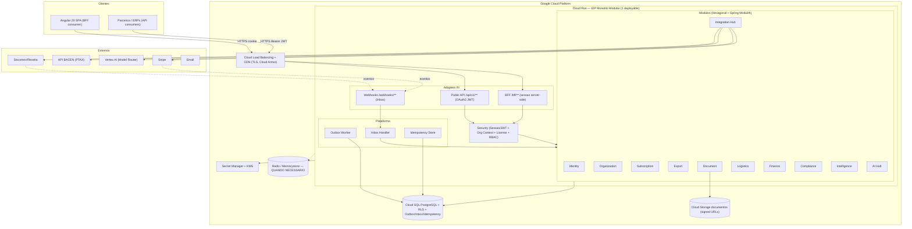
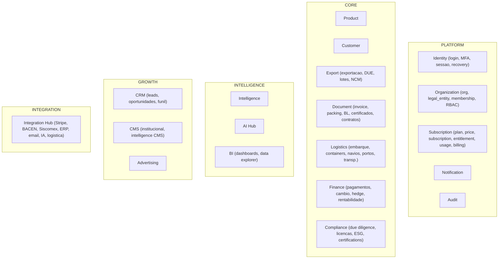
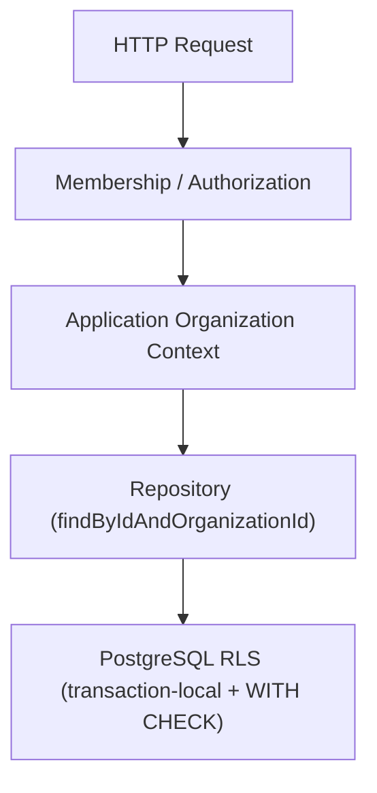
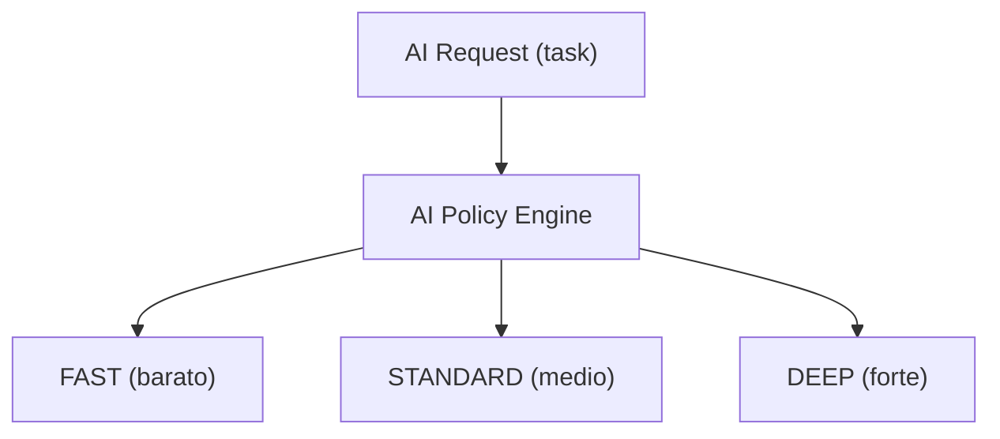
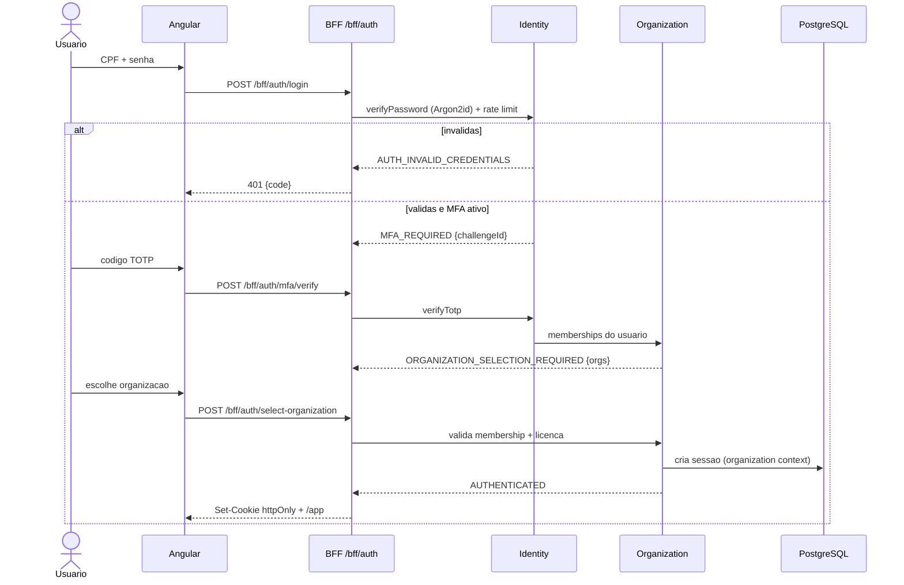
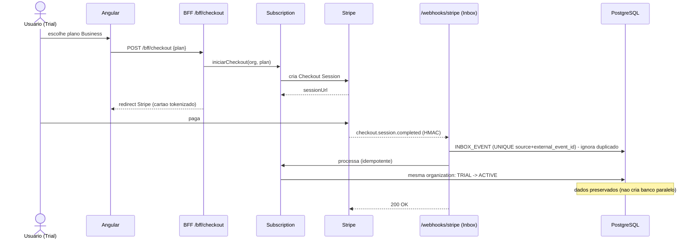
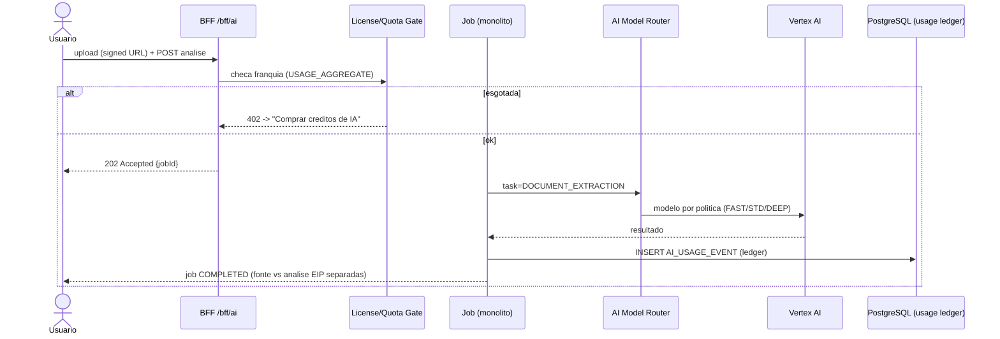
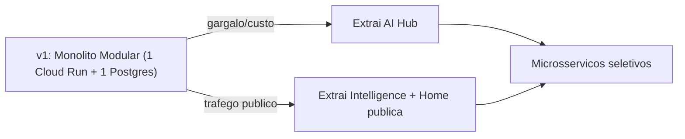

# EIP — Arquitetura de Backend (Monólito Modular Hexagonal)

> Documento de arquitetura para a plataforma EIP (Export Intelligence Platform).
> Objetivo: sair do front mockado para um backend real, seguro, barato de operar e pronto para escalar — sem cair no custo de microsserviços prematuros.
> **Versão: 1.1** · Autor: Arquitetura EIP · Status: proposta revisada para implementação.

## Changelog (v1.0 → v1.1)

Revisão técnica incorporada antes da primeira linha de implementação. Cinco correções bloqueadoras e diversas melhorias:

1. **RLS corrigido** para contexto *transaction-local* (`set_config(..., true)`), com `WITH CHECK`, `FORCE ROW LEVEL SECURITY` e role de aplicação sem bypass — o exemplo anterior (aspecto por transação com `SET` de sessão) tinha risco de vazamento por reuso de conexão do pool.
2. **Modelo multi-tenant** passa a usar `ORGANIZATION` como boundary e `LEGAL_ENTITY` (CNPJ) como filho — evita migração dolorosa no primeiro grupo com 2 CNPJs.
3. **Outbox + Inbox + Idempotência** viram componentes de plataforma (não só Stripe), tudo em PostgreSQL.
4. **Autenticação** desambiguada: usuário humano usa sessão server-side via BFF (Identity interno); máquina usa OAuth2 client_credentials na Public API. Não construiremos um Authorization Server completo na V1.
5. **IA** deixa de fixar "Gemini 1.5 Flash" (modelo aposentado) e passa a um **Model Router** por política de tarefa, com o modelo em configuração, não no domínio.

Outras melhorias: separação de módulos (Identity/Organization/Subscription; Billing fora do CRM; Integration Hub próprio), política de criptografia em 3 níveis, tratamento de CPF, storage seguro com signed URLs, upload/processamento assíncrono, orçamento de conexões (Cloud Run × Hikari × Cloud SQL), índices multi-tenant, paginação/cursor, optimistic locking, dinheiro em BigDecimal, UTC/timestamptz, UUIDv7, Spring Modulith + ArchUnit, contract-first (OpenAPI) a partir dos mocks, migração gradual por gateway no front, Redis opcional no dia 1, e custo de cloud tratado como estimativa a dimensionar.

## Sumário

1. Contexto e princípios
2. Decisões de arquitetura (ADRs)
3. Modelo multi-tenant: Organization e Legal Entity
4. Visão de contêiner (C4)
5. Mapa de módulos (bounded contexts)
6. Estrutura de pacotes (hexagonal) + Spring Modulith
7. Segurança: autenticação, autorização e criptografia
8. Isolamento de dados: RLS + defesa em profundidade
9. Plataforma: Idempotência, Outbox e Inbox
10. Exemplos de código
11. IA: Model Router, metering e custo
12. Storage de documentos e processamento assíncrono
13. Performance e escalabilidade (orçamento de conexões, índices, paginação)
14. Catálogo de endpoints (mock → REST) e contract-first
15. Diagramas de sequência
16. Cloud e custo (GCP)
17. Observabilidade, auditoria e qualidade
18. Estratégia de evolução (monólito → microsserviços)
19. Roadmap de implementação
20. Riscos e mitigação

---

## 1. Contexto e princípios

O EIP é um SaaS B2B multiempresa (por **Organization**, que agrupa um ou mais CNPJs) para gestão e inteligência de comércio exterior. O front-end Angular 20 já existe com ~55 serviços mockados cobrindo Identity, Exportações, Documentos, Logística, Financeiro, Compliance, CRM, BI, IA, SaaS/Billing, Intelligence, CMS e Admin. Esta arquitetura os transforma em endpoints reais sem quebrar nenhuma tela.

Princípios:

- **Domínio no centro (Hexagonal / Ports & Adapters).** O núcleo não conhece Spring, JPA, HTTP nem fornecedores (Stripe, IA). Frameworks são detalhes plugáveis.
- **Custo primeiro.** Um único artefato implantável, um banco, escala a zero. Redis e brokers só quando doer.
- **Fronteiras de microsserviço já desenhadas.** Módulos se comunicam por ports publicados e eventos de domínio confiáveis (Outbox). Extração futura sem reescrever regra.
- **Seguro por padrão.** OAuth2 só onde faz sentido, isolamento reforçado no banco (RLS transaction-local + WITH CHECK), segredos em KMS/Secret Manager, cartão nunca trafega pelo EIP, defesa em profundidade.
- **Confiável por padrão.** Idempotência e Outbox/Inbox como plataforma desde o dia 1, para não fazer retrofit em 200 endpoints depois.
- **Dois consumidores, um núcleo.** BFF (sessão server-side) para o Angular; Public API (OAuth2 client_credentials) para parceiros. Mesmos casos de uso.

## 2. Decisões de arquitetura (ADRs)

| # | Decisão | Escolha | Descartado | Motivo |
|---|---|---|---|---|
| ADR-01 | Estilo | Monólito modular | Microsserviços | Custo/operação; extração preservada por ports |
| ADR-02 | Organização interna | Hexagonal + Spring Modulith | Camadas técnicas puras | Isola domínio; fronteiras verificadas em teste |
| ADR-03 | Runtime | Java 21 + Spring Boot 3.x + Virtual Threads (com load test) | WebFlux reativo | Concorrência I/O sem complexidade; validar pinning/pool |
| ADR-04 | API do front | BFF com sessão server-side (cookie httpOnly) | SPA com token no browser | Segurança; payload sob medida |
| ADR-05 | API de clientes | Public API /api/v1/** + OAuth2 client_credentials | Expor BFF | Contrato estável e escopos |
| ADR-06 | Identidade V1 | Identity interno + sessão; sem Authorization Server próprio | AS/OIDC completo já | Reduz complexidade antes de ter cliente |
| ADR-07 | Multi-tenant boundary | ORGANIZATION (CNPJ = LEGAL_ENTITY) | tenant_id = CNPJ | Evita migração no 1º grupo econômico |
| ADR-08 | Isolamento | RLS transaction-local + WITH CHECK + FORCE + role sem bypass | SET de sessão por aspecto | Pool de conexões pode vazar contexto |
| ADR-09 | Persistência | PostgreSQL + Flyway | NoSQL já | Relacional cobre o domínio |
| ADR-10 | Confiabilidade | Idempotência + Outbox + Inbox em PostgreSQL | Publicar evento in-process solto | Evita evento perdido/fantasma |
| ADR-11 | Cache/fila | Opcional; PostgreSQL + Caffeine primeiro, Redis quando distribuído | Redis obrigatório no dia 1 | Memorystore cobra mesmo ocioso |
| ADR-12 | IA | Model Router por política; modelo em config | Fixar Gemini 1.5 Flash (aposentado) | Modelos mudam de geração rápido |
| ADR-13 | Cloud | GCP (Cloud Run + Cloud SQL) | AWS/Azure | Scale-to-zero + Vertex AI na mesma nuvem |
| ADR-14 | Contratos | Contract-first OpenAPI derivado dos mocks | Endpoint improvisado | Alinha front/back; gera client tipado |

Cada ADR pode virar arquivo em docs/adr/ quando o time crescer.

## 3. Modelo multi-tenant: Organization e Legal Entity

O boundary de isolamento é **Organization**, não o CNPJ. Um CNPJ é uma **Legal Entity** dentro da organização. Assim, um grupo econômico com vários CNPJs continua sendo um único tenant.

```text
ORGANIZATION            (boundary multi-tenant = tenant_id)
    │
    ├── LEGAL_ENTITY / CNPJ 1
    ├── LEGAL_ENTITY / CNPJ 2
    └── LEGAL_ENTITY / CNPJ N
```

Regras:
- Toda tabela de negócio carrega `organization_id` (o "tenant_id" técnico aponta para ORGANIZATION).
- Documentos fiscais, contratos e operações referenciam a `legal_entity_id` quando o CNPJ importa.
- `USER` é global de identidade; o vínculo com a organização é `ORGANIZATION_MEMBERSHIP` (papel/role por organização). Um usuário pode ter membership em várias organizações e escolhe em qual trabalhar após autenticar.
- Autenticação ≠ contexto: o `organization_id` só entra na sessão/contexto **após** a seleção de organização.

Isso está alinhado ao portal público já construído (login → MFA → seleção de empresa) e evita migração dolorosa quando surgir o primeiro grupo com dois CNPJs.

## 4. Visão de contêiner (C4)



## 5. Mapa de módulos (bounded contexts)

Proposta revisada, separando o que tem ciclos de vida diferentes (Identity/Organization/Subscription) e tirando Billing de dentro do CRM.



Comunicação entre módulos:
- **Síncrona**: via port IN (interface de use case) de outro módulo, injetada por Spring. Ex.: Subscription consulta Organization para validar o tenant.
- **Assíncrona confiável**: via **evento de domínio persistido no Outbox** na mesma transação; um worker publica para os handlers. Ex.: `ExportacaoCriada` → Intelligence e BI reagem sem acoplamento e sem risco de evento fantasma/perdido.

Regra de ouro: módulos só se falam por ports ou eventos — nunca acessando repositório/tabela um do outro. Spring Modulith + ArchUnit verificam isso em teste.

## 6. Estrutura de pacotes (hexagonal) + Spring Modulith

```
com.eip
├── bootstrap/                 # @SpringBootApplication, config, profiles
├── platform/                  # kernel ESTRITO e transversal (nao virar lixeira)
│   ├── security/              # SecurityConfig, OrgContext, RbacEvaluator, LicenseGate
│   ├── tenant/                # OrganizationContextHolder + RLS connection prep
│   ├── idempotency/           # IdempotencyStore, @Idempotent
│   ├── outbox/                # OutboxEvent, OutboxPublisher, OutboxWorker
│   ├── inbox/                 # InboxEvent, InboxProcessor
│   ├── observability/         # correlationId, tracing, logging
│   ├── error/                 # ApiError, GlobalExceptionHandler
│   └── clock/                 # Clock, time utilities
└── modules/
    └── export/
        ├── domain/            # PURO Java (sem Spring/JPA)
        │   ├── model/         # Exportacao, DUE, Lote (aggregates, VOs)
        │   ├── event/         # ExportacaoCriada
        │   └── port/{in,out}/ # UseCases; RepositoryPort, DocumentGatewayPort
        ├── application/       # casos de uso; @Service; @Transactional
        └── adapter/{in/{bff,web},out/{persistence,...}}
```

Diretrizes:
- Direção de dependência sempre para dentro: `adapter → application → domain`. Domínio testável sem Spring/banco.
- `platform/` (antigo `shared/`) é **estrito**: só security, tenant, idempotency, outbox, inbox, observability, error, clock. **Proibido** `CustomerDto`, `ExportUtils`, helpers de domínio. ArchUnit falha o build se alguém colocar regra de negócio ali.
- **Spring Modulith** define cada pasta sob `modules/` como um módulo com API publicada; testes `ApplicationModules.verify()` proíbem import cruzado indevido. ArchUnit reforça (domínio não importa Spring/JPA; adapter não é importado por application).
- Entidades JPA só em `adapter/out/persistence`, mapeadas para o domínio por Mapper. Injeção por construtor; nada de `@Autowired` em campo.

## 7. Segurança: autenticação, autorização e criptografia

### 7.1 Autenticação (desambiguada)

| Consumidor | Fluxo | Sessão | Uso |
|---|---|---|---|
| Usuário humano (Angular) | Identity interno EIP (CPF+senha → MFA → seleção de org) | **Sessão server-side** + cookie httpOnly | Todo o /app |
| Parceiro/ERP (máquina) | OAuth2 **client_credentials** | Stateless JWT | Public API /api/v1/** |
| Federação (futuro) | OIDC/SAML (Entra ID, Google Workspace) via adapter | — | Quando houver demanda enterprise |

Na V1 **não construímos um Authorization Server completo**. Usuário humano = sessão server-side segura; máquina = OAuth2 client_credentials, e a Public API não deve atrasar o backend operacional (é fase P2).

Cookie de sessão: `HttpOnly=true`, `Secure=true`, `SameSite=Lax/Strict` conforme fluxo, `Path` restrito, e **CSRF real** no BFF. Nenhum token sensível acessível ao JavaScript.

### 7.2 Autorização — três camadas, nesta ordem

1. **AuthN**: sessão/JWT válidos?
2. **Organization Context + Membership**: o usuário tem membership ativo na organização selecionada?
3. **License Gate** (assinatura): ACTIVE / READ_ONLY / BILLING_ONLY / NONE (espelha o `authProfileService`). READ_ONLY bloqueia create/edit/delete; BILLING_ONLY só /assinatura; NONE bloqueia tudo.
4. **RBAC**: o perfil pode `view/create/edit/delete/export` na tela? Evoluir para **Permission** granular + **resource ownership** (a linha pertence à organização/ao dono).

### 7.3 Criptografia — política em três níveis

**Nível 1 — senhas (hash, nunca criptografia reversível):** Argon2id parametrizado e atualizável. Recovery codes de MFA também por hash (não precisam ser recuperados).

**Nível 2 — segredos recuperáveis (criptografia com envelope encryption):** TOTP secret, credenciais de integração, refresh tokens externos, chaves/certificados. Padrão:
```text
Application → Data Encryption Key (DEK) → AES-256-GCM
                     ↑
                 KMS protege a DEK (Cloud KMS)
```
Armazenar `secret_ciphertext` + `key_version` (nunca plaintext).

**Nível 3 — dados gerais:** criptografia em repouso da cloud (Cloud SQL/Storage) + TLS em trânsito. Campos especialmente sensíveis podem ganhar criptografia adicional na aplicação quando justificado.

### 7.4 CPF (dado pessoal)

Nunca em logs, URLs, correlationId, analytics ou payload de evento genérico. Se for necessário buscar por CPF, usar abordagem determinística sem CPF em claro no índice:
```text
cpf_ciphertext   (Nivel 2, recuperavel)
cpf_lookup_hash  = HMAC(cpf_normalizado, chave server-side)
```
Lookup por `cpf_lookup_hash`. Decisão registrada em ADR; não obrigatória na primeira migration se o modelo de ameaça/custo não justificar.

## 8. Isolamento de dados: RLS + defesa em profundidade

Três barreiras — RLS é a **última**, não desculpa para código sem isolamento:



### 8.1 Contexto transaction-local (corrige o risco de pool)

O contexto do tenant deve viver **na transação**, não na sessão da conexão (que volta ao pool e pode ser reusada por outro tenant). Usar `set_config(..., is_local=true)`:

```sql
-- executado no inicio de cada transacao, ligado a ela
SELECT set_config('app.current_organization', :orgId, true);
```

```java
// platform/tenant/OrganizationRlsPreparer.java
// Chamado no boundary transacional (ex.: TransactionSynchronization / interceptor JPA)
void prepare(Connection cx, String orgId) throws SQLException {
    try (var ps = cx.prepareStatement("SELECT set_config('app.current_organization', ?, true)")) {
        ps.setString(1, orgId);   // is_local = true -> escopo da transacao
        ps.execute();
    }
}
```

### 8.2 Policy defensiva com WITH CHECK + FORCE

```sql
ALTER TABLE export ENABLE ROW LEVEL SECURITY;
ALTER TABLE export FORCE ROW LEVEL SECURITY;   -- vale ate para o dono da tabela

CREATE POLICY organization_isolation ON export
  USING (
    organization_id = NULLIF(current_setting('app.current_organization', true), '')::uuid
  )
  WITH CHECK (
    organization_id = NULLIF(current_setting('app.current_organization', true), '')::uuid
  );
```
- `USING` impede **ler** linha de outra organização.
- `WITH CHECK` impede **inserir/alterar** linha com `organization_id` de outra organização.
- A aplicação conecta com **role sem BYPASSRLS** e que não seja superuser.

### 8.3 Teste obrigatório de vazamento (o teste de segurança mais importante)

```text
GIVEN Org A tem Export EA e Org B tem Export EB
WHEN  usuario autenticado em A consulta EB pelo UUID
THEN  0 dados de B sao retornados (e INSERT/UPDATE com org de B falha)
```
Repetir automaticamente para export, document, finance, customer, product, logistics, compliance, audit e storage.

## 9. Plataforma: Idempotência, Outbox e Inbox

### 9.1 Idempotência (componente de plataforma, não só Stripe)

```text
IDEMPOTENCY_RECORD
  id · organization_id · key · operation
  request_hash · response_status · response_ref
  created_at · expires_at
  UNIQUE(organization_id, operation, key)
```
Cliente envia header `Idempotency-Key`. Obrigatória em: criar exportação, criar invoice, gerar documento, iniciar checkout, solicitar exportação de dados, criar pagamento, ação de IA cara, processar webhook, criar embarque e comandos de integrações.
```text
POST + key ABC → nao existe → processa → salva resultado
POST + key ABC (repetido, mesmo payload) → retorna o MESMO resultado
POST + key ABC (payload diferente) → 409 IDEMPOTENCY_KEY_REUSED
```

### 9.2 Transactional Outbox (evento confiável)

Evita evento fantasma (rollback após publish) e evento perdido (crash após commit). Sem Kafka/RabbitMQ — só PostgreSQL:
```text
OUTBOX_EVENT
  id · aggregate_type · aggregate_id · organization_id
  event_type · payload
  occurred_at · available_at · processed_at
  attempts · last_error
```
```text
BEGIN
  INSERT export
  INSERT outbox_event          -- mesma transacao
COMMIT
        ↓
Outbox Worker (poll + FOR UPDATE SKIP LOCKED)
        ↓
Application Event → handlers (Intelligence, BI, Notification...)
```

### 9.3 Inbox (eventos externos idempotentes)

```text
INBOX_EVENT
  source · external_event_id · payload_hash
  status · received_at · processed_at
  UNIQUE(source, external_event_id)
```
Para Stripe, Siscomex, ERP, banco, transportadora. Webhook duplicado é ignorado; perdido é reprocessável. Padrão oficial do EIP: **Outbox para sair, Inbox para entrar.**

## 10. Exemplos de código

### 10.1 Domínio puro

```java
// modules/export/domain/model/Exportacao.java
public class Exportacao {
    private final ExportacaoId id;
    private final OrganizationId organizationId;
    private ExportacaoStatus status;
    private final List<ItemExportacao> itens;
    private long version;   // optimistic locking

    public void confirmar() {
        if (itens.isEmpty())
            throw new ExportacaoInvalidaException("Exportacao sem itens nao pode ser confirmada");
        if (this.status != ExportacaoStatus.RASCUNHO)
            throw new ExportacaoInvalidaException("Somente rascunho pode ser confirmado");
        this.status = ExportacaoStatus.CONFIRMADA;
    }
}
```

### 10.2 Ports

```java
public interface CriarExportacaoUseCase {
    ExportacaoView criar(CriarExportacaoCommand cmd);
}

public interface ExportacaoRepositoryPort {
    Exportacao salvar(Exportacao e);
    Optional<Exportacao> porId(ExportacaoId id, OrganizationId org);
    Page<Exportacao> listar(OrganizationId org, ExportacaoFiltro f, PageQuery page);
}
```

### 10.3 Application com Outbox na mesma transação

```java
@Service
@RequiredArgsConstructor
public class ExportacaoService implements CriarExportacaoUseCase {
    private final ExportacaoRepositoryPort repo;
    private final OutboxPublisher outbox;   // grava OUTBOX_EVENT na MESMA tx

    @Override @Transactional
    public ExportacaoView criar(CriarExportacaoCommand cmd) {
        var org = OrganizationContextHolder.current();
        var exportacao = Exportacao.novaRascunho(org, cmd.itens());
        repo.salvar(exportacao);
        outbox.record(new ExportacaoCriada(exportacao.id(), org)); // confiavel
        return ExportacaoView.from(exportacao);
    }
}
```

### 10.4 Idempotência no controller (BFF)

```java
@PostMapping
@PreAuthorize("@rbac.can('exportacoes/gerenciar','create')")
public ExportacaoView criar(@RequestHeader("Idempotency-Key") String key,
                            @Valid @RequestBody CriarExportacaoRequest req) {
    return idempotency.execute("export.create", key, req, () -> criar.criar(req.toCommand()));
}
```

### 10.5 Public API (cliente OAuth2)

```java
@RestController
@RequestMapping("/api/v1/exportacoes")
@RequiredArgsConstructor
class ExportacaoApiController {
    private final CriarExportacaoUseCase criar;

    @PostMapping
    @PreAuthorize("hasAuthority('SCOPE_exportacoes:write')")
    public ResponseEntity<ExportacaoResource> criar(@Valid @RequestBody CriarExportacaoApiRequest req) {
        var view = criar.criar(req.toCommand());
        return ResponseEntity.created(URI.create("/api/v1/exportacoes/" + view.id()))
                             .body(ExportacaoResource.from(view));
    }
}
```

### 10.6 Segurança — dois filtros

```java
@Configuration @EnableMethodSecurity
public class SecurityConfig {
    @Bean @Order(1)
    SecurityFilterChain apiChain(HttpSecurity http) throws Exception {
        http.securityMatcher("/api/v1/**")
            .authorizeHttpRequests(a -> a.anyRequest().authenticated())
            .oauth2ResourceServer(o -> o.jwt(j -> j.jwtAuthenticationConverter(scopes())))
            .sessionManagement(s -> s.sessionCreationPolicy(SessionCreationPolicy.STATELESS))
            .csrf(CsrfConfigurer::disable);
        return http.build();
    }
    @Bean @Order(2)
    SecurityFilterChain bffChain(HttpSecurity http) throws Exception {
        http.securityMatcher("/bff/**", "/login/**")
            .authorizeHttpRequests(a -> a
                .requestMatchers("/bff/public/**").permitAll()
                .anyRequest().authenticated())
            .formLogin(Customizer.withDefaults())        // Identity interno + sessao
            .csrf(c -> c.csrfTokenRepository(CookieCsrfTokenRepository.withHttpOnlyFalse()));
        return http.build();
    }
}
```

### 10.7 Optimistic locking, dinheiro e datas

```java
// Entidade JPA (adapter/out/persistence) — NAO o modelo de dominio
@Entity @Table(name = "export")
class ExportacaoEntity {
    @Id UUID id;
    @Column(nullable=false) UUID organizationId;
    @Version long version;                 // 409 CONCURRENT_MODIFICATION em conflito
    @Column(columnDefinition="timestamptz") OffsetDateTime createdAt; // UTC
}

// Dinheiro e cambio: sempre BigDecimal + moeda + escala/arredondamento explicitos
record Money(BigDecimal amount, Currency currency) { /* nunca double */ }
```

### 10.8 Contrato de erro (com detalhes de validação)

```json
{
  "code": "VALIDATION_ERROR",
  "message": "Existem campos invalidos.",
  "correlationId": "b1c2-...",
  "errors": [
    { "field": "destinationCountry", "code": "REQUIRED" }
  ]
}
```
Nunca vazar stack trace, SQL ou nomes internos. `@RestControllerAdvice` global mapeia exceções de domínio para códigos estáveis (ex.: `AUTH_INVALID_CREDENTIALS`, `IDEMPOTENCY_KEY_REUSED`, `CONCURRENT_MODIFICATION`).

### 10.9 IDs

`UUIDv7` para novas entidades quando a lib suportar bem (mesmas vantagens de UUID com melhor localidade temporal de índice que UUIDv4). Otimização secundária — não atrasar o projeto por isso.

## 11. IA: Model Router, metering e custo

**Não fixar um modelo específico no domínio** (Gemini 1.5 Flash foi aposentado; modelos trocam de geração rápido). O domínio depende de `AiGatewayPort`; a escolha do modelo é **configuração + roteamento**.

```text
AI_MODEL_CONFIG          AI_TASK_POLICY
  provider                 NCM_CLASSIFICATION
  model                    DOCUMENT_SUMMARY
  task                     TRANSLATION
  priority (FAST/STD/DEEP) RISK_ANALYSIS
  cost_class               DOCUMENT_EXTRACTION
  enabled                  CHAT
```



Trocar provedor (Vertex AI ↔ OpenAI ↔ Anthropic) = novo adapter/config, sem tocar no domínio.

### 11.1 Metering — PostgreSQL é o ledger, cache é secundário

Redis/Caffeine podem acelerar checagem de franquia, mas **o registro confiável de uso/faturamento é o PostgreSQL**:
```text
AI_USAGE_EVENT
  id · organization_id · user_id · operation
  provider · model · input_units · output_units · ocr_pages
  provider_cost · eip_credits · request_id · idempotency_key · created_at
        ↓ agregacao
USAGE_AGGREGATE (por organizacao/mes)
```
Liga direto no modelo comercial (franquia por plano; ao passar de 80% mostra CTA de AI Pack). Governança: separar **fonte externa** de **análise EIP AI**; conteúdo sensível pode exigir revisão humana (Intelligence CMS); sanitizar entrada; nunca enviar PII/segredo desnecessário ao provedor.

## 12. Storage de documentos e processamento assíncrono

RLS protege o PostgreSQL, **não** o Cloud Storage. Portanto:

- Chave organizada e opaca: `/organizations/{organizationId}/documents/{documentId}/{objectId}` — mas conhecer o caminho **não** dá acesso.
- Download sempre mediado e com URL assinada de curta duração:
```text
GET /bff/documents/{id}/download
  → autenticar → membership → permissao → organizacao → ownership do documento
  → gerar signed URL de curta duracao
```
- Metadados no banco:
```text
DOCUMENT
  id · organization_id · legal_entity_id · storage_key
  original_filename · media_type · size_bytes · sha256
  classification · upload_status · scan_status · created_at
```
`sha256` serve para integridade, deduplicação, auditoria e idempotência.

### 12.1 Upload direto ao storage (não pelo container)
```text
Angular → (pede) → Backend → signed upload URL
Angular ──(PUT arquivo)──► Cloud Storage ──(finalize event)──► Backend
```
Evita ocupar memória/CPU do Cloud Run durante uploads grandes.

### 12.2 Processamento pesado é assíncrono (job)
OCR, IA, ZIP de exportação, relatórios grandes não bloqueiam HTTP:
```text
POST /document-analysis → 202 Accepted { "jobId": "..." }
Job: QUEUED → PROCESSING → COMPLETED | FAILED
```
No início o worker roda **dentro do mesmo monólito** (fila em PostgreSQL com `FOR UPDATE SKIP LOCKED`). Não precisa microsserviço nem broker.

## 13. Performance e escalabilidade

### 13.1 Orçamento de conexões (crítico)
Cloud SQL pequeno não suporta milhares de conexões. A regra precisa ser planejada desde o início:
```text
max_instances (Cloud Run) × max_pool_size (Hikari) ≤ orcamento_conexoes (Cloud SQL)
```
Início conservador: `min instances: 0`, `max instances: baixo/controlado`, `concurrency` calibrada, **Hikari pool pequeno** (ex.: 5–10). Depois, load test. Atenção: **Cloud Run escala a zero, mas Cloud SQL não** — a instância de banco continua ligada e cobrando.

### 13.2 Virtual Threads com cautela
Java 21 + Virtual Threads é razoável, mas exige habilitação explícita no Spring e cuidado com *pinning* (blocos `synchronized`/JDBC podem "pinar" a carrier thread). Fazer **load test** antes de assumir ganho; considerar `spring.main.keep-alive` quando aplicável. O gargalo tende a ser o **banco**, não as threads.

### 13.3 Índices multi-tenant
Quase toda query é "dentro da organização X". Índices devem começar por `organization_id`:
```sql
CREATE INDEX ON export (organization_id, status);
CREATE INDEX ON export (organization_id, created_at DESC);
CREATE INDEX ON export (organization_id, customer_id);
```

### 13.4 Paginação e concorrência
- Toda coleção paginada (`page/size`); feeds grandes (Intelligence, auditoria, eventos) com **cursor**.
- Agregados editáveis em paralelo usam **optimistic locking** (`@Version`); conflito → `409 CONCURRENT_MODIFICATION`.
- Dinheiro/câmbio sempre `BigDecimal` + moeda; datas em **UTC**/`timestamptz`, datas puras de negócio em `LocalDate`.

## 14. Catálogo de endpoints (mock → REST) e contract-first

Fluxo recomendado, aproveitando que o front já está mockado:
```text
Mocks existentes → Contrato canonico → OpenAPI 3.x → Backend → client Angular tipado (gerado)
```
Para cada `*MockService.ts`, escrevemos **contract tests** (GET/POST, validação, erros, paginação, permissões, estados) que o backend real precisa passar **antes** de substituir o mock. Migração gradual por gateway no front (sem trocar 55 mocks de uma vez):
```text
ExportacaoGateway
 ├ MockExportacaoGateway   (environment.useRealExportApi = false)
 └ HttpExportacaoGateway   (environment.useRealExportApi = true)
```

Amostra do mapeamento (BFF = sessão cookie; Public API = OAuth2 scopes):

| Domínio | Mock | BFF | Public API | Escopo |
|---|---|---|---|---|
| Identity | authFlow | POST /bff/auth/login, /mfa/verify, /select-organization | — | (sessão) |
| Identity | security | GET/POST /bff/security/sessions, /mfa/enroll | — | — |
| Export | exportacao | GET/POST /bff/exportacoes | GET/POST /api/v1/exportacoes | exportacoes:read/write |
| Export | ncm-classification | POST /bff/ncm/classificar | POST /api/v1/ncm/classify | ncm:read |
| Document | invoice, packingList, billOfLading | GET/POST /bff/documentos/* | GET /api/v1/documentos/* | documentos:read/write |
| Logistics | embarque, containers, navios | GET /bff/logistica/* | GET /api/v1/embarques | logistica:read |
| Finance | pagamentos, hedge, cambio | GET /bff/financeiro/* | GET /api/v1/financeiro/* | financeiro:read |
| Compliance | dueDiligence, licencas | GET/POST /bff/compliance/* | POST /api/v1/compliance/screening | compliance:write |
| Subscription | saasBilling | GET /bff/assinatura, POST /bff/checkout | — | (sessão) |
| Subscription | Stripe | — | POST /webhooks/stripe (Inbox) | (HMAC) |
| Intelligence | intelligence | GET /bff/public/intelligence | GET /api/v1/intelligence | intelligence:read |
| Intelligence | watchlist, alertas | GET/POST /bff/intelligence/* | — | — |
| CRM | leads, crm | GET/POST /bff/leads | — | — |
| CMS | cmsIntelligence, advertising, publicSettings | GET/POST /bff/cms/* | — | — |
| AI Hub | aiOperations | POST /bff/ai/analisar (202 + jobId) | POST /api/v1/ai/analyze | ai:use |
| Público | home/pricing/institucional | GET /bff/public/home, /pricing | — | (público) |

Public API versionada por caminho (`/api/v1`); BFF evolui junto com o front (sem versão).

## 15. Diagramas de sequência

### 15.1 Login com MFA + seleção de organização



### 15.2 Criar exportação (Public API) com RLS + Outbox

```mermaid
sequenceDiagram
    participant P as ERP Parceiro
    participant AUTH as OAuth2 (client_credentials)
    participant API as /api/v1/exportacoes
    participant APP as ExportacaoService
    participant DB as PostgreSQL (RLS)

    P->>AUTH: client_credentials
    AUTH-->>P: token (scope exportacoes:write)
    P->>API: POST (Bearer + Idempotency-Key)
    API->>APP: idempotency.execute(...)
    APP->>DB: BEGIN; set_config(app.current_organization, ...); INSERT export; INSERT outbox_event; COMMIT
    APP-->>API: ExportacaoView
    API-->>P: 201 Created + Location
    Note over DB: Outbox Worker publica ExportacaoCriada (assincrono, confiavel)
```

### 15.3 Trial → Assinatura (não destrutivo) + webhook via Inbox



### 15.4 Análise de documento com IA (assíncrona, custo controlado)



## 16. Cloud e custo (GCP)

GCP pelo scale-to-zero do Cloud Run + Vertex AI na mesma nuvem (evita egress). **Redis é opcional no dia 1.**

| Componente | Serviço | Observação |
|---|---|---|
| App | Cloud Run | Escala a zero; paga por uso. |
| Banco | Cloud SQL PostgreSQL | Instância cobra mesmo com Cloud Run a zero. |
| Arquivos | Cloud Storage | Signed URLs; centavos/GB. |
| Segredos/chaves | Secret Manager + Cloud KMS | Envelope encryption (Nível 2). |
| IA | Vertex AI (Model Router) | Modelo em config, não no domínio. |
| CDN/WAF | Cloud CDN + Cloud Armor | Home pública cacheada. |
| Cache/fila | Redis/Memorystore | **Só quando** houver múltiplas instâncias/necessidade distribuída. |

Stack mínima do primeiro deploy: **Cloud Run + Cloud SQL + Cloud Storage + Secret Manager.** Substitutos de Redis no início: sessão (Spring Session JDBC), jobs/outbox/inbox/idempotência (PostgreSQL + SKIP LOCKED), cache (Caffeine local), rate limit de borda (Cloud Armor).

**Custo:** não fixar orçamento no documento. Cloud SQL depende de máquina, região, storage, rede, backups e HA; tipos compartilhados baratos têm limitação de SLA. Regra: **dimensionar na calculadora da região escolhida e revisar o orçamento antes de produção.** (As faixas de "~US$10–25/mês" da v1.0 foram removidas por serem otimistas demais como orçamento arquitetural.)

Escala sem trocar arquitetura: **vertical** (CPU/RAM do Cloud Run e Cloud SQL), **horizontal** (N instâncias do mesmo container — app stateless; sessão em cookie/JDBC), **extração seletiva** (módulo que virar gargalo vira novo Cloud Run consumindo os mesmos ports; Outbox in-process troca por Pub/Sub sem mudar o domínio).

### 16.1 Dockerfile (multi-stage)

```dockerfile
FROM eclipse-temurin:21-jdk AS build
WORKDIR /app
COPY . .
RUN ./mvnw -q -DskipTests package

FROM eclipse-temurin:21-jre
WORKDIR /app
COPY --from=build /app/target/eip-*.jar app.jar
EXPOSE 8080
ENTRYPOINT ["java","-XX:+UseZGC","-jar","app.jar"]
```

### 16.2 docker-compose (dev local; Redis presente só para testes distribuídos)

```yaml
services:
  app:
    build: .
    ports: ["8080:8080"]
    environment:
      SPRING_PROFILES_ACTIVE: local
      SPRING_DATASOURCE_URL: jdbc:postgresql://db:5432/eip
    depends_on: [db]
  db:
    image: postgres:16
    environment:
      POSTGRES_DB: eip
      POSTGRES_PASSWORD: eip
    ports: ["5432:5432"]
  # redis:  # habilitar apenas quando precisar de cache/fila distribuidos
  #   image: redis:7
  #   ports: ["6379:6379"]
```

## 17. Observabilidade, auditoria e qualidade

- **Logs estruturados** (JSON) com `correlationId` e `organizationId` — nunca CPF/segredos.
- **Métricas** (Micrometer → Cloud Monitoring) e **tracing** (OpenTelemetry).
- **Health separado**: `/actuator/health/liveness` e `/readiness`; **não** expor o Actuator inteiro publicamente.
- **Resiliência**: timeouts + circuit breaker (Resilience4j) nos adapters externos; nenhum bloco do agregador público derruba a Home.
- **Auditoria ≠ log.** `AUDIT_EVENT` (organization_id, actor_id, action, resource, before_hash, after_hash, ip, correlation_id) é trilha de negócio/compliance, separada do Cloud Logging.
- **Imutabilidade/retenção**: sem DELETE físico em PAYMENT, INVOICE, REFUND, AUDIT, LEGAL_ACCEPTANCE, SECURITY_EVENT, AI_USAGE.
- **Testes**: domínio (sem Spring), aplicação com Testcontainers (Postgres real + RLS), contract tests contra os mocks, testes de vazamento entre organizações, Spring Modulith `verify()` + ArchUnit.

## 18. Estratégia de evolução (monólito → microsserviços)



Extrai-se **só o que dói**, quando doer. Como os módulos falam por ports e o Outbox já desacopla eventos, um módulo extraído vira um serviço consumindo os mesmos contratos; o publisher in-process troca por Pub/Sub sem mudar o domínio.

## 19. Roadmap de implementação

| Fase | Entrega | Prioridade |
|---|---|---|
| P0 Foundation | Projeto Spring + Spring Modulith, PostgreSQL/Flyway, erro padrão, observabilidade, **Organization Context + RLS (transaction-local, WITH CHECK, FORCE)**, **Idempotência**, **Outbox/Inbox**, storage abstraction, testes arquiteturais e de vazamento | P0 |
| P0 Identity | login, senha (Argon2id), MFA, sessões, membership, RBAC, seleção de organização, recovery | P0 |
| P0 Subscription | trial, license/entitlements, billing, Stripe via Inbox, webhook idempotente | P0 |
| P1 Core | Product → Customer → Export → Document → Logistics | P1 |
| P1 Finance/Compliance | financeiro, câmbio, compliance, auditoria | P1 |
| P1/P2 Intelligence/AI | Intelligence, OCR, AI Model Router, usage ledger | P1/P2 |
| P2 Growth/Public API | CRM, CMS, advertising, Public API (OAuth2 client_credentials) | P2 |
| Contínuo | hardening, contract tests, load tests, orçamento de conexões | contínuo |

Esta ordem evita retrofit de idempotência/RLS/outbox em 200 endpoints depois. **A Public API (P2) não deve atrasar o backend operacional.**

## 20. Riscos e mitigação

| Risco | Mitigação |
|---|---|
| Monólito virar "big ball of mud" | Spring Modulith `verify()` + ArchUnit; `platform/` estrito |
| Vazamento entre organizações | RLS transaction-local + WITH CHECK + FORCE + role sem bypass + testes de vazamento |
| Contexto de tenant vazando pelo pool | `set_config(..., is_local=true)` (transaction-local), nunca `SET` de sessão |
| Evento perdido/fantasma | Transactional Outbox (mesma tx) + Outbox Worker |
| Webhook duplicado/perdido | Inbox com UNIQUE(source, external_event_id) + idempotência |
| Requisição duplicada do cliente | Idempotency-Key + IDEMPOTENCY_RECORD |
| Custo de IA descontrolado | Model Router + franquia/metering (ledger em Postgres) + circuit breaker |
| Modelo de IA obsoleto | Modelo em config, nunca no domínio |
| Esgotar conexões do banco | Orçamento max_instances × pool ≤ budget; pool pequeno; load test |
| Vazamento de documentos no storage | Signed URLs curtas + checagem de ownership; caminho não concede acesso |
| Segredos/PII vazados | KMS envelope encryption; CPF via HMAC lookup; sem segredo em log/URL |
| Vendor lock-in (GCP) | Adapters isolam infra; Docker/Postgres/Redis portáveis |
| Custo de cloud subestimado | Dimensionar na calculadora da região; revisar antes de produção |

---

> **Próximo passo (v1.1):** materializar o esqueleto **P0 Foundation** — projeto Spring Boot + Spring Modulith, `platform/` (security, tenant/RLS transaction-local, idempotency, outbox, inbox, error, observability), Flyway com as policies RLS (WITH CHECK + FORCE), Testcontainers com teste de vazamento entre organizações, Dockerfile e docker-compose — e só então **Organization + Identity**. Evita replicar erro estrutural pelos 55 contratos mockados.