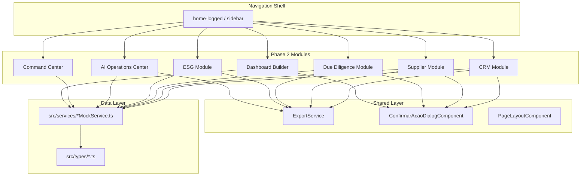

# Design Document — EIP Phase 2 Enhancements

## Overview

Phase 2 extends the Export Intelligence Platform with 8 new modules (CRM, Supplier Management, Due Diligence, ESG, AI Operations Center, Command Center, Personalized Dashboards, Shared Dashboards) and updates navigation/routing. All modules follow the established Angular 20 patterns: standalone components, inject() DI, MatTableDataSource with MatSort/MatPaginator, reactive forms with debounceTime(300), and domain-specific theming.

Each module consists of:
- **Type definitions** (`src/types/{module}.ts`) — interfaces and type unions
- **Mock service** (`src/services/{module}MockService.ts`) — Injectable service with mock data
- **Component(s)** (`src/app/components/{domain}/{feature}/`) — standalone Angular components
- **Route registration** — lazy-loaded in `app.routes.ts` before the `**` wildcard

The design reuses existing shared infrastructure: `ExportService` for CSV/PDF export, `ConfirmarAcaoDialogComponent` for confirmation dialogs, and the Angular Material component library already imported project-wide.

## Architecture



### Routing Strategy

All Phase 2 routes are registered as children of `home-logged` using `loadComponent` for lazy loading. They are placed after existing module routes but BEFORE the `**` catch-all:

```
// === PHASE 2 MODULES ===
clientes/visao-360
clientes/contatos
clientes/oportunidades
supply-chain/fornecedores
compliance/due-diligence
esg/sustentabilidade
ai-operations/dashboard
command-center
dashboards/meus
dashboards/compartilhados
```

### Domain Theming

| Module | Primary Color | CSS Class |
|--------|--------------|-----------|
| CRM | Blue (#1565c0) | `.theme-crm` |
| Supply Chain | Orange (#f57c00) | `.theme-supply-chain` |
| Due Diligence | Purple (#4527a0) | `.theme-compliance` |
| ESG | Green (#2e7d32) | `.theme-esg` |
| AI Operations | Indigo (#283593) | `.theme-ai-ops` |
| Command Center | Dark Blue (#0d47a1) | `.theme-command` |
| Dashboards | Teal (#00695c) | `.theme-dashboards` |

## Components and Interfaces

### Module 1: CRM — Customer 360

**Files:**
```
src/types/crm.ts
src/services/crmMockService.ts
src/app/components/crm/
  visao-360/
    visao-360.component.ts|html|scss
  contatos/
    contatos.component.ts|html|scss
  oportunidades/
    oportunidades.component.ts|html|scss
  dialogs/
    novo-cliente-dialog.component.ts
    nova-oportunidade-dialog.component.ts
```

**Component Architecture:**
- `Visao360Component` — standalone, tabs (Overview, Contracts, Shipments, Financial, Interactions), customer list with MatTableDataSource, search/filter form
- `ContatosComponent` — standalone, contacts grid with MatSort/MatPaginator
- `OportunidadesComponent` — standalone, pipeline view with stage summaries + grid

**Key Patterns:**
- `inject(CrmMockService)` for data
- `inject(MatDialog)` for creation dialogs
- `inject(ExportService)` for CSV/PDF export
- `FormGroup` with `valueChanges.pipe(debounceTime(300))` for filtering
- `takeUntil(destroy$)` for subscription management

### Module 2: Supplier Management

**Files:**
```
src/types/supplier.ts
src/services/supplierMockService.ts
src/app/components/supply-chain/
  fornecedores/
    fornecedores.component.ts|html|scss
  dialogs/
    novo-fornecedor-dialog.component.ts
```

**Component Architecture:**
- `FornecedoresComponent` — standalone, supplier grid with risk score badges, detail view with tabs (Overview, Documents, Audit History, Performance, Contracts)
- Risk score calculation: weighted formula `(delivery*0.30 + quality*0.25 + financial*0.20 + compliance*0.15 + geographic*0.10)`
- Conditional styling: row highlighted in orange (`#f57c00`) when `riskScore > 70`

### Module 3: Due Diligence

**Files:**
```
src/types/due-diligence.ts
src/services/dueDiligenceMockService.ts
src/app/components/compliance/
  due-diligence/
    due-diligence.component.ts|html|scss
  dialogs/
    nova-screening-dialog.component.ts
    resolucao-dialog.component.ts
```

**Component Architecture:**
- `DueDiligenceComponent` — standalone, tabs (Pending, Completed, Flagged, Expired), screening grid, SLA countdown display
- `NovaScreeningDialogComponent` — form for initiating screening
- `ResolucaoDialogComponent` — resolution form (Approve/Reject/Escalate with mandatory justification)
- Theme: purple/indigo `#4527a0`
- SLA calculation: 5 business days from creation, counting only weekdays

### Module 4: ESG / Sustainability

**Files:**
```
src/types/esg.ts
src/services/esgMockService.ts
src/app/components/esg/
  sustentabilidade/
    sustentabilidade.component.ts|html|scss
  dialogs/
    registrar-certificacao-dialog.component.ts
```

**Component Architecture:**
- `SustentabilidadeComponent` — standalone, KPI cards row, operations grid, emissions breakdown panel
- Emissions breakdown calculation: Production (40%), Transport (35%), Processing (15%), Packaging (10%)
- ESG Rating: A-E scale based on overall score
- Theme: green `#2e7d32`

### Module 5: AI Operations Center

**Files:**
```
src/types/ai-operations.ts
src/services/aiOperationsMockService.ts
src/app/components/ai-operations/
  dashboard/
    ai-operations-dashboard.component.ts|html|scss
```

**Component Architecture:**
- `AiOperationsDashboardComponent` — standalone, KPI cards, time-series chart (ngx-charts or canvas), agent performance grid
- Warning threshold: accuracy < 85% shows warning indicator
- Detail view: expandable row or side panel with request history chart, error log, cost breakdown

### Module 6: Command Center

**Files:**
```
src/types/command-center.ts
src/services/commandCenterMockService.ts
src/app/components/command-center/
  command-center.component.ts|html|scss
```

**Component Architecture:**
- `CommandCenterComponent` — standalone, map visualization (mock with colored markers), horizontal timeline, KPI cards, Digital Twin toggle
- Auto-refresh: `interval(60000).pipe(takeUntil(destroy$))` triggers data reload
- Map markers: Green (on-time), Yellow (at-risk), Red (delayed)
- Digital Twin: alternate view mode toggled by button

### Module 7: Dashboard Builder (Meus Dashboards)

**Files:**
```
src/types/dashboard-builder.ts
src/services/dashboardBuilderMockService.ts
src/app/components/dashboards/
  meus-dashboards/
    meus-dashboards.component.ts|html|scss
  compartilhados/
    compartilhados.component.ts|html|scss
  widgets/
    widget-renderer.component.ts
    widget-catalog-dialog.component.ts
    widget-config-dialog.component.ts
  dialogs/
    novo-dashboard-dialog.component.ts
    compartilhar-dialog.component.ts
```

**Component Architecture:**
- `MeusDashboardsComponent` — standalone, grid of user's dashboards, create button
- `CompartilhadosComponent` — standalone, grid of shared dashboards with permission indicators
- `WidgetRendererComponent` — dynamic widget renderer based on widget type
- Widget types: KPI_CARD, LINE_CHART, BAR_CHART, PIE_CHART, DATA_TABLE, STATUS_INDICATOR
- Layout: 1-column, 2-column, or 3-column CSS grid
- Persistence: mock service stores per-user configurations
- Sharing: permission model (VIEW_ONLY, EDIT)

### Navigation Updates

The sidebar menu in `home-logged` component adds new groups/items:

```
Clientes/CRM (new group)
  ├── Visão 360
  ├── Contatos
  └── Oportunidades

Supply Chain (new group)
  └── Fornecedores

Compliance (existing group — add item)
  ├── Licenças (existing)
  ├── Regulamentações (existing)
  └── Due Diligence (new)

ESG/Sustentabilidade (new group)
  └── Sustentabilidade

AI Operations (new group)
  └── Dashboard

Command Center (new top-level item)

Dashboards (existing group — update)
  ├── Principal (existing)
  ├── Meus Dashboards (remove Coming Soon)
  └── Compartilhados (remove Coming Soon)
```

## Data Models

### CRM Types (`src/types/crm.ts`)

```typescript
export interface Customer {
  id: string;
  companyName: string;
  tradeName: string;
  taxId: string;
  country: string;
  address: string;
  segment: CustomerSegment;
  primaryContact: string;
  totalRevenue: number;
  activeContracts: number;
  riskScore: number;
  lastInteractionDate: Date;
  createdAt: Date;
}

export type CustomerSegment = 'AGRO' | 'INDUSTRIAL' | 'TRADING' | 'RETAIL' | 'SERVICES';

export interface Contact {
  id: string;
  customerId: string;
  name: string;
  email: string;
  phone: string;
  role: string;
  status: 'ACTIVE' | 'INACTIVE';
}

export interface Opportunity {
  id: string;
  title: string;
  customerId: string;
  customerName: string;
  estimatedValue: number;
  probability: number;
  stage: OpportunityStage;
  expectedCloseDate: Date;
  assignedUser: string;
  createdAt: Date;
  updatedAt: Date;
}

export type OpportunityStage = 'PROSPECTING' | 'QUALIFICATION' | 'PROPOSAL' | 'NEGOTIATION' | 'CLOSED_WON' | 'CLOSED_LOST';

export interface OpportunityActivity {
  id: string;
  opportunityId: string;
  fromStage: OpportunityStage;
  toStage: OpportunityStage;
  timestamp: Date;
  user: string;
  notes: string;
}

export interface CrmFilters {
  searchText: string;
  country: string;
  segment: CustomerSegment | '';
  revenueMin: number | null;
  revenueMax: number | null;
}
```

### Supplier Types (`src/types/supplier.ts`)

```typescript
export interface Supplier {
  id: string;
  companyName: string;
  taxId: string;
  country: string;
  category: SupplierCategory;
  contactName: string;
  email: string;
  phone: string;
  riskScore: number;
  qualificationStatus: QualificationStatus;
  lastAuditDate: Date;
  activeContracts: number;
  metrics: SupplierMetrics;
  createdAt: Date;
}

export type SupplierCategory = 'RAW_MATERIAL' | 'PACKAGING' | 'LOGISTICS' | 'SERVICES' | 'EQUIPMENT';
export type QualificationStatus = 'QUALIFIED' | 'PENDING' | 'CONDITIONAL' | 'DISQUALIFIED';

export interface SupplierMetrics {
  deliveryPerformance: number;   // 0-100, weight 30%
  qualityMetrics: number;        // 0-100, weight 25%
  financialStability: number;    // 0-100, weight 20%
  complianceHistory: number;     // 0-100, weight 15%
  geographicRisk: number;        // 0-100, weight 10%
}

export interface SupplierDocument {
  id: string;
  supplierId: string;
  type: string;
  name: string;
  uploadDate: Date;
  expiryDate: Date | null;
  status: 'VALID' | 'EXPIRED' | 'PENDING';
}

export interface SupplierAudit {
  id: string;
  supplierId: string;
  date: Date;
  type: string;
  result: 'APPROVED' | 'CONDITIONAL' | 'FAILED';
  auditor: string;
  findings: string;
  score: number;
}
```

### Due Diligence Types (`src/types/due-diligence.ts`)

```typescript
export interface Screening {
  id: string;
  entityName: string;
  entityType: 'INDIVIDUAL' | 'COMPANY';
  country: string;
  taxId: string;
  screeningType: ScreeningType;
  status: ScreeningStatus;
  riskLevel: 'LOW' | 'MEDIUM' | 'HIGH' | 'CRITICAL';
  result: ScreeningResult | null;
  assignedAnalyst: string;
  resolution: ScreeningResolution | null;
  createdAt: Date;
  completedAt: Date | null;
  slaDeadline: Date;
}

export type ScreeningType = 'KYC' | 'AML' | 'SANCTIONS' | 'PEP';
export type ScreeningStatus = 'PENDING' | 'IN_PROGRESS' | 'COMPLETED' | 'FLAGGED' | 'EXPIRED';

export interface ScreeningResult {
  matchStatus: 'CLEAR' | 'POTENTIAL_MATCH' | 'CONFIRMED_MATCH';
  matchedWatchlists: string[];
  confidenceScore: number;
  recommendedAction: string;
  details: string;
}

export interface ScreeningResolution {
  action: 'APPROVE' | 'REJECT' | 'ESCALATE';
  justification: string;
  resolvedBy: string;
  resolvedAt: Date;
}
```

### ESG Types (`src/types/esg.ts`)

```typescript
export interface EsgOperation {
  id: string;
  exportId: string;
  product: string;
  destination: string;
  carbonFootprint: number; // tCO2e
  traceabilityStatus: 'FULL' | 'PARTIAL' | 'NONE';
  certifications: string[];
  esgRating: EsgRating;
  emissionsBreakdown: EmissionsBreakdown;
}

export type EsgRating = 'A' | 'B' | 'C' | 'D' | 'E';

export interface EmissionsBreakdown {
  production: number;   // 40%
  transport: number;    // 35%
  processing: number;   // 15%
  packaging: number;    // 10%
}

export interface EsgCertification {
  id: string;
  type: CertificationType;
  issuer: string;
  validFrom: Date;
  validUntil: Date;
  certificateNumber: string;
  operationId: string;
}

export type CertificationType = 'ORGANIC' | 'FAIR_TRADE' | 'RAINFOREST_ALLIANCE' | 'CARBON_NEUTRAL';

export interface EsgMetrics {
  totalCarbonFootprint: number;
  operationsWithTraceability: number;
  totalOperations: number;
  activeCertifications: number;
  esgScore: number;
}
```

### AI Operations Types (`src/types/ai-operations.ts`)

```typescript
export interface AiAgent {
  id: string;
  name: string;
  module: string;
  requests24h: number;
  avgResponseTime: number; // ms
  accuracy: number; // percentage
  cost: number; // USD
  status: 'ACTIVE' | 'DEGRADED' | 'OFFLINE' | 'MAINTENANCE';
  lastError: string | null;
  lastErrorAt: Date | null;
}

export interface AiOperationsMetrics {
  totalRequests24h: number;
  avgResponseTime: number;
  accuracyRate: number;
  estimatedCost: number;
  activeAgents: number;
}

export interface AiRequestTimeSeries {
  timestamp: Date;
  requests: number;
  avgResponseTime: number;
}

export interface AiAgentDetail {
  agent: AiAgent;
  requestHistory: AiRequestTimeSeries[];
  errorLog: AiErrorEntry[];
  costBreakdown: AiCostBreakdown[];
  configuration: Record<string, string>;
}

export interface AiErrorEntry {
  id: string;
  timestamp: Date;
  type: string;
  message: string;
  module: string;
}

export interface AiCostBreakdown {
  operationType: string;
  requests: number;
  cost: number;
}
```

### Command Center Types (`src/types/command-center.ts`)

```typescript
export interface ActiveOperation {
  id: string;
  exportId: string;
  customer: string;
  product: string;
  origin: string;
  destination: string;
  currentStatus: OperationStatus;
  eta: Date;
  riskLevel: 'LOW' | 'MEDIUM' | 'HIGH';
  milestones: OperationMilestone[];
  coordinates: { lat: number; lng: number };
}

export type OperationStatus = 'ON_TIME' | 'AT_RISK' | 'DELAYED';

export interface OperationMilestone {
  type: MilestoneType;
  label: string;
  date: Date | null;
  completed: boolean;
}

export type MilestoneType = 'CONTRACT_SIGNED' | 'PRODUCTION' | 'DOCUMENTATION' | 'SHIPMENT' | 'TRANSIT' | 'ARRIVAL' | 'FINANCIAL_SETTLEMENT';

export interface CommandCenterMetrics {
  activeOperations: number;
  onTimeDeliveryRate: number;
  revenueInTransit: number;
  pendingDocuments: number;
  complianceAlerts: number;
  averageCycleTime: number; // days
}
```

### Dashboard Builder Types (`src/types/dashboard-builder.ts`)

```typescript
export interface UserDashboard {
  id: string;
  name: string;
  description: string;
  layout: DashboardLayout;
  widgets: DashboardWidget[];
  ownerId: string;
  ownerName: string;
  createdAt: Date;
  updatedAt: Date;
  shared: boolean;
}

export type DashboardLayout = '1-COLUMN' | '2-COLUMN' | '3-COLUMN';

export interface DashboardWidget {
  id: string;
  type: WidgetType;
  title: string;
  dataSource: string;
  timeRange: string;
  filters: Record<string, string>;
  displayFormat: Record<string, any>;
  position: { row: number; col: number };
}

export type WidgetType = 'KPI_CARD' | 'LINE_CHART' | 'BAR_CHART' | 'PIE_CHART' | 'DATA_TABLE' | 'STATUS_INDICATOR';

export interface WidgetCatalogItem {
  type: WidgetType;
  label: string;
  description: string;
  module: WidgetModule;
  icon: string;
  defaultConfig: Partial<DashboardWidget>;
}

export type WidgetModule = 'EXPORTS' | 'FINANCIAL' | 'LOGISTICS' | 'COMPLIANCE' | 'ESG';

export interface SharedDashboard {
  dashboardId: string;
  sharedWith: string;
  sharedBy: string;
  sharedDate: Date;
  permission: 'VIEW_ONLY' | 'EDIT';
}
```

## Correctness Properties

*A property is a characteristic or behavior that should hold true across all valid executions of a system — essentially, a formal statement about what the system should do. Properties serve as the bridge between human-readable specifications and machine-verifiable correctness guarantees.*

### Property 1: Customer filter correctness

*For any* customer list and any combination of filter criteria (Country, Segment, Revenue Range), the filtered result SHALL contain only customers that match ALL active filter conditions, and SHALL not exclude any customer that matches all conditions.

**Validates: Requirements 1.6**

### Property 2: Opportunity stage totals correctness

*For any* list of opportunities, the summary bar total for each pipeline stage SHALL equal the sum of `estimatedValue` for all opportunities in that stage.

**Validates: Requirements 2.4**

### Property 3: Opportunity status transition logging

*For any* opportunity and any valid stage transition, the system SHALL create an activity log entry containing the previous stage, new stage, timestamp, and acting user.

**Validates: Requirements 2.5**

### Property 4: Supplier risk score calculation

*For any* set of supplier metrics (deliveryPerformance, qualityMetrics, financialStability, complianceHistory, geographicRisk) each in [0, 100], the computed risk score SHALL equal `delivery*0.30 + quality*0.25 + financial*0.20 + compliance*0.15 + geographic*0.10` and SHALL always be in the range [0, 100].

**Validates: Requirements 3.2**

### Property 5: Supplier risk warning threshold

*For any* supplier, the warning badge and orange row highlight SHALL be displayed if and only if the supplier's risk score exceeds 70.

**Validates: Requirements 3.4**

### Property 6: Screening resolution requirement

*For any* screening whose result has matchStatus of "POTENTIAL_MATCH" or "CONFIRMED_MATCH", the system SHALL require a resolution action (Approve/Reject/Escalate) with non-empty justification text before the screening can be marked complete.

**Validates: Requirements 4.4**

### Property 7: SLA countdown business days calculation

*For any* pending screening with a creation date, the displayed SLA countdown SHALL equal the number of remaining business days (excluding Saturdays and Sundays) between the current date and the SLA deadline (creation date + 5 business days).

**Validates: Requirements 4.6**

### Property 8: Emissions breakdown consistency

*For any* ESG operation with a total carbon footprint value, the emissions breakdown components SHALL satisfy: `production + transport + processing + packaging = totalCarbonFootprint` where production = 40%, transport = 35%, processing = 15%, packaging = 10% of the total.

**Validates: Requirements 5.3**

### Property 9: AI agent accuracy warning threshold

*For any* AI agent, the warning indicator and "Needs Attention" classification SHALL appear if and only if the agent's accuracy is below 85%.

**Validates: Requirements 6.4**

### Property 10: Dashboard widget rendering completeness

*For any* saved dashboard configuration with N widgets, opening that dashboard SHALL render exactly N widget components, each matching its configured type and position.

**Validates: Requirements 8.3**

### Property 11: Dashboard configuration round-trip persistence

*For any* valid dashboard configuration (name, description, layout, widgets), saving the configuration and then loading it SHALL produce an equivalent configuration object.

**Validates: Requirements 8.7**

### Property 12: View Only permission enforcement

*For any* user with "View Only" permission on a shared dashboard, ALL edit actions (modify widget, change layout, add widget, remove widget) SHALL be disabled.

**Validates: Requirements 9.4**

## Error Handling

### Service-Level Errors

All mock services simulate errors with `delay()` and `of()`. In production, these will be replaced by HTTP calls. Error handling strategy:

| Scenario | Handling |
|----------|----------|
| Service returns empty data | Display "Nenhum registro encontrado" message in grid |
| Form validation failure | Show mat-error messages below invalid fields |
| Dialog submission failure | Show MatSnackBar with error message, keep dialog open |
| Data load timeout | Show loading spinner for max 10s, then error state with retry button |
| Export failure (CSV/PDF) | Show MatSnackBar with "Erro ao exportar" message |

### Form Validation

All reactive forms follow the pattern:
- Required fields: `Validators.required`
- Email fields: `Validators.email`
- Numeric ranges: `Validators.min(0)`, `Validators.max(100)`
- Date ranges: custom validator ensuring `validFrom < validUntil`
- Tax ID: `Validators.pattern` for format validation

### Component Lifecycle

All components implement `OnDestroy` with:
```typescript
private destroy$ = new Subject<void>();

ngOnDestroy(): void {
  this.destroy$.next();
  this.destroy$.complete();
}
```

All subscriptions use `.pipe(takeUntil(this.destroy$))`.

## Testing Strategy

### Unit Tests (Example-Based)

Each component should have a `.spec.ts` file testing:
- Component creation
- Grid column presence
- Dialog opening on button click
- Form validation (required fields, format validation)
- Tab rendering

### Property-Based Tests

**Library:** [fast-check](https://github.com/dubzzz/fast-check) (already common in Angular/TypeScript projects)

**Configuration:** Minimum 100 iterations per property test.

**Tag format:** `// Feature: eip-phase2-enhancements, Property {N}: {title}`

Properties to implement:
1. Customer filter correctness — generate random customer arrays and filter combos
2. Opportunity stage totals — generate random opportunity sets, verify sums
3. Status transition logging — generate random transitions, verify log creation
4. Risk score calculation — generate random metrics [0-100], verify weighted sum
5. Risk warning threshold — generate random scores, verify badge condition
6. Resolution requirement — generate screening results, verify form validation
7. SLA countdown — generate random creation dates, verify business day math
8. Emissions breakdown — generate random totals, verify component proportions
9. AI accuracy warning — generate random accuracy values, verify threshold
10. Dashboard widget rendering — generate random widget configs, verify count
11. Dashboard round-trip — generate random configs, verify save/load equality
12. View Only enforcement — generate random permission states, verify disabled

### Integration Tests

- Route navigation: verify all Phase 2 routes resolve correctly
- Menu items: verify sidebar contains all new entries
- Lazy loading: verify no eager loading of Phase 2 components

### Smoke Tests

- MatPaginator options `[10, 25, 50, 100]` on all grids
- MatSort attached to all columns
- Theme colors applied correctly per domain
- Routes registered before `**` wildcard
- `loadComponent` used for all new routes
- No "Coming Soon" indicators on implemented dashboard routes
