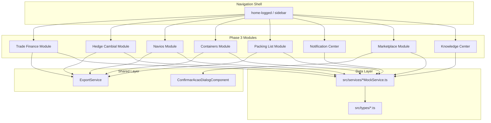

# Design Document — EIP Phase 3: Connected Platform

## Overview

Phase 3 extends the Export Intelligence Platform with 8 new modules (Trade Finance, Hedge Cambial, Navios, Containers, Packing List, Notification Center, Marketplace, Knowledge Center) completing the platform's coverage of the export lifecycle. All modules follow the established Angular 20 patterns: standalone components, inject() DI, MatTableDataSource with MatSort/MatPaginator, reactive forms with debounceTime(300), and domain-specific theming.

Each module consists of:
- **Type definitions** (`src/types/{module}.ts`) — interfaces and type unions
- **Mock service** (`src/services/{module}MockService.ts`) — Injectable service with mock data
- **Component(s)** (`src/app/components/{domain}/{feature}/`) — standalone Angular components
- **Dialogs** (`src/app/components/{domain}/dialogs/`) — MatDialog form components
- **Route registration** — lazy-loaded in `app.routes.ts` before the `**` wildcard

The design reuses existing shared infrastructure: `ExportService` for CSV/PDF export, `ConfirmarAcaoDialogComponent` for confirmation dialogs, and the Angular Material component library already imported project-wide.

## Architecture



### Routing Strategy

All Phase 3 routes are registered as children of `home-logged` using `loadComponent` for lazy loading. They are placed BEFORE the `**` catch-all:

```
// === PHASE 3 — CONNECTED PLATFORM ===
financeiro/trade-finance
financeiro/hedge
logistica/navios
logistica/containers
documentos/packing-list
notificacoes/centro
marketplace
conhecimento/centro
```

### Domain Theming

| Module | Primary Color | CSS Class |
|--------|--------------|-----------|
| Trade Finance | Deep Purple (#512da8) | `.theme-trade-finance` |
| Hedge Cambial | Amber (#ff8f00) | `.theme-hedge` |
| Navios | Blue Grey (#37474f) | `.theme-navios` |
| Containers | Brown (#5d4037) | `.theme-containers` |
| Packing List | Cyan (#00838f) | `.theme-packing-list` |
| Notification Center | Red (#c62828) | `.theme-notifications` |
| Marketplace | Deep Orange (#e64a19) | `.theme-marketplace` |
| Knowledge Center | Light Blue (#0277bd) | `.theme-knowledge` |

## Components and Interfaces

### Module 1: Trade Finance

**Files:**
```
src/types/trade-finance.ts
src/services/tradeFinanceMockService.ts
src/app/components/financeiro/trade-finance/
  trade-finance.component.ts|html|scss
src/app/components/financeiro/dialogs/
  nova-lc-dialog.component.ts
  nova-cobranca-dialog.component.ts
  nova-garantia-dialog.component.ts
```

**Component Architecture:**
- `TradeFinanceComponent` — standalone, metric cards row, MatTableDataSource grid with all columns, search input with debounceTime(300), detail side panel on row click, export button
- `NovaLcDialogComponent` — reactive form: bank, beneficiary, value, currency, expiry, terms, linked contract. Flex layout, NO mat-dialog-content, footer flex-shrink:0
- `NovaCobrancaDialogComponent` — reactive form: collecting bank, presenting bank, value, documents required, payment terms
- `NovaGarantiaDialogComponent` — reactive form: guarantor bank, beneficiary, value, validity period, guarantee type

**Key Patterns:**
- `inject(TradeFinanceMockService)` for data
- `inject(MatDialog)` for creation dialogs
- `inject(ExportService)` for CSV/PDF export
- `FormControl` with `valueChanges.pipe(debounceTime(300))` for search filter
- `takeUntil(destroy$)` for subscription management
- Row conditional class: `expiry-warning` when instrument expiry <= 30 days from today

### Module 2: Hedge Cambial

**Files:**
```
src/types/hedge.ts
src/services/hedgeMockService.ts
src/app/components/financeiro/hedge/
  hedge.component.ts|html|scss
src/app/components/financeiro/dialogs/
  novo-hedge-dialog.component.ts
```

**Component Architecture:**
- `HedgeComponent` — standalone, exposure summary panel (totalExposed, totalHedged, hedgeRatio%, netOpen), metric cards row, MatTableDataSource grid, search input with debounceTime(300), detail panel on row click, export button
- `NovoHedgeDialogComponent` — reactive form: type (NDF/Forward/Option), counterparty bank, notional value, currency pair, strike rate, maturity date, linked export. Flex layout, NO mat-dialog-content, footer flex-shrink:0

**Key Patterns:**
- Exposure calculation: `hedgeRatio = (totalHedged / totalExposed) * 100`, `netOpen = totalExposed - totalHedged`
- Row conditional class: `maturity-critical` when contract maturity <= 7 days
- Mark-to-market displayed with color coding (green positive, red negative)

### Module 3: Navios (Vessels)

**Files:**
```
src/types/navios.ts
src/services/naviosMockService.ts
src/app/components/logistica/navios/
  navios.component.ts|html|scss
src/app/components/logistica/dialogs/
  novo-navio-dialog.component.ts
```

**Component Architecture:**
- `NaviosComponent` — standalone, metric cards row, MatTableDataSource grid with all columns, search input with debounceTime(300), detail panel with tabs (Specifications, Current Voyage, Schedule History, Linked Shipments), export button
- `NovoNavioDialogComponent` — reactive form: vessel name, IMO number, flag, type, capacity, shipping line, current schedule. Flex layout, NO mat-dialog-content, footer flex-shrink:0
- Schedule tab: port rotation table with ETAs, ETDs, berth assignments

**Key Patterns:**
- Row conditional class: `delay-alert` when ETA delta from original > 24 hours
- Status icons: In Transit (ship icon), At Port (anchor icon), Delayed (warning icon)
- IMO number validation: `Validators.pattern(/^\d{7}$/)`

### Module 4: Containers

**Files:**
```
src/types/containers.ts
src/services/containersMockService.ts
src/app/components/logistica/containers/
  containers.component.ts|html|scss
src/app/components/logistica/dialogs/
  novo-container-dialog.component.ts
```

**Component Architecture:**
- `ContainersComponent` — standalone, metric cards row, MatTableDataSource grid, search input with debounceTime(300), status filter chips (Booked, Gate-In, Loaded, In Transit, Arrived, Gate-Out, Returned, Detained), detail panel on row click, export button
- `NovoContainerDialogComponent` — reactive form: container number, size (20ft/40ft/40ftHC), type (FCL/LCL), shipping line, booking reference, linked shipment, free days allowed. Flex layout, NO mat-dialog-content, footer flex-shrink:0

**Key Patterns:**
- Row conditional class: `demurrage-critical` when freeDaysRemaining <= 0
- Demurrage cost projection: `projectedCost = daysOverFree * dailyRate`
- Container number validation: `Validators.pattern(/^[A-Z]{4}\d{7}$/)`
- Status chips for filter: `mat-chip-listbox` with multi-select

### Module 5: Packing List

**Files:**
```
src/types/packing-list.ts
src/services/packingListMockService.ts
src/app/components/documentos/packing-list/
  packing-list.component.ts|html|scss
src/app/components/documentos/dialogs/
  novo-packing-list-dialog.component.ts
```

**Component Architecture:**
- `PackingListComponent` — standalone, metric cards row, MatTableDataSource grid, search input with debounceTime(300), detail panel with item breakdown and weight summary, export button, "Gerar PDF" button
- `NovoPackingListDialogComponent` — reactive form: linked invoice, exporter data, buyer data, shipping marks, package details (FormArray for items: type, quantity, dimensions, weight), container assignment. Flex layout, NO mat-dialog-content, footer flex-shrink:0

**Key Patterns:**
- Weight validation: `Math.abs(packingListWeight - invoiceWeight) / invoiceWeight > 0.01` triggers warning
- Package detail FormArray with dynamic add/remove
- PDF generation: delegates to ExportService with packing list data structure
- AI completeness score: mock value 0-100 displayed as progress bar

### Module 6: Notification Center

**Files:**
```
src/types/notifications.ts
src/services/notificationsMockService.ts
src/app/components/notificacoes/
  centro/
    notificacoes-centro.component.ts|html|scss
  bell-dropdown/
    notification-bell.component.ts|html|scss
```

**Component Architecture:**
- `NotificacoesCentroComponent` — standalone, metric cards row, notification list (NOT a table — use mat-list with custom templates), search input with debounceTime(300), filter panel (channel chips, priority chips, read status toggle, date range picker), detail panel on click, "Marcar Todas como Lidas" button
- `NotificationBellComponent` — standalone, bell icon with badge count, dropdown panel showing 5 most recent unread, link to full center. Placed in app header.

**Key Patterns:**
- Sort: always by timestamp descending (most recent first)
- Channel icons: Platform (computer icon), Email (email icon), Push (phone icon), WhatsApp (chat icon)
- Priority color coding: Critical (red), High (orange), Medium (yellow), Low (grey)
- Escalation: if critical + unread > 1 hour → pulsing animation class `escalated`
- Mark as read: on click, toggle `readAt` timestamp
- Bulk mark read: iterate visible (filtered) notifications, set `readAt`

### Module 7: Marketplace

**Files:**
```
src/types/marketplace.ts
src/services/marketplaceMockService.ts
src/app/components/marketplace/
  marketplace.component.ts|html|scss
src/app/components/marketplace/dialogs/
  marketplace-detail-dialog.component.ts
```

**Component Architecture:**
- `MarketplaceComponent` — standalone, metric cards row, featured section, card grid (mat-card), filter bar (category chips, status toggle, search input with debounceTime(300)), sort dropdown (name, rating, category, recently added)
- `MarketplaceDetailDialogComponent` — full description, features list, pricing, integration requirements, reviews, activation button. Flex layout, NO mat-dialog-content, footer flex-shrink:0
- Activation/Deactivation: uses `ConfirmarAcaoDialogComponent` for confirmation

**Key Patterns:**
- Card grid: CSS grid with responsive columns (1/2/3 columns based on viewport)
- Status badge: Active (green chip), Available (blue chip), Coming Soon (grey chip)
- Rating: mat-icon stars (filled/empty) + numeric rating
- Featured section: top 3 recommended based on user's active modules (mock logic)
- Category filter: Logistics, Finance, Compliance, Analytics, Insurance, Government

### Module 8: Knowledge Center

**Files:**
```
src/types/knowledge-center.ts
src/services/knowledgeCenterMockService.ts
src/app/components/conhecimento/
  centro/
    knowledge-center.component.ts|html|scss
```

**Component Architecture:**
- `KnowledgeCenterComponent` — standalone, metric cards row, search input with debounceTime(300), category tabs (Documentation, FAQs, Video Tutorials, Best Practices), filter sidebar (module, content type, difficulty level), "Mais Acessados" section, "Atualizados Recentemente" section, article detail view, feedback buttons (helpful/not helpful) with MatSnackBar
- No dialog needed — detail view is inline or routed

**Key Patterns:**
- Tabs: `mat-tab-group` for top-level categories
- Filter sidebar: `mat-checkbox` groups for module, type, difficulty
- Difficulty levels: Básico, Intermediário, Avançado
- Module filters: Exportações, Contratos, Financeiro, Logística, Compliance, Documentos
- "Mais Acessados": sorted by `viewCount` desc, take top 10
- "Atualizados Recentemente": filtered by `updatedAt` within last 30 days
- Feedback: `MatSnackBar.open('Obrigado pelo feedback!', 'OK', { duration: 3000 })`

### Navigation Updates

The sidebar menu in `home-logged` component adds new items:

```
Financeiro (existing group — add items)
  ├── Contas a Receber (existing)
  ├── Câmbio (existing)
  ├── Pagamentos (existing)
  ├── Trade Finance (new)
  └── Hedge Cambial (new)

Logística (existing group — add items)
  ├── Embarques (existing)
  ├── Portos (existing)
  ├── Transportadoras (existing)
  ├── Navios (new)
  └── Containers (new)

Documentos (existing group — add item)
  ├── DU-E (existing)
  ├── RE (existing)
  ├── Certificados (existing)
  ├── Invoice (existing)
  └── Packing List (new)

Notificações (new group)
  └── Centro de Notificações

Marketplace (new top-level item)

Conhecimento (new group)
  └── Central de Conhecimento
```

## Data Models

### Trade Finance Types (`src/types/trade-finance.ts`)

```typescript
export interface TradeFinanceInstrument {
  id: string;
  instrumentNumber: string;
  type: InstrumentType;
  status: InstrumentStatus;
  bank: string;
  beneficiary: string;
  value: number;
  currency: string;
  expiryDate: Date;
  linkedContractId: string;
  linkedContractNumber: string;
  terms: string;
  createdAt: Date;
  updatedAt: Date;
}

export type InstrumentType = 'LC' | 'DOCUMENTARY_COLLECTION' | 'BANK_GUARANTEE';
export type InstrumentStatus = 'ACTIVE' | 'EXPIRED' | 'CANCELLED' | 'PENDING' | 'SETTLED';

export interface LcDetails {
  instrumentId: string;
  advisingBank: string;
  confirmingBank: string | null;
  partialShipment: boolean;
  transhipment: boolean;
  latestShipmentDate: Date;
  documentsRequired: string[];
}

export interface DocumentaryCollectionDetails {
  instrumentId: string;
  collectingBank: string;
  presentingBank: string;
  documentsRequired: string[];
  paymentTerms: 'SIGHT' | 'USANCE';
  usanceDays: number | null;
}

export interface BankGuaranteeDetails {
  instrumentId: string;
  guarantorBank: string;
  guaranteeType: 'PERFORMANCE' | 'ADVANCE_PAYMENT' | 'BID_BOND' | 'CUSTOMS';
  validityPeriod: { from: Date; to: Date };
}

export interface TradeFinanceEvent {
  id: string;
  instrumentId: string;
  eventType: string;
  description: string;
  timestamp: Date;
  user: string;
}

export interface TradeFinanceMetrics {
  activeLCs: number;
  totalValueUnderLCs: number;
  pendingCollections: number;
  expiringInstruments: number;
}

export interface TradeFinanceFilters {
  searchText: string;
  type: InstrumentType | '';
  status: InstrumentStatus | '';
  bank: string;
}
```

### Hedge Types (`src/types/hedge.ts`)

```typescript
export interface HedgeContract {
  id: string;
  contractNumber: string;
  counterpartyBank: string;
  type: HedgeType;
  notionalValue: number;
  currencyPair: string;
  strikeRate: number;
  currentRate: number;
  maturityDate: Date;
  markToMarket: number;
  status: HedgeStatus;
  linkedExportId: string | null;
  linkedExportRef: string | null;
  createdAt: Date;
}

export type HedgeType = 'NDF' | 'FORWARD' | 'OPTION';
export type HedgeStatus = 'ACTIVE' | 'MATURED' | 'CANCELLED' | 'SETTLED';

export interface HedgeSettlement {
  id: string;
  contractId: string;
  settlementDate: Date;
  settlementRate: number;
  pnl: number;
  settled: boolean;
}

export interface ExposureSummary {
  totalExposedValue: number;
  totalHedgedValue: number;
  hedgeRatioPercent: number;
  netOpenPosition: number;
}

export interface HedgeMetrics {
  activeContracts: number;
  totalNotionalValue: number;
  averageHedgeRatio: number;
  totalUnrealizedPnL: number;
}

export interface HedgeFilters {
  searchText: string;
  type: HedgeType | '';
  status: HedgeStatus | '';
  bank: string;
}
```

### Navios Types (`src/types/navios.ts`)

```typescript
export interface Vessel {
  id: string;
  vesselName: string;
  imoNumber: string;
  flag: string;
  vesselType: VesselType;
  capacityTeu: number | null;
  capacityDwt: number | null;
  shippingLine: string;
  currentPort: string | null;
  eta: Date | null;
  originalEta: Date | null;
  status: VesselStatus;
  createdAt: Date;
}

export type VesselType = 'CONTAINER' | 'BULK_CARRIER' | 'TANKER' | 'GENERAL_CARGO' | 'REEFER';
export type VesselStatus = 'IN_TRANSIT' | 'AT_PORT' | 'ANCHORED' | 'MAINTENANCE' | 'DELAYED';

export interface VesselSchedule {
  id: string;
  vesselId: string;
  portName: string;
  portCode: string;
  eta: Date;
  etd: Date | null;
  berthAssignment: string | null;
  status: 'PLANNED' | 'ARRIVED' | 'DEPARTED';
}

export interface VesselVoyage {
  id: string;
  vesselId: string;
  voyageNumber: string;
  origin: string;
  destination: string;
  departureDate: Date;
  arrivalDate: Date | null;
  linkedShipments: string[];
}

export interface NaviosMetrics {
  totalTracked: number;
  inTransit: number;
  atPort: number;
  withDelayAlerts: number;
}

export interface NaviosFilters {
  searchText: string;
  vesselType: VesselType | '';
  status: VesselStatus | '';
  shippingLine: string;
}
```

### Containers Types (`src/types/containers.ts`)

```typescript
export interface Container {
  id: string;
  containerNumber: string;
  size: ContainerSize;
  type: ContainerType;
  status: ContainerStatus;
  currentLocation: string;
  vesselName: string | null;
  bookingReference: string;
  shippingLine: string;
  linkedShipmentId: string | null;
  freeDaysAllowed: number;
  freeDaysRemaining: number;
  gateInDate: Date | null;
  dailyDemurrageRate: number;
  createdAt: Date;
}

export type ContainerSize = '20FT' | '40FT' | '40FT_HC';
export type ContainerType = 'FCL' | 'LCL';
export type ContainerStatus = 'BOOKED' | 'GATE_IN' | 'LOADED' | 'IN_TRANSIT' | 'ARRIVED' | 'GATE_OUT' | 'RETURNED' | 'DETAINED';

export interface ContainerMovement {
  id: string;
  containerId: string;
  fromStatus: ContainerStatus;
  toStatus: ContainerStatus;
  location: string;
  timestamp: Date;
  notes: string;
}

export interface DemurrageCalculation {
  containerId: string;
  daysOverFree: number;
  dailyRate: number;
  totalAccrued: number;
  projectedCost: number;
}

export interface ContainersMetrics {
  totalActive: number;
  atRiskOfDemurrage: number;
  totalDemurrageCost: number;
  averageDwellTime: number;
}

export interface ContainersFilters {
  searchText: string;
  size: ContainerSize | '';
  type: ContainerType | '';
  status: ContainerStatus | '';
  shippingLine: string;
}
```

### Packing List Types (`src/types/packing-list.ts`)

```typescript
export interface PackingList {
  id: string;
  packingListNumber: string;
  linkedInvoiceId: string;
  linkedInvoiceNumber: string;
  exporter: PartyInfo;
  buyer: PartyInfo;
  totalPackages: number;
  totalGrossWeight: number;
  totalNetWeight: number;
  invoiceGrossWeight: number;
  status: PackingListStatus;
  shippingMarks: string;
  containerAssignment: string | null;
  completenessScore: number;
  createdAt: Date;
  updatedAt: Date;
}

export type PackingListStatus = 'DRAFT' | 'VALIDATED' | 'PENDING_VALIDATION' | 'DISCREPANCY' | 'APPROVED';

export interface PartyInfo {
  name: string;
  address: string;
  country: string;
  taxId: string;
}

export interface PackingListItem {
  id: string;
  packingListId: string;
  description: string;
  packageType: PackageType;
  quantity: number;
  dimensions: { length: number; width: number; height: number };
  grossWeight: number;
  netWeight: number;
  marks: string;
}

export type PackageType = 'CARTON' | 'PALLET' | 'CRATE' | 'DRUM' | 'BAG' | 'BUNDLE';

export interface PackingListMetrics {
  totalPackingLists: number;
  pendingValidation: number;
  averageCompletenessScore: number;
  linkedToActiveShipments: number;
}

export interface PackingListFilters {
  searchText: string;
  status: PackingListStatus | '';
  exporter: string;
}

export interface WeightDiscrepancy {
  packingListWeight: number;
  invoiceWeight: number;
  differencePercent: number;
  hasDiscrepancy: boolean;
}
```

### Notifications Types (`src/types/notifications.ts`)

```typescript
export interface Notification {
  id: string;
  channel: NotificationChannel;
  title: string;
  message: string;
  priority: NotificationPriority;
  readAt: Date | null;
  createdAt: Date;
  eventType: string;
  relatedEntityId: string | null;
  relatedEntityType: string | null;
}

export type NotificationChannel = 'PLATFORM' | 'EMAIL' | 'PUSH' | 'WHATSAPP';
export type NotificationPriority = 'CRITICAL' | 'HIGH' | 'MEDIUM' | 'LOW';

export interface NotificationPreference {
  eventType: string;
  channels: NotificationChannel[];
  enabled: boolean;
}

export interface NotificationMetrics {
  totalUnread: number;
  criticalUnread: number;
  notificationsToday: number;
  notificationsThisWeek: number;
}

export interface NotificationFilters {
  searchText: string;
  channel: NotificationChannel | '';
  priority: NotificationPriority | '';
  readStatus: 'READ' | 'UNREAD' | '';
  dateFrom: Date | null;
  dateTo: Date | null;
}
```

### Marketplace Types (`src/types/marketplace.ts`)

```typescript
export interface MarketplaceItem {
  id: string;
  name: string;
  provider: string;
  logo: string;
  category: MarketplaceCategory;
  description: string;
  features: string[];
  rating: number;
  reviewCount: number;
  pricing: string;
  integrationRequirements: string[];
  status: MarketplaceStatus;
  featured: boolean;
  addedAt: Date;
}

export type MarketplaceCategory = 'LOGISTICS' | 'FINANCE' | 'COMPLIANCE' | 'ANALYTICS' | 'INSURANCE' | 'GOVERNMENT';
export type MarketplaceStatus = 'ACTIVE' | 'AVAILABLE' | 'COMING_SOON';

export interface MarketplaceReview {
  id: string;
  itemId: string;
  author: string;
  rating: number;
  comment: string;
  createdAt: Date;
}

export interface MarketplaceMetrics {
  activeConnectors: number;
  availableConnectors: number;
  totalCategories: number;
  recentlyAdded: number;
}

export interface MarketplaceFilters {
  searchText: string;
  category: MarketplaceCategory | '';
  status: MarketplaceStatus | '';
  sortBy: 'name' | 'rating' | 'category' | 'recent';
}
```

### Knowledge Center Types (`src/types/knowledge-center.ts`)

```typescript
export interface KnowledgeArticle {
  id: string;
  title: string;
  content: string;
  category: KnowledgeCategory;
  module: KnowledgeModule;
  contentType: ContentType;
  difficulty: DifficultyLevel;
  viewCount: number;
  rating: number;
  ratingCount: number;
  author: string;
  tags: string[];
  relatedArticleIds: string[];
  createdAt: Date;
  updatedAt: Date;
}

export type KnowledgeCategory = 'DOCUMENTATION' | 'FAQ' | 'VIDEO_TUTORIAL' | 'BEST_PRACTICE';
export type KnowledgeModule = 'EXPORTACOES' | 'CONTRATOS' | 'FINANCEIRO' | 'LOGISTICA' | 'COMPLIANCE' | 'DOCUMENTOS';
export type ContentType = 'ARTICLE' | 'VIDEO' | 'GUIDE' | 'FAQ_ITEM';
export type DifficultyLevel = 'BASICO' | 'INTERMEDIARIO' | 'AVANCADO';

export interface KnowledgeFeedback {
  articleId: string;
  userId: string;
  helpful: boolean;
  timestamp: Date;
}

export interface KnowledgeMetrics {
  totalArticles: number;
  totalFaqs: number;
  totalVideoTutorials: number;
  averageRating: number;
}

export interface KnowledgeFilters {
  searchText: string;
  category: KnowledgeCategory | '';
  module: KnowledgeModule | '';
  difficulty: DifficultyLevel | '';
  contentType: ContentType | '';
}
```

## Mock Service Methods

Each mock service follows the same pattern: `@Injectable({ providedIn: 'root' })`, returns `Observable<T>` via `of().pipe(delay(300))`.

### TradeFinanceMockService

```typescript
getInstruments(): Observable<TradeFinanceInstrument[]>
getInstrumentById(id: string): Observable<TradeFinanceInstrument>
getInstrumentEvents(instrumentId: string): Observable<TradeFinanceEvent[]>
getMetrics(): Observable<TradeFinanceMetrics>
createLC(data: Partial<TradeFinanceInstrument>): Observable<TradeFinanceInstrument>
createDocumentaryCollection(data: Partial<TradeFinanceInstrument>): Observable<TradeFinanceInstrument>
createBankGuarantee(data: Partial<TradeFinanceInstrument>): Observable<TradeFinanceInstrument>
```

### HedgeMockService

```typescript
getContracts(): Observable<HedgeContract[]>
getContractById(id: string): Observable<HedgeContract>
getSettlements(contractId: string): Observable<HedgeSettlement[]>
getExposureSummary(): Observable<ExposureSummary>
getMetrics(): Observable<HedgeMetrics>
createContract(data: Partial<HedgeContract>): Observable<HedgeContract>
```

### NaviosMockService

```typescript
getVessels(): Observable<Vessel[]>
getVesselById(id: string): Observable<Vessel>
getVesselSchedule(vesselId: string): Observable<VesselSchedule[]>
getVesselVoyages(vesselId: string): Observable<VesselVoyage[]>
getMetrics(): Observable<NaviosMetrics>
createVessel(data: Partial<Vessel>): Observable<Vessel>
```

### ContainersMockService

```typescript
getContainers(): Observable<Container[]>
getContainerById(id: string): Observable<Container>
getMovements(containerId: string): Observable<ContainerMovement[]>
getDemurrageCalculation(containerId: string): Observable<DemurrageCalculation>
getMetrics(): Observable<ContainersMetrics>
createContainer(data: Partial<Container>): Observable<Container>
```

### PackingListMockService

```typescript
getPackingLists(): Observable<PackingList[]>
getPackingListById(id: string): Observable<PackingList>
getPackingListItems(packingListId: string): Observable<PackingListItem[]>
getMetrics(): Observable<PackingListMetrics>
getWeightDiscrepancy(packingListId: string): Observable<WeightDiscrepancy>
createPackingList(data: Partial<PackingList>): Observable<PackingList>
generatePdf(packingListId: string): Observable<Blob>
```

### NotificationsMockService

```typescript
getNotifications(): Observable<Notification[]>
getMetrics(): Observable<NotificationMetrics>
markAsRead(id: string): Observable<void>
markAllAsRead(ids: string[]): Observable<void>
getRecentUnread(limit: number): Observable<Notification[]>
getPreferences(): Observable<NotificationPreference[]>
updatePreferences(prefs: NotificationPreference[]): Observable<void>
```

### MarketplaceMockService

```typescript
getItems(): Observable<MarketplaceItem[]>
getItemById(id: string): Observable<MarketplaceItem>
getReviews(itemId: string): Observable<MarketplaceReview[]>
getFeatured(): Observable<MarketplaceItem[]>
getMetrics(): Observable<MarketplaceMetrics>
activateConnector(id: string): Observable<MarketplaceItem>
deactivateConnector(id: string): Observable<MarketplaceItem>
```

### KnowledgeCenterMockService

```typescript
getArticles(): Observable<KnowledgeArticle[]>
getArticleById(id: string): Observable<KnowledgeArticle>
getMostViewed(limit: number): Observable<KnowledgeArticle[]>
getRecentlyUpdated(days: number): Observable<KnowledgeArticle[]>
getMetrics(): Observable<KnowledgeMetrics>
submitFeedback(feedback: KnowledgeFeedback): Observable<void>
```

## Correctness Properties

*A property is a characteristic or behavior that should hold true across all valid executions of a system — essentially, a formal statement about what the system should do. Properties serve as the bridge between human-readable specifications and machine-verifiable correctness guarantees.*

### Property 1: Search filter correctness

*For any* module data table with N items and any non-empty search string, the filtered result SHALL contain only items whose searchable text fields contain the search string (case-insensitive), and SHALL not exclude any item that contains the search string.

**Validates: Requirements 1.3, 2.3, 3.3, 4.3, 5.3, 6.3, 7.2, 8.2**

### Property 2: Summary metric aggregation correctness

*For any* data set within a module, the displayed summary metric values SHALL equal the correct aggregation (count, sum, average) of the underlying filtered data. Specifically:
- Trade Finance: activeLCs = count where type=LC AND status=ACTIVE; totalValueUnderLCs = sum of value where type=LC AND status=ACTIVE
- Hedge: averageHedgeRatio = mean of individual hedge ratios across all active contracts
- Containers: totalDemurrageCost = sum of (daysOverFree * dailyRate) for all containers with freeDaysRemaining <= 0
- Notifications: totalUnread = count where readAt is null

**Validates: Requirements 1.8, 2.9, 3.6, 4.6, 5.6, 6.7, 7.6, 8.8**

### Property 3: Time-based warning threshold correctness

*For any* record with a time-based threshold condition, the warning indicator SHALL appear if and only if the condition is met:
- Trade Finance: expiry warning iff expiryDate - today <= 30 days
- Hedge: critical warning iff maturityDate - today <= 7 days
- Navios: delay alert iff |currentETA - originalETA| > 24 hours
- Containers: demurrage alert iff freeDaysRemaining <= 0

**Validates: Requirements 1.10, 2.8, 3.8, 4.8**

### Property 4: Hedge exposure calculation

*For any* set of hedge contracts and export exposure data, the exposure summary SHALL satisfy: `hedgeRatioPercent = (totalHedgedValue / totalExposedValue) * 100` and `netOpenPosition = totalExposedValue - totalHedgedValue`, where totalHedgedValue is the sum of notional values of all active hedge contracts.

**Validates: Requirements 2.5**

### Property 5: Packing list weight discrepancy detection

*For any* packing list with a linked invoice, the system SHALL flag a discrepancy warning if and only if `|totalGrossWeight - invoiceGrossWeight| / invoiceGrossWeight > 0.01` (difference exceeds 1%).

**Validates: Requirements 5.8, 5.10**

### Property 6: Container status filter correctness

*For any* set of containers and any selected status filter value, the filtered results SHALL contain only containers whose status exactly matches the selected filter, and SHALL contain all containers with that status.

**Validates: Requirements 4.9**

### Property 7: Notification sort order

*For any* set of notifications, the displayed list SHALL be sorted by `createdAt` in descending order (most recent first), such that for any two adjacent notifications in the list, the first one's `createdAt` is >= the second one's `createdAt`.

**Validates: Requirements 6.1**

### Property 8: Notification mark-all-as-read

*For any* set of visible (filtered) notifications with mixed read/unread status, after executing "Marcar Todas como Lidas", every notification in the visible set SHALL have a non-null `readAt` timestamp.

**Validates: Requirements 6.6**

### Property 9: Notification bell dropdown correctness

*For any* set of notifications, the bell dropdown SHALL display exactly the N most recent notifications where `readAt` is null (N = min(5, total unread count)), sorted by `createdAt` descending.

**Validates: Requirements 6.8**

### Property 10: Notification escalation rule

*For any* notification with `priority = CRITICAL` and `readAt = null`, the escalated visual class SHALL be applied if and only if `now - createdAt > 1 hour`.

**Validates: Requirements 6.10**

### Property 11: Marketplace sort correctness

*For any* set of marketplace items and any sort criteria (name, rating, category, recent), the displayed items SHALL be ordered correctly according to the selected sort key: alphabetical for name/category, descending numeric for rating, descending date for recent.

**Validates: Requirements 7.8**

### Property 12: Knowledge Center top-10 most viewed

*For any* set of articles, the "Mais Acessados" section SHALL contain exactly the min(10, total articles) articles with the highest `viewCount` values, sorted by `viewCount` descending.

**Validates: Requirements 8.5**

### Property 13: Knowledge Center recently updated

*For any* set of articles, the "Atualizados Recentemente" section SHALL contain only articles where `updatedAt` is within the last 30 days from today, and SHALL not exclude any article that was updated within that period.

**Validates: Requirements 8.6**

### Property 14: Container demurrage cost projection

*For any* container with `freeDaysRemaining <= 0`, the projected demurrage cost SHALL equal `daysOverFree * dailyDemurrageRate`, where `daysOverFree = |freeDaysRemaining|`.

**Validates: Requirements 4.8**

## Error Handling

### Service-Level Errors

All mock services simulate errors with `delay()` and `of()`. Error handling strategy:

| Scenario | Handling |
|----------|----------|
| Service returns empty data | Display "Nenhum registro encontrado" message in grid/list |
| Form validation failure | Show mat-error messages below invalid fields |
| Dialog submission failure | Show MatSnackBar with error message, keep dialog open |
| Data load timeout | Show loading spinner for max 10s, then error state with retry button |
| Export failure (CSV/PDF) | Show MatSnackBar with "Erro ao exportar" message |
| PDF generation failure | Show MatSnackBar with "Erro ao gerar PDF" message |
| Notification mark-as-read failure | Show MatSnackBar with error, revert optimistic update |

### Form Validation

All reactive forms follow the pattern:
- Required fields: `Validators.required`
- Email fields: `Validators.email`
- Numeric ranges: `Validators.min(0)`
- Date ranges: custom validator ensuring `from < to`
- Container number: `Validators.pattern(/^[A-Z]{4}\d{7}$/)`
- IMO number: `Validators.pattern(/^\d{7}$/)`
- Currency: `Validators.pattern(/^[A-Z]{3}$/)`

### Component Lifecycle

All components implement `OnDestroy` with:
```typescript
private destroy$ = new Subject<void>();

ngOnDestroy(): void {
  this.destroy$.next();
  this.destroy$.complete();
}
```

All subscriptions use `.pipe(takeUntil(this.destroy$))`.

## Testing Strategy

### Unit Tests (Example-Based)

Each component should have a `.spec.ts` file testing:
- Component creation
- Grid/list column/field presence
- Dialog opening on button click
- Form validation (required fields, format validation)
- Tab rendering
- Export button calls ExportService

### Property-Based Tests

**Library:** [fast-check](https://github.com/dubzzz/fast-check)

**Configuration:** Minimum 100 iterations per property test.

**Tag format:** `// Feature: eip-phase3-connected-platform, Property {N}: {title}`

Properties to implement:
1. Search filter correctness — generate random data arrays and search strings per module
2. Metric aggregation — generate random data sets, verify count/sum/average computations
3. Time-based warning thresholds — generate random dates, verify warning iff threshold condition met
4. Hedge exposure calculation — generate random contract values, verify ratio and net open
5. Packing list weight discrepancy — generate random weight pairs, verify detection iff > 1%
6. Container status filter — generate random container lists with varied statuses, verify filter
7. Notification sort order — generate random timestamps, verify descending order
8. Mark-all-as-read — generate random read/unread sets, verify all become read
9. Bell dropdown correctness — generate random notification sets, verify top-5 unread selection
10. Notification escalation — generate random timestamps and priorities, verify escalation rule
11. Marketplace sort — generate random items, verify sort correctness per key
12. Knowledge Center top-10 — generate random view counts, verify correct selection
13. Knowledge Center recently updated — generate random update dates, verify 30-day filter
14. Demurrage cost projection — generate random day/rate values, verify multiplication

### Integration Tests

- Route navigation: verify all Phase 3 routes resolve correctly
- Menu items: verify sidebar contains all new entries
- Lazy loading: verify no eager loading of Phase 3 components
- NotificationBellComponent renders in app header

### Smoke Tests

- MatPaginator options `[10, 25, 50, 100]` on all grids
- MatSort attached to all sortable columns
- Theme colors applied correctly per domain
- Routes registered before `**` wildcard
- `loadComponent` used for all new routes
- Dialog layout: flex, NO mat-dialog-content, footer flex-shrink:0
