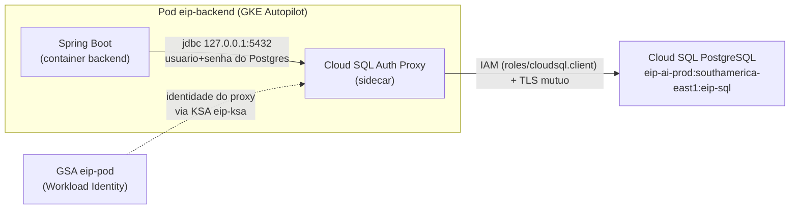

# Design — Identidade do Pod e Fluxo de Secrets

> Documento de design dedicado, complementar ao `design.md` da spec `gcp-production-deployment`.
> Escopo: **identidade da carga de trabalho (pod) + fluxo de credenciais/secrets**.
>
> **Natureza desta tarefa:** DESIGN APENAS (não-faturável). Nada é provisionado aqui.
> Não há `gcloud/kubectl/terraform/firebase apply`, não há geração de senha, não há criação
> de usuário, versão de secret ou cluster. Os blocos de YAML/Terraform abaixo são **propostas**
> para a Etapa 4 (fase faturável), não manifestos aplicáveis.

---

## Sumário executivo das decisões

1. **Banco:** conexão sempre via **Cloud SQL Auth Proxy (sidecar)** em `127.0.0.1:5432`. Sem
   `key.json`, sem senha GCP no pod, sem `authorized_networks` aberto. A identidade do proxy é a
   **GSA do pod** via Workload Identity, com `roles/cloudsql.client`.
2. **Secrets:** a lacuna atual (`secretKeyRef` apontando para um K8s Secret `eip-db-credentials`
   que ninguém materializa) é resolvida com o **Secret Manager add-on gerenciado do GKE**
   (derivado do Secrets Store CSI Driver + provider do Google Secret Manager, habilitado como
   **add-on do cluster**, não como instalação manual do CSI genérico) + um `SecretProviderClass`
   com `secretObjects` que **sincroniza** para o K8s Secret `eip-db-credentials`. Assim o
   **contrato de ENV atual do Spring é preservado** (sem reescrever o backend).
3. **IAM — duas identidades distintas no fluxo de arquivos:** o **pod** (`eip-pod`) obtém
   `roles/cloudsql.client` + `roles/aiplatform.user` + `roles/secretmanager.secretAccessor`
   **por secret** (nos 2 secrets) + `roles/iam.serviceAccountTokenCreator` **sobre o signer SA**;
   **sem nenhuma role de bucket**. O **signer SA** (`eip-signer`) é quem precisa de
   `storage.objects.create` + `storage.objects.get` **restritos ao bucket `eip-ai-prod-documents`**,
   porque é a identidade que a signed URL V4 representa perante o GCS.
   **Remover `roles/storage.objectAdmin`** do pod — o backend não toca objetos, só pede a assinatura.
4. **Três identidades distintas** e isoladas: GSA/KSA do pod, usuário Postgres `eip_app`
   (RLS-enforced) e usuário Postgres `eip_report` (SELECT-only, BYPASSRLS, só métricas Super Admin).
5. **Senhas:** geradas sob demanda (quando autorizado), gravadas direto como versão no Secret
   Manager via stdin, nunca em disco/Git/tfstate. App e reporting com senhas distintas.

Estas recomendações exigem **reescrever o `gsa_pod.tf`** (remover `objectAdmin`, trocar o
`secretAccessor` amplo por binding por-secret, adicionar `serviceAccountTokenCreator` no signer),
**criar o `signer.tf`** (signer SA `eip-signer` + role custom de bucket `create`+`get`) e
**ajustar o `deployment.yaml`** (usernames literais + volume CSI + `SecretProviderClass`). O diff
proposto está descrito abaixo, **mas não deve ser aplicado nesta tarefa**.

---

## Seção 1 — Fluxo de autenticação do banco (desenho definitivo)

### Diagrama



Textualmente:

```
Spring Boot --> localhost:5432 --> Cloud SQL Auth Proxy (sidecar) --> [IAM + TLS] --> Cloud SQL PostgreSQL
```

### Pontos de design (confirmados no código)

- O `deployment.yaml` já define `SPRING_DATASOURCE_URL = jdbc:postgresql://127.0.0.1:5432/eip` e o
  sidecar `cloud-sql-proxy:2.14.1` com `eip-ai-prod:southamerica-east1:eip-sql` e `--port=5432`.
  O Spring **nunca** fala com o IP do banco; só com o proxy local.
- **Sem `key.json`**: o proxy usa ADC, que no pod é a **GSA `eip-pod`** via Workload Identity
  (binding KSA `default/eip-ksa` ↔ GSA, já presente no `gsa_pod.tf`). O `serviceAccountName`
  do deployment é `eip-ksa`.
- **Sem senha GCP no pod**: a autorização de rede/transporte até o banco é 100% IAM.
- **Sem `authorized_networks` 0.0.0.0/0**: o proxy abre túnel TLS mútuo pela borda gerenciada do
  Cloud SQL; não é preciso liberar faixas de IP. (A instância já está RUNNABLE com
  `authorized_networks` vazio e deletion protection — manter assim.)

### Separação crítica: conexão × autenticação do usuário

Há **duas camadas distintas** que não devem ser confundidas:

| Camada | Quem autoriza | Com o quê |
|---|---|---|
| **Conexão** (abrir o túnel até a instância) | IAM | `roles/cloudsql.client` na GSA do pod (via proxy) |
| **Autenticação do usuário Postgres** (logar como `eip_app`/`eip_report`) | PostgreSQL | **usuário + senha de banco** (credencial de BANCO, não GCP) |

Ou seja: `roles/cloudsql.client` **autoriza a CONEXÃO** via proxy, mas **não** autentica o usuário
do Postgres. A senha do `eip_app`/`eip_report` continua sendo uma credencial de banco, que vem do
**Secret Manager → pod** (Seção 2). Não estamos usando IAM database authentication aqui; estamos
usando autenticação por senha do Postgres sobre um canal autorizado por IAM.

---

## Seção 2 — Fluxo de secrets (resolução da lacuna arquitetural)

### O problema

O `deployment.yaml` injeta `DB_USER`, `DB_PASSWORD`, `REPORTING_DB_USER`, `REPORTING_DB_PASSWORD`
via `valueFrom.secretKeyRef` de um **K8s Secret** chamado `eip-db-credentials`. Porém um
`secretKeyRef` **puro do Kubernetes NÃO lê o Secret Manager** — ele só lê um `Secret` que já exista
no cluster. Hoje **nada materializa** `eip-db-credentials` a partdo do Secret Manager
(`eip-db-app-password`, `eip-db-reporting-password`, hoje vazios). É preciso definir **quem** faz
essa ponte Secret Manager → K8s Secret.

### Opções comparadas

#### (a) Secret Manager add-on gerenciado do GKE — `secrets-store.csi.k8s.io` + provider GCP

O recurso escolhido é o **"Secret Manager add-on"** gerenciado do GKE, derivado do open-source
**Secrets Store CSI Driver** + **provider do Google Secret Manager**. Ele é habilitado como
**add-on do cluster** (ex.: `--addons=SecretManager` no `gcloud` / `enable_secret_manager` no
recurso de cluster), e **NÃO** é a instalação manual do CSI genérico — o Google gerencia o driver
e o provider.

Duas formas de consumir os secrets:

1. **Montar como arquivos em memória** (volume CSI) — forma **recomendada pela doc do Google**,
   mais segura (o valor fica em `tmpfs`, não é persistido em etcd como K8s Secret).
2. **Sincronizar para um K8s Secret** ("Synchronize secrets to Kubernetes Secrets"), via
   `secretObjects` — recurso oficial, tratado pela doc como **alternativa** à montagem em arquivo.

> **Decisão para o EIP:** usar a **sincronização para K8s Secret** (`secretObjects`/sync). É a
> opção menos "pura" (duplica o valor em etcd), mas é a necessária para **preservar o contrato de
> ENV atual do Spring** (`DB_PASSWORD`/`REPORTING_DB_PASSWORD` via `secretKeyRef`) **sem reescrever
> o backend**. A montagem em arquivo exigiria o Spring ler de disco — custo/risco que não se
> justifica aqui.

- **Prós:** nativo GCP; add-on **gerenciado** (sem operador persistente próprio para manter);
  rotação de versão refletida no restart do pod; binding de acesso por-secret se encaixa no
  least-privilege; integra Workload Identity (usa a GSA do pod para ler o Secret Manager).
- **Contras:** exige habilitar o add-on do Secret Manager no cluster; o `secretObjects` duplica o
  valor num K8s Secret (etcd) — inevitável para manter o contrato de ENV.

> **Nota (confirmar na Etapa 4):** o **nome exato da flag do add-on** na versão do **Autopilot**
> escolhida deve ser confirmado antes do go-live (ex.: `--addons=SecretManager` /
> `enable_secret_manager`), pois a disponibilidade/nomenclatura pode variar por versão do cluster.

#### (b) External Secrets Operator (ESO)

Operador que reconcilia `ExternalSecret` → K8s Secret a partir de várias origens (incl. GCP SM).

- **Prós:** flexível, multi-cloud, reconciliação contínua e rotação automática configurável.
- **Contras:** **componente extra** a instalar, versionar e manter (CRDs + controller rodando);
  mais superfície operacional do que o EIP precisa num único cluster GCP.

#### (c) Sincronização manual/controlada (script/CI)

Um passo de pipeline lê do Secret Manager e cria/atualiza o K8s Secret `eip-db-credentials`.

- **Prós:** simples, sem componentes no cluster.
- **Contras:** duplica o segredo no etcd; **sem reconciliação** — rotação vira processo manual
  disciplinado; risco de o segredo passar por logs/variáveis de CI se mal feito.

### Recomendação: opção (a) — Secret Manager add-on gerenciado do GKE

Para o EIP (GKE **Autopilot**, prioridade custo/simplicidade, stack **nativa GCP**, cluster único),
o **add-on gerenciado do Secret Manager** é o melhor equilíbrio: sem operador extra para manter
(ESO), com reconciliação de versão no ciclo de vida do pod (melhor que o script manual), e
integrando Workload Identity + binding por-secret do least-privilege. Consumo via **sync para K8s
Secret** (`secretObjects`) para preservar o contrato de ENV.

> Observação Autopilot: habilitar o **add-on gerenciado do Secret Manager** (não o CSI genérico
> instalado à mão) é uma configuração de cluster da Etapa 4. **Confirmar o nome exato da flag do
> add-on** na versão do Autopilot escolhida antes do go-live; caso contrário, cair para (c) como
> alternativa de contingência.

### Preservando o contrato de ENV atual do Spring

O backend hoje lê **ENV vars** (`DB_PASSWORD`, etc.). O add-on do Secret Manager, por padrão, monta
**arquivos**. Para manter o contrato de ENV **sem reescrever o backend**, usamos `secretObjects` no
`SecretProviderClass`: isso faz o add-on **sincronizar** os valores montados para um **K8s Secret**
(`eip-db-credentials`), e o `deployment.yaml` continua usando `secretKeyRef` para as **senhas**.

> Decisão: **manter o contrato de ENV** (sync para K8s Secret). Preferimos **não** reescrever o
> backend para ler de arquivo — o custo/risco de alterar o Spring não se justifica frente ao sync.

### Manifesto proposto (NÃO aplicar) — `SecretProviderClass`

Criado em `deploy/k8s/secret-provider-class.yaml` (**marcado "PROPOSTO — NÃO APLICAR"**):

```yaml
# PROPOSTO — NÃO APLICAR. Etapa 4 (fase faturável), após aprovação.
# Materializa eip-db-credentials (K8s Secret) a partir do Secret Manager via CSI driver.
apiVersion: secrets-store.csi.x-k8s.io/v1
kind: SecretProviderClass
metadata:
  name: eip-db-credentials-spc
  namespace: default
spec:
  provider: gcp
  parameters:
    secrets: |
      - resourceName: "projects/eip-ai-prod/secrets/eip-db-app-password/versions/latest"
        path: "db-password"
      - resourceName: "projects/eip-ai-prod/secrets/eip-db-reporting-password/versions/latest"
        path: "reporting-db-password"
  # Sincroniza os valores montados para um K8s Secret, preservando o contrato de ENV do Spring.
  secretObjects:
    - secretName: eip-db-credentials
      type: Opaque
      data:
        - objectName: "db-password"
          key: "db-password"
        - objectName: "reporting-db-password"
          key: "reporting-db-password"
```

> Nota sobre `db-user`/`reporting-db-user`: os **usernames** (`eip_app`, `eip_report`) **não são
> secret**. **Decisão adotada:** movê-los para `env.value` **literais** no deployment
> (`DB_USER="eip_app"`, `REPORTING_DB_USER="eip_report"`) e manter **apenas as senhas** no Secret
> Manager / K8s Secret (menos secrets a gerir). Por isso o `secretObjects` acima sincroniza somente
> `db-password` e `reporting-db-password`.

### Diff aplicado no `deployment.yaml` (arquivo marcado; NÃO aplicado ao cluster)

```yaml
# Trecho já refletido no deploy/k8s/deployment.yaml (marcado — NÃO aplicado ao cluster).
spec:
  template:
    spec:
      serviceAccountName: eip-ksa     # inalterado
      containers:
        - name: backend
          env:
            - name: DB_USER
              value: "eip_app"          # username NÃO é secret -> literal
            - name: DB_PASSWORD
              valueFrom:
                secretKeyRef: { name: eip-db-credentials, key: db-password }
            - name: REPORTING_DB_USER
              value: "eip_report"       # username NÃO é secret -> literal
            - name: REPORTING_DB_PASSWORD
              valueFrom:
                secretKeyRef: { name: eip-db-credentials, key: reporting-db-password }
          volumeMounts:
            - name: db-secrets-store
              mountPath: "/mnt/secrets-store"
              readOnly: true
      volumes:
        - name: db-secrets-store
          csi:
            driver: secrets-store.csi.k8s.io
            readOnly: true
            volumeAttributes:
              secretProviderClass: "eip-db-credentials-spc"
```

**O que muda no `deployment.yaml` atual, em resumo:**
- **Troca** `DB_USER`/`REPORTING_DB_USER` de `secretKeyRef` para `env.value` **literais**
  (`eip_app` / `eip_report`) — usernames não são secret.
- **Mantém** `DB_PASSWORD`/`REPORTING_DB_PASSWORD` via `secretKeyRef` do K8s Secret
  `eip-db-credentials` (chaves `db-password` / `reporting-db-password`).
- **Adiciona** `volumes[].csi` + `volumeMounts` referenciando o `SecretProviderClass`.
- Pré-requisito de cluster (Etapa 4): **add-on gerenciado do Secret Manager** habilitado + binding
  `secretAccessor` por-secret na GSA do pod (Seção 3).

---

## Seção 3 — Matriz IAM mínima (least-privilege por finalidade e por identidade)

### Fluxo correto da Signed URL V4 (CORREÇÃO IMPORTANTE)

> Doc oficial do Google: se a signed URL permite que um usuário leia os dados do objeto, a
> **service account** que assina precisa, ela mesma, de permissão para ler os dados do objeto.
> (Conteúdo reescrito para conformidade de licenciamento.)

Portanto o desenho correto do fluxo é:

```
pod GSA (eip-pod)
   --> signBlob (via roles/iam.serviceAccountTokenCreator sobre o signer)
       --> eip-signer (signer SA) assina a URL V4
           --> cliente usa a URL temporária
               --> GCS valida a operação contra as PERMISSÕES DO eip-signer no bucket
```

Consequência: **não basta** `serviceAccountTokenCreator`. O **signer SA (`eip-signer`)** precisa
ter as permissões de GCS correspondentes às operações que a URL autoriza, **restritas ao bucket
`eip-ai-prod-documents`**. Quem exerce a permissão perante o GCS é a identidade do signer embutida
na URL — não o pod, não o cliente.

### Inventário real do `StoragePort` (confirmado no código)

Há **exatamente 3 métodos**:

| Método | Operação HTTP da URL | Permissão GCS exigida do signer |
|---|---|---|
| `signedUpload` | PUT | `storage.objects.create` |
| `signedDownload` | GET | `storage.objects.get` |
| `buildKey` | — (só monta string) | nenhuma (não toca GCS) |

**NÃO há** DELETE de objeto nem LIST de objeto. O "listar" do módulo é **listagem de METADADOS no
banco** (via JPA), **não** no GCS. Logo o `eip-signer` precisa **apenas** de `storage.objects.create`
+ `storage.objects.get` no bucket — **sem delete, sem list**.

### Matriz IAM — identidade do POD (`eip-pod`)

| Finalidade | Role | Escopo | Observação |
|---|---|---|---|
| Cloud SQL | `roles/cloudsql.client` | projeto | conexão via Auth Proxy (sidecar) |
| Vertex AI | `roles/aiplatform.user` | projeto | chamadas Gemini/Vertex via ADC |
| Secret Manager | `roles/secretmanager.secretAccessor` | **por secret** — `eip-db-app-password` e `eip-db-reporting-password` (NÃO no projeto) | ler as senhas de banco |
| Assinatura de URL | `roles/iam.serviceAccountTokenCreator` **sobre o signer SA** (não no projeto) | signer SA | para IAM `signBlob` das URLs V4 |

> O **pod NÃO tem role de bucket**. Ele apenas pede a assinatura ao signer.

### Matriz IAM — identidade do SIGNER (`eip-signer`)

| Finalidade | Permissões | Escopo | Observação |
|---|---|---|---|
| Assinar URLs de upload/download | `storage.objects.create` + `storage.objects.get` | **bucket `eip-ai-prod-documents`** (binding de bucket, NUNCA no projeto) | exatamente as 2 operações do `StoragePort`; sem delete, sem list |

> O **signer NÃO é a identidade do pod**: é apenas a identidade que a URL V4 representa perante o
> GCS. Ela não recebe `cloudsql.client`/`aiplatform.user`/`secretAccessor`.

### Correção da afirmação anterior

A versão anterior deste documento afirmava que **"nenhuma role de bucket é necessária"**. Isso está
**incorreto**. O correto:

- o **POD** não tem role de bucket (ele só pede `signBlob`); **mas**
- o **SIGNER** precisa de `storage.objects.create` + `storage.objects.get` **no bucket
  `eip-ai-prod-documents`**, porque é a SA cuja permissão o GCS valida quando o cliente usa a URL.
- `roles/storage.objectAdmin` (presente hoje no `gsa_pod.tf` **no pod**) continua devendo ser
  **removido** — o pod não toca objetos.

### Nota Autopilot sobre `signBlob`

No **GKE Autopilot** com Workload Identity, `iam.serviceAccounts.signBlob` tende a estar
implicitamente disponível, mas mantemos o binding **explícito** `roles/iam.serviceAccountTokenCreator`
do `eip-pod` sobre o `eip-signer` por **clareza e portabilidade**.

### Confirmação do código do adapter

Confirmado no `GcsStorageAdapter.java` (profile `cloud`): o backend **não executa operação de objeto**
pelo pod. Ele faz **exclusivamente** `storage.signUrl(...)` para PUT e GET, usando
`ImpersonatedCredentials` que impersona o **signer SA** (`eip.gcs.signer-service-account`) e assina
via IAM Credentials `signBlob`. O Javadoc exige `roles/iam.serviceAccountTokenCreator` do caller
sobre o signer SA — e, pela doc do GCS, o signer precisa das permissões de objeto no bucket.

### Permissões do signer SA (`eip-signer`)

O `eip-signer` precisa **exatamente** das permissões das 2 operações do `StoragePort`
(`storage.objects.create` + `storage.objects.get`), **restritas ao bucket `eip-ai-prod-documents`**
via `google_storage_bucket_iam_member` (binding de bucket), **NUNCA** no projeto.

**Opção recomendada — role customizada (least-privilege exato):**

- `google_project_iam_custom_role` com **somente** `storage.objects.create` + `storage.objects.get`.
- Concedida ao `eip-signer` **no bucket** via `google_storage_bucket_iam_member`.
- **Trade-off:** least-privilege exato, **sem** `list`; porém a role custom **exige manutenção**
  (acompanhar mudanças de permissões do GCS ao longo do tempo).

**Alternativa aceitável — roles predefinidas:**

- `roles/storage.objectCreator` (cobre `create`) + `roles/storage.objectViewer` (cobre `get`,
  **mas inclui `list`**), ambas no bucket via dois `google_storage_bucket_iam_member`.
- **Trade-off:** mais simples de manter; porém concede um **leve excesso** (`storage.objects.list`),
  que o `StoragePort` não usa.

> **Decisão de design:** propor a **role customizada** como preferida (least-privilege exato) e
> deixar `objectCreator` + `objectViewer` como alternativa documentada. A escolha final fica para o
> usuário no momento da aplicação; o `signer.tf` traz a custom ativa e a alternativa **comentada**.

### Signer SA e bucket de produção (ainda não criados)

- **Dev (referência):** signer SA `eip-backend@eip-ai-dev.iam.gserviceaccount.com`, bucket
  `eip-ai-dev-documents` (us-central1).
- **Produção (nomes propostos):** signer SA `eip-signer@eip-ai-prod.iam.gserviceaccount.com`,
  bucket `eip-ai-prod-documents` (southamerica-east1).
- **Status:** bucket e signer SA de produção são de uma **etapa de storage (Etapa 4+)** e
  **ainda não existem**. Os valores de produção serão injetados via env
  (`GCS_SIGNER_SA`, `GCS_BUCKET`, `GOOGLE_CLOUD_PROJECT`). O `signer.tf` cria o signer SA e o
  binding de bucket; o bucket é referenciado por nome via variável `documents_bucket` (criado na
  etapa de storage, ou via `bucket.tf` proposto se desejado).

### Diff proposto para `gsa_pod.tf` (NÃO aplicar — reescrita da Etapa 4)

```hcl
# PROPOSTO — reescrita least-privilege do gsa_pod.tf (Etapa 4). NÃO aplicar nesta tarefa.

# 1) Remover roles/storage.objectAdmin da lista de roles de projeto.
locals {
  pod_roles = [
    "roles/aiplatform.user",   # Vertex AI
    "roles/cloudsql.client",   # Cloud SQL Auth Proxy
    # "roles/secretmanager.secretAccessor" -> NÃO amplo; ver binding por-secret abaixo
    # "roles/storage.objectAdmin"         -> REMOVIDO (backend só assina URLs)
  ]
}

resource "google_project_iam_member" "pod_roles" {
  for_each = toset(local.pod_roles)
  project  = var.project_id
  role     = each.value
  member   = "serviceAccount:${google_service_account.pod.email}"
}

# 2) secretAccessor POR SECRET (em vez de google_project_iam_member amplo).
resource "google_secret_manager_secret_iam_member" "pod_db_app_password" {
  secret_id = "eip-db-app-password"   # projects/eip-ai-prod/secrets/eip-db-app-password
  role      = "roles/secretmanager.secretAccessor"
  member    = "serviceAccount:${google_service_account.pod.email}"
}

resource "google_secret_manager_secret_iam_member" "pod_db_reporting_password" {
  secret_id = "eip-db-reporting-password"
  role      = "roles/secretmanager.secretAccessor"
  member    = "serviceAccount:${google_service_account.pod.email}"
}

# 3) serviceAccountTokenCreator SOBRE O SIGNER SA — definido no signer.tf (recurso eip-signer),
#    não no projeto. Ver deploy/infra/etapa4-gke-pod/signer.tf.

# 4) Workload Identity binding KSA<->GSA: INALTERADO.
```

> O binding `serviceAccountTokenCreator` do pod sobre o signer e as permissões de bucket do signer
> ficam no **`signer.tf`** (reescrita da Etapa 4), para manter a identidade do signer coesa num
> único arquivo.

**Resumo do diff vs. `gsa_pod.tf` atual:**
- **Remove** `roles/storage.objectAdmin`.
- **Remove** `roles/secretmanager.secretAccessor` do escopo de projeto; **adiciona** dois bindings
  `google_secret_manager_secret_iam_member` (um por secret).
- **Adiciona** `google_service_account_iam_member` com `serviceAccountTokenCreator` no signer SA.
- **Mantém** `roles/aiplatform.user`, `roles/cloudsql.client` e o binding Workload Identity.

---

## Seção 4 — As três identidades separadas (resumo)

```
GSA/KSA do pod (eip-pod / eip-ksa):
    roles/cloudsql.client
  + roles/aiplatform.user
  + roles/secretmanager.secretAccessor  (POR SECRET: eip-db-app-password, eip-db-reporting-password)
  + roles/iam.serviceAccountTokenCreator  (SOBRE o signer SA)
  (SEM role de bucket)

Signer SA (eip-signer):
    storage.objects.create + storage.objects.get  (NO BUCKET eip-ai-prod-documents)
    role custom recomendada (exato) OU objectCreator+objectViewer (alternativa, inclui list)
    (NÃO é a identidade do pod; é a identidade que a URL V4 representa perante o GCS)

PostgreSQL app user (eip_app):
    operações normais da aplicação, RLS-ENFORCED (NON-superuser, NON-BYPASSRLS)

PostgreSQL reporting user (eip_report):
    SELECT-only em 5 tabelas (subscription, organization, ai_usage_event, product_event, lead),
    BYPASSRLS, usado SÓ pelo Super Admin metrics
```

### Justificativa do BYPASSRLS do `eip_report` (confirmada no código)

- Definido na migração **V17** (`V17__reporting_role.sql`): `CREATE ROLE eip_report LOGIN ...
  NOSUPERUSER BYPASSRLS`, com `GRANT SELECT` **apenas** em `subscription, organization,
  ai_usage_event, product_event, lead`. Nenhum privilégio de escrita.
- **Uso real:** `MetricsJpaAdapter` (analytics cross-tenant de Super Admin) via
  `reportingJdbcTemplate` (lazy). **Nunca escreve.**
- **Por que BYPASSRLS:** as métricas agregam **todos os tenants**; o `eip_app` normal é RLS-scoped
  (V4: `FORCE RLS`, role sem BYPASSRLS), então não conseguiria enxergar além do tenant ativo.
  O `eip_report` é o canal **read-only e isolado** para a visão agregada.
- **Produção:** o role + o atributo BYPASSRLS são criados por um **DB admin**, **não** pela Flyway
  do app (nota da V17 e do `application-cloud.yml`). As credenciais vêm do Secret Manager.

---

## Seção 5 — Procedimento de geração/rotação de senhas (desenho, NÃO executar)

> As senhas aqui são **credenciais de BANCO** (Postgres `eip_app`/`eip_report`), não credenciais
> GCP. App e reporting usam senhas **distintas**.

### Geração (quando autorizado)

1. Gerar senha forte aleatória **sem imprimir no terminal nem em log**. Ex. de abordagens:
   - `openssl rand -base64 32`
   - Terraform `random_password` marcado como `sensitive = true`
   - gerador equivalente de CI com saída suprimida
2. Gravar **direto como versão** no Secret Manager, lendo de **stdin** (nunca de arquivo em disco
   versionado):
   ```
   # EXEMPLO (NÃO EXECUTAR nesta tarefa):
   printf '%s' "$SENHA" | gcloud secrets versions add eip-db-app-password --data-file=-
   printf '%s' "$SENHA_REP" | gcloud secrets versions add eip-db-reporting-password --data-file=-
   ```
3. **Nunca** colocar a senha em `.tf`/`tfvars`/`state`/Git, nem ecoar em terminal/log.

### Terraform e state

- Se usar `random_password`, marcar como **sensível** e, idealmente, **manter a geração fora do
  state do Cloud SQL** — ou gerar **fora do Terraform** e apenas referenciar a versão do Secret
  Manager. O objetivo é que a **senha nunca entre no tfstate**.

### Rotação

1. Adicionar **nova versão** no Secret Manager (passo 2 acima).
2. **Atualizar o usuário no Postgres** com a nova senha (`ALTER ROLE eip_app WITH PASSWORD ...`
   executado por DB admin, via canal seguro).
3. **Reiniciar/rolar o pod** (`kubectl rollout restart`) para que o CSI driver materialize a nova
   versão no K8s Secret e o Spring recarregue as ENV.

> Observação: como as ENV são lidas no startup, a rotação exige o rollout do pod (passo 3). O
> `SecretProviderClass` aponta para `versions/latest`; o rollout é o gatilho de recarga.

---

## Pré-requisitos e dependências (não executados)

- **Etapa 4 (faturável):** cria GSA `eip-pod`, signer SA `eip-signer` + binding de bucket
  (`signer.tf`), bindings IAM revisados (Seção 3), cluster GKE Autopilot, **add-on gerenciado do
  Secret Manager**, aplica `SecretProviderClass` + `deployment.yaml`.
- **Etapa de storage:** cria o bucket `eip-ai-prod-documents` (southamerica-east1, uniform
  bucket-level access, public access prevention). O signer SA e o binding de bucket vêm do
  `signer.tf` (Etapa 4); se o bucket for criado aqui, usar o `bucket.tf` proposto.
- **DB admin:** cria `eip_app`/`eip_report` (BYPASSRLS para o reporting) e grava as senhas no
  Secret Manager (`eip-db-app-password`, `eip-db-reporting-password`, hoje vazios).

---

## Checkpoint

Os **arquivos declarativos** da Etapa 4 foram **reescritos/criados** (`gsa_pod.tf`, `signer.tf`,
`bucket.tf`, `variables.tf`, `secret-provider-class.yaml`, `deployment.yaml`), **marcados "NÃO
EXECUTAR / Etapa 4 / aguardando autorização"**. **Nada foi aplicado**: sem `terraform/gcloud/
kubectl/firebase` (sem init/plan/apply), sem geração de senha, sem criação de usuário/secret/cluster.
`docker-compose` e `src/main` permanecem intactos. **Aguardando revisão do diff pelo usuário** antes
de qualquer provisionamento.
