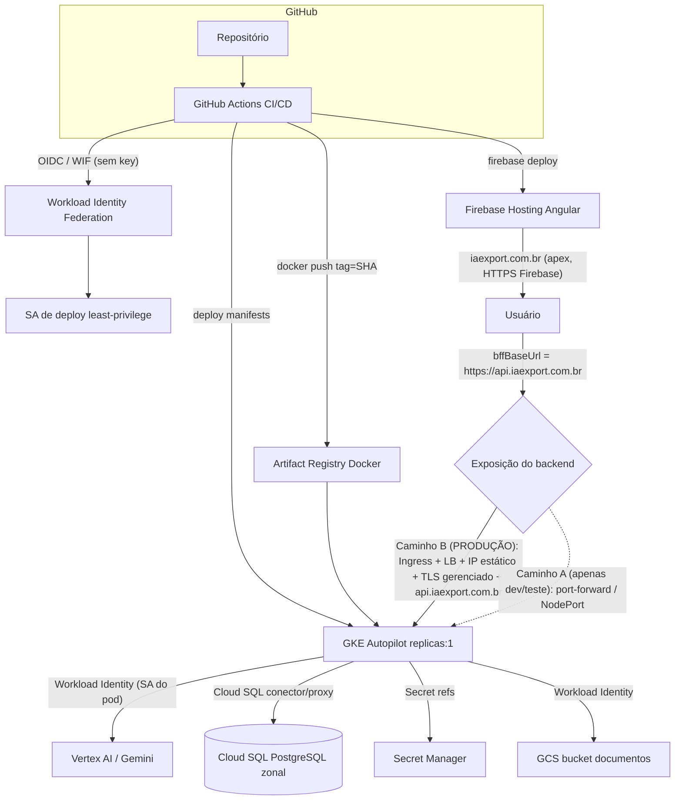

# Documento de Design: Deployment de Produção na GCP (gcp-production-deployment)

> ## ⛔ TRAVA CRÍTICA — LEIA ANTES DE QUALQUER COISA
>
> **Esta spec é SOMENTE documentação.** Nenhum recurso faturável da GCP (GKE, Cloud SQL,
> Load Balancer, Artifact Registry, IP estático, etc.) será provisionado nesta fase.
>
> O fluxo é estritamente: **Inventário → design.md → requirements.md → tasks.md**.
>
> A implementação (criação de infraestrutura e pipelines) só acontece **DEPOIS**:
> 1. da **aprovação explícita do usuário** sobre este design.md; **e**
> 2. da aprovação do **Relatório de Pré-Aprovação de Custos** (seção dedicada abaixo).
>
> Até lá, todas as edições são apenas em arquivos locais (código/config/manifests),
> que **não geram cobrança**. Nenhum comando `gcloud`, `kubectl`, `terraform` ou
> equivalente que crie recursos será executado.
>
> **Reforço:** nenhuma task marcada com 💲 executa sem aprovação explícita do usuário. A **Fase 0 é
> não-faturável** (apenas código/config/manifests/workflows versionados). O arquivo `cd.yml` existe no
> repositório, mas **não cria nada em PR** e só realiza deploy em `master` **depois** da infra faturável
> ser provisionada e dos vars/secrets de WIF existirem.

---

## Visão Geral

O objetivo é preparar o EIP (backend Spring Boot + frontend Angular 20) para **deployment
automatizado e econômico na GCP a partir do GitHub**, preservando a arquitetura e os fluxos
já validados — sem quebrar o caminho feliz `UI → BFF → Vertex AI → ledger`.

Princípios que guiam todo o design:

- **Custo mínimo primeiro.** Nenhuma ferramenta paga (sem SonarQube, sem quality gate pago).
  Runners default do GitHub Actions. Tamanhos mínimos de recursos. Free tiers sempre que possível.
- **Simplicidade sobre sofisticação.** Começar com `replicas: 1`, Cloud SQL sem HA, zonal.
- **Sem segredos no código.** Workload Identity Federation (sem chave de SA persistente) e
  Secret Manager para senhas de banco.
- **Rastreabilidade por SHA.** Imagens taggeadas pelo Git SHA (nunca `latest`); rollback é
  re-aplicar o SHA anterior.
- **Preservar o ambiente local.** O `docker-compose.yml` local permanece **intacto**.

Dois caminhos de exposição do backend são desenhados lado a lado. **A decisão definitiva do usuário
é: o Caminho B (HTTP(S) Load Balancer gerenciado + IP estático + certificado TLS gerenciado pelo
Google + domínio `api.iaexport.com.br`) é o ALVO DE PRODUÇÃO.** O Caminho A (sem LB / NodePort /
`port-forward`) existe **apenas para desenvolvimento/teste técnico — NÃO é produção**.

### Decisões definitivas do usuário (substituem os padrões anteriores)

1. **Região oficial de produção: `southamerica-east1` (São Paulo).** Banco + backend na mesma região;
   público-alvo brasileiro. `us-central1` seria mais barato, mas a decisão é SP (menor latência ao
   usuário final). Vertex: `VERTEX_LOCATION` pode permanecer `global` (Gemini) ou `southamerica-east1`
   **se o modelo estiver disponível lá — confirmar disponibilidade do modelo na região antes do
   go-live**. O id do modelo continua resolvido pelo router via `ai_model_config`, não por env.
2. **Exposição ALVO de produção = Caminho B** (LB gerenciado + IP estático + TLS gerenciado + domínio
   `api.iaexport.com.br`). Caminho A é só dev/teste técnico.
3. **Frontend:** Firebase Hosting com domínio custom **`iaexport.com.br`** (apex). Usuário já possui o
   domínio e controla o DNS.
4. **Cloud SQL:** `db-f1-micro`, sem HA, zonal, disco mínimo — **configuração econômica INICIAL**, a
   ser redimensionada (HA/tier maior) antes de assumir SLA mais rigoroso.
5. **GKE:** `replicas: 1`, requests iniciais `cpu 250m / memory 512Mi` — **512Mi NÃO é capacidade
   comprovada**; medir RSS/heap/CPU após deploy e, se necessário, subir para 1Gi. **Avaliar G1 em vez
   de ZGC** no container pequeno (decisão a validar com medição).
6. **Projeto:** `eip-ai-prod`, separado de `eip-ai-dev` (confirmado).
7. **Pipeline:** CI (em PR, sem deploy) separado de CD (em `master`, com push de imagem + rollout +
   firebase). Nunca `latest` — sempre `eip-backend:<git-sha>`.
8. **Gate de testes:** `ai-resilience-hardening` 1.4/2.4/3.6/4.4 bloqueantes; 5.5 best-effort —
   vale tanto no PR quanto no `master`.

---

## Inventário do Estado Atual

Inventário real, obtido por leitura dos arquivos do repositório (não suposição).

### Backend (Spring Boot)

| Item | Estado atual (confirmado) |
|------|---------------------------|
| `backend/Dockerfile` | Multi-stage: `maven:3.9-eclipse-temurin-21` (build, `mvn -DskipTests package`, cache `.m2` via BuildKit) → `eclipse-temurin:21-jre` (runtime). `EXPOSE 8080`. Entrypoint: `java -XX:+UseZGC -jar app.jar`. **Sem Maven wrapper** no repo. |
| `backend/pom.xml` | Java 21, Spring Boot **3.5.6**, Spring Modulith 1.3.5, Resilience4j 2.2.0, Flyway (core + postgresql), Spring Security + OAuth2 (resource server + client), Data JPA, Actuator, AOP, springdoc, google-auth-library-oauth2-http, google-cloud-storage. Testes: Testcontainers (postgresql), spring-modulith-test, archunit, spring-security-test. Artefato: `eip-backend-0.0.1-SNAPSHOT.jar`. |
| `backend/docker-compose.yml` | **LOCAL (não remover).** Serviço `app` (profile `local`, `SPRING_DATASOURCE_URL=jdbc:postgresql://db:5432/eip`, `DB_USER/DB_PASSWORD=eip`) + `db` (`postgres:16`, db/user/pass `eip`, healthcheck `pg_isready`). `redis` comentado. |
| `backend/docker-compose.cloud.yml` | **DEV-CLOUD (não é produção).** Override profile `cloud`: monta ADC do host **read-only** em `/gcloud` (`ADC_DIR`), `GOOGLE_APPLICATION_CREDENTIALS=/gcloud/application_default_credentials.json`, `GOOGLE_CLOUD_PROJECT=eip-ai-dev`, `VERTEX_LOCATION=global`, `REPORTING_DB_USER/PASSWORD`. Comentário explícito: nenhum `key.json` na imagem. |
| `backend/README-cloud-run.md` | Guia de verificação manual do profile `cloud` com `gcloud auth application-default login` + `docker compose -f docker-compose.yml -f docker-compose.cloud.yml up -d`. |

### Perfis Spring (diferenças relevantes)

Base: `backend/src/main/resources/application.yml`; override cloud: `application-cloud.yml`.

| Aspecto | `local` / default (`application.yml`) | `cloud` (`application-cloud.yml`) |
|---------|---------------------------------------|-----------------------------------|
| Datasource | URL/user/pass via env (`SPRING_DATASOURCE_URL`, `DB_USER`, `DB_PASSWORD`), Hikari `maximum-pool-size=8` | Hikari `maximum-pool-size=5` (muitas instâncias → respeitar budget de conexões do DB) |
| JPA ddl-auto | `validate` (base); `none` no bloco `local` | herda `validate` |
| Flyway | `enabled: true`, `baseline-on-migrate: true` | herda |
| Virtual threads | `spring.threads.virtual.enabled=true` | herda |
| Vertex AI | não configurado (usa mock no default/demo) | `eip.ai.vertex.{project,location,endpoint,api-version,timeout.connect/read}` via env (defaults `eip-ai-dev`/`global`/30s) |
| GCS | — | `eip.gcs.{bucket,project,signer-service-account,signed-url-ttl-minutes}` (bucket `eip-ai-dev-documents`, signer `eip-backend@eip-ai-dev.iam.gserviceaccount.com`) |
| Reporting datasource | `eip.reporting.datasource` (role `eip_report`, defaults locais) | mesma seção, mas user/pass **de Secret Manager** em prod via `REPORTING_*` |
| Resilience4j | — | retry (`max-attempts=2`, backoff exp + jitter, allow-list sem 4xx), circuit breaker, bulkhead para `vertex` |
| Actuator exposure | `health,info,prometheus` | `health,info,prometheus,metrics,circuitbreakers` + `management.health.circuitbreakers.enabled=true` |
| Health probes | `management.endpoint.health.probes.enabled=true` + group `readiness: readinessState,db` | herda da base |

### Flyway (migrations)

- Localização: `backend/src/main/resources/db/migration`. Versões **V1 → V23** (contíguas).
- V23 = `ai_usage_outcome` (adiciona `outcome`/`failure_category`/`trace_id` ao ledger de IA).
- **RLS / FORCE ROW LEVEL SECURITY** presente em V4 (`rls_policies`) e V8 (`ai_hub`).
- V17 (`reporting_role`) cria o role `eip_report` (SELECT-only, BYPASSRLS) usado pelo worker de
  reporting via `REPORTING_DB_USER`/`REPORTING_DB_PASSWORD`.
- Flyway roda as migrations **no startup do backend** (como hoje). Isso se mantém na GCP.

### Frontend (Angular 20)

| Item | Estado atual (confirmado) |
|------|---------------------------|
| `angular.json` | Builder `@angular/build:application`. `defaultConfiguration: production`. Produção substitui `environment.ts` por `environment.prod.ts` (`fileReplacements`), `outputHashing: all`, budgets (initial 500kB warn / 1MB error). Saída padrão em `dist/psf-digital-frontend`. Testes via `@angular/build:karma`. |
| `src/environments/environment.ts` (dev) | `production:false`, `useMockServices:false`, `bffBaseUrl:''` (paths relativos `/bff/...` via proxy), `realApis`: `auth:true`, `ai:true`, demais `false`. |
| `src/environments/environment.prod.ts` | `production:true`, **`useMockServices:true`**, `bffBaseUrl:''`, **todas as `realApis` em `false`**. ⚠️ **GAP:** o build de produção hoje roda **totalmente mockado** e same-origin (`bffBaseUrl:''`). Para prod real precisa ligar `realApis` e apontar `bffBaseUrl` para o backend. Ver "Gaps a resolver". |
| Build | `node_modules\.bin\ng.cmd build --configuration=development|production`, saída `dist/psf-digital-frontend`. |

### Secrets/config atuais (dev)

- **ADC por volume** no dev-cloud: `%APPDATA%\gcloud\application_default_credentials.json` montado read-only. **NÃO vai para produção.**
- SA de impersonation (signer GCS): `eip-backend@eip-ai-dev.iam.gserviceaccount.com`.
- Bucket GCS (dev): `eip-ai-dev-documents`. Em produção haverá bucket próprio em `eip-ai-prod` na
  região de produção (`southamerica-east1`).
- Vertex: `PROJECT=eip-ai-dev`, `MODEL=gemini-3.8-flash` (resolvido pelo router via `ai_model_config`, não por env), `LOCATION=global`.

### Health endpoints

- `/actuator/health` → `UP`. `circuitbreakers` health indicator habilitado no profile `cloud`.
- `probes.enabled=true` **já está** na base, e há um group `readiness` (`readinessState,db`).
- **GAP:** não há group `liveness` explícito. Spring Boot cria `liveness`/`readiness` padrão quando
  `probes.enabled=true`, mas é prudente **declarar explicitamente** os grupos
  (`management.endpoint.health.group.liveness.include=livenessState` e
  `readiness.include=readinessState,db`) para que as probes do GKE
  (`/actuator/health/liveness` e `/actuator/health/readiness`) sejam estáveis e intencionais.
  Ver "Gaps a resolver".

### GitHub / CI-CD

- **Não existe `.github/workflows`** (confirmado por busca). O CI/CD será criado **do zero**.

### LOCAL vs CLOUD/PROD (fronteira explícita)

| Camada | LOCAL (inalterado) | CLOUD / PROD (alvo desta spec) |
|--------|--------------------|--------------------------------|
| Orquestração | Docker Compose (`docker-compose.yml`) | GKE Autopilot (backend) |
| Banco | `postgres:16` em container | Cloud SQL for PostgreSQL (zonal, sem HA) |
| Credenciais Vertex | ADC por volume (dev-cloud) | Workload Identity (SA do pod), **sem key.json** |
| Frontend | `ng serve` + proxy | Firebase Hosting (CDN + HTTPS grátis) |
| Imagens | build local | Artifact Registry (tag = Git SHA) |
| Secrets | env vars `eip/eip` | Secret Manager → GKE |

> O `docker-compose.yml` local **permanece intacto**. O `docker-compose.cloud.yml` continua
> servindo para testes de dev-cloud com ADC; **não** é o mecanismo de produção.

### Gaps a resolver (não-faturáveis, fase de preparação)

1. **Liveness group explícito** no backend (base `application.yml`), para probes estáveis no GKE.
2. **`environment.prod.ts`** do Angular: ligar `realApis` necessárias (ao menos `auth`, `ai`),
   definir `useMockServices:false` e apontar `bffBaseUrl` para o backend de produção
   **`https://api.iaexport.com.br` (Caminho B)**.
3. **Manifests K8s** versionados (Deployment, Service, probes, requests/limits, Secret refs) — não existem.
4. **Workflows GitHub Actions** (CI/CD separados) — não existem.
5. **Dockerfile**: ENTRYPOINT que respeite o limite de memória do container e permita avaliação
   G1 vs ZGC. Usar `JAVA_OPTS` parametrizável via env com default seguro para pod pequeno
   (`-XX:MaxRAMPercentage=70 -XX:+UseG1GC`), em vez da flag fixa `-XX:+UseZGC`. ZGC permanece opção
   para pods maiores via override de `JAVA_OPTS`. `PORT` já suportado via `server.port=${PORT:8080}`.

---

## Arquitetura Alvo



> **Produção:** frontend em `iaexport.com.br` (Firebase Hosting, apex) fala com o backend em
> `https://api.iaexport.com.br` (Caminho B). O Caminho A (linha pontilhada) é somente para
> desenvolvimento/teste técnico e nunca atende usuários finais.

### Fluxo de deploy (visão de sequência) — CD (`master`)

> Em **PR** (`ci.yml`) os mesmos checks de build/test rodam, mas o fluxo **para após `docker build`**
> (sem push, sem rollout, sem firebase). O diagrama abaixo é o **CD** (`master`).

```mermaid
sequenceDiagram
    participant Dev as Dev (push master)
    participant GA as GitHub Actions
    participant WIF as WIF/OIDC
    participant AR as Artifact Registry
    participant GKE as GKE Autopilot
    participant FH as Firebase Hosting

    Dev->>GA: push/merge na branch master (cd.yml)
    GA->>GA: checkout + gate de testes (1.4/2.4/3.6/4.4; 5.5 best-effort)
    GA->>GA: build Angular (prod) + build backend (jar)
    GA->>WIF: autenticar via OIDC (sem key)
    WIF-->>GA: token de acesso de curta duração
    GA->>AR: docker build + push (tag = Git SHA)
    GA->>GKE: aplicar manifests com imagem :<SHA>
    GKE->>GKE: Flyway migra no startup + probes liveness/readiness
    GKE-->>GA: rollout OK (readiness UP)
    GA->>FH: firebase deploy (frontend)
    Note over GA,GKE: Rollback = re-aplicar manifests do SHA anterior
```

---

## Componentes e Decisões

### 1. GitHub Actions — CI separado de CD

**Propósito:** orquestrar build, testes, publicação de imagem e deploy, a custo zero de ferramentas
(runners default `ubuntu-latest`). **CI e CD são workflows separados e com gatilhos distintos.**

**`ci.yml` — CI em Pull Request (e pushes de branch que não seja `master`). SEM deploy, SEM login GCP.**

```
PR (qualquer branch → PR):
  - backend:      compile/test  (mvn -B verify, incl. gate 1.4/2.4/3.6/4.4; 5.5 best-effort)
  - frontend:     build/test    (npm ci, ng build --configuration=production, ng test headless best-effort)
  - docker-build: docker build  (SEM push, SEM deploy)
```

**`cd.yml` — CD em push/merge na branch `master`. Faz deploy.**

```
master (push/merge em master):
  - mesmos checks  (compile/test backend, build/test front)
  - docker build
  - push Artifact Registry   eip-backend:<GIT_SHA>
  - GKE rollout              (imagem :<SHA>, kubectl set image/apply + rollout status)
  - aguardar readiness
  - Firebase deploy          (frontend)
```

Regra permanente: **CI = PR (build/test, sem deploy); CD = `master` (push imagem + rollout + firebase).**
A tag da imagem é sempre `${{ github.sha }}` — **nunca `latest`**. O CD autentica na GCP via WIF/OIDC
(`google-github-actions/auth`), sem chave de SA persistente (apenas `workload_identity_provider` e
`service_account` como *vars*).

**Jobs (desenho; os YAML existem como arquivos na Fase 0, mas o CD só funciona após a infra faturável):**

| Workflow | Job | Faz | Deploy? |
|----------|-----|-----|---------|
| `ci.yml` | `backend` | `mvn -B verify` (gate 1.4/2.4/3.6/4.4; 5.5 best-effort) | Não |
| `ci.yml` | `frontend` | `npm ci` + `ng build --configuration=production` + `ng test` headless (best-effort) | Não |
| `ci.yml` | `docker-build` | `docker build` do backend (sem push) | Não |
| `cd.yml` | `backend`/`frontend` | mesmos checks do CI (gate) | Não |
| `cd.yml` | `build-and-push` | auth WIF + `docker build` + push `eip-backend:${{ github.sha }}` | Push |
| `cd.yml` | `deploy-backend` | auth WIF + `get-credentials` + `kubectl set image`/apply `:<SHA>` + `rollout status` | Sim |
| `cd.yml` | `deploy-frontend` | `firebase deploy` (autenticado por WIF/OIDC) | Sim |

**Gate de testes (o que bloqueia o deploy vs best-effort) — vale em PR e em `master`:**

| Teste | Fonte | No gate? |
|-------|-------|----------|
| Compilação backend (`mvn package`) | pom.xml | **Sim** (bloqueia) |
| Build Angular produção | angular.json | **Sim** (bloqueia) |
| 1.4 Unit/property taxonomia de erro (jqwik/Maven) | ai-resilience-hardening | **Sim** (bloqueia) |
| 2.4 Property validação de resposta (stub) | ai-resilience-hardening | **Sim** (bloqueia) |
| 3.6 Property reconciliação parcial/review | ai-resilience-hardening | **Sim** (bloqueia) |
| 4.4 Property redação + desfecho de ledger | ai-resilience-hardening | **Sim** (bloqueia) |
| 5.5 Testes de componente/serviço do front | ai-resilience-hardening | **Best-effort** (não bloqueia; `continue-on-error`; estabilizar e promover a gate) |
| Smoke com Vertex real | manual/orchestrator | **Fora do CI/CD** (único check com provedor real; não automatizar no pipeline) |

> O gate (1.4/2.4/3.6/4.4 bloqueantes; 5.5 best-effort) é idêntico em **PR** (`ci.yml`) e em
> **`master`** (`cd.yml`). Como não há Maven local, o CI é onde esses testes finalmente rodam.

### 2. Workload Identity Federation (WIF) — autenticação GitHub → GCP

**Propósito:** autenticar o GitHub Actions na GCP **sem chave de SA persistente**.

- **Pool OIDC:** `github-pool`. **Provider OIDC:** `github-provider` com issuer
  `https://token.actions.githubusercontent.com`, mapeando `assertion.repository` e `assertion.ref`.
- **Condição de atributo:** restringir ao repositório específico e à branch `master`
  (ex.: `attribute.repository == 'alandep/psf-digital-frontend' && attribute.ref == 'refs/heads/master'`),
  para que só este repo e esta branch possam impersonar a SA.
- **SA de deploy** (`deployer@eip-ai-prod.iam.gserviceaccount.com`) com **least-privilege POR ETAPA**.
  Na **Etapa 1 (WIF)** a SA é **criada SEM nenhuma role de projeto**; o único binding desta etapa é
  `roles/iam.workloadIdentityUser` **sobre a própria SA** (não é role de projeto — é o que permite o
  GitHub impersoná-la). As roles de projeto são concedidas **incrementalmente** nas etapas seguintes
  (ver seção IAM: `artifactregistry.writer` na etapa de Artifact Registry; `container.developer` e
  `firebasehosting.admin` na etapa de GKE/Firebase).
- **Sem `credentials_json` persistente** nos secrets do GitHub: apenas `workload_identity_provider`
  e `service_account` (identificadores, não segredos).

> **Projeto + billing fora da IaC.** O projeto `eip-ai-prod` e a vinculação de billing são
> criados/controlados pelo usuário **diretamente no Console** — **não** há `google_project` nem
> recurso de billing no Terraform; a IaC assume o projeto pré-existente (com billing ativo) via
> `var.project_id`. **APIs são habilitadas incrementalmente por etapa:** Etapa 1 habilita apenas
> `iam`, `iamcredentials`, `sts`, `cloudresourcemanager`; as demais APIs entram nas etapas que as
> usam. A estrutura `deploy/infra/` é dividida em subpastas por etapa com **state isolado**, de modo
> que aplicar a Etapa 1 **não** cria recursos das outras etapas.

### 3. Artifact Registry (imagens Docker)

- Repositório Docker regional em **`southamerica-east1`** (mesma região do GKE) `eip-backend`.
- **Tag = Git SHA** (nunca `latest`); imagem completa `southamerica-east1-docker.pkg.dev/eip-ai-prod/eip-backend/eip-backend:<GIT_SHA>`.
- **Política de limpeza (cleanup policy):** manter as últimas N imagens (`keep-last-N`, ex.: 10) e
  **deletar por idade** (ex.: untagged/antigas > 30 dias), para evitar acúmulo e custo de storage.

### 4. GKE Autopilot (backend)

- Modo **Autopilot** em **`southamerica-east1`** (paga-se por recurso de pod solicitado; sem gerenciar nós).
- `replicas: 1` inicialmente.
- **Requests iniciais:** `cpu 250m / memory 512Mi` (limits `cpu 500m / memory 1Gi`). ⚠️ **512Mi NÃO é
  capacidade comprovada** — ponto de partida a MEDIR (RSS/heap/CPU do Spring Boot) após deploy; se
  houver `OOMKilled` ou pressão de memória, subir para 1Gi. Ver "Ponto de economia 3".
- **GC:** o runtime usa **G1** por default (via `JAVA_OPTS`, ver Dockerfile) por ter footprint menor
  em heaps pequenos; **avaliar G1 vs ZGC com medição** no pod pequeno. ZGC continua disponível por
  override de `JAVA_OPTS` para pods maiores.
- **Probes:** `livenessProbe` → `/actuator/health/liveness`; `readinessProbe` → `/actuator/health/readiness`
  (depende do gap de liveness group ser resolvido na preparação).
- **Workload Identity:** a KSA (Kubernetes SA) é vinculada a uma GSA (`eip-pod@eip-ai-prod...`) que
  tem acesso a Vertex AI e GCS — **substitui o ADC-por-volume do dev**, sem `key.json`.
- **Flyway** roda no startup do pod (como hoje). A readiness inclui `db`, então o pod só entra em
  tráfego quando o banco está acessível e as migrations aplicaram.

Ver subseção **"Ponto de economia 3: tamanho mínimo do pod"** para requests/limits.

### 5. Cloud SQL (PostgreSQL)

- **PostgreSQL 16** (igual ao local) em **`southamerica-east1`** (mesma região do backend), **zonal,
  sem HA**, tier mínimo **`db-f1-micro`**, disco mínimo (ex.: 10 GB).
- ⚠️ **Configuração econômica INICIAL.** Deve ser **redimensionada antes de assumir SLA mais rigoroso**:
  adicionar HA (regional) e/ou tier maior quando houver criticidade. Ver acceptance criteria 5.4.
- **Conexão:** recomendação = **Cloud SQL Auth Proxy como sidecar** no pod do backend.
  Justificativa: é a opção mais simples e barata para começar — não exige IP privado/VPC peering
  (que no caminho privado puro pode envolver custos/complexidade de rede), autentica via IAM
  (sem expor senha de rede), e funciona bem com `replicas: 1`. O backend conecta em
  `jdbc:postgresql://127.0.0.1:5432/eip` (o proxy local no pod). Senha do app vem do Secret Manager.
- Alternativa (futuro): conector nativo / IP privado quando houver VPC dedicada e necessidade de
  menor latência. Registrado como trade-off, não como escolha inicial.

Ver subseção **"Ponto de economia 2: Cloud SQL"**.

### 6. Frontend (Firebase Hosting)

- Hospedado **fora do Kubernetes**, em **Firebase Hosting** (CDN + HTTPS grátis).
- **Domínio custom:** **`iaexport.com.br`** (apex). O usuário já possui o domínio registrado e controla
  o DNS. Requer **verificação de domínio no Firebase** para `iaexport.com.br` e os registros DNS que o
  Firebase indicar (apex A/AAAA ou conforme o fluxo de domínio custom do Firebase Hosting).
- O build de produção (`ng build --configuration=production`) gera `dist/psf-digital-frontend`,
  publicado via `firebase deploy`.
- `environment.prod.ts` aponta `bffBaseUrl` para **`https://api.iaexport.com.br` (Caminho B)**.
  **HTTPS do front é gerenciado pelo Firebase.**

### 7. Vertex AI / Gemini

- Permanece **no backend**. O pod GKE chama Vertex via **Workload Identity** (GSA do pod com
  `roles/aiplatform.user`) — **sem `key.json`**, substituindo o ADC-por-volume do dev.
- Config via env no profile `cloud`: `GOOGLE_CLOUD_PROJECT=eip-ai-prod`, `VERTEX_LOCATION`. Em SP,
  `VERTEX_LOCATION` pode permanecer **`global`** (Gemini) ou **`southamerica-east1`** se o modelo
  estiver disponível na região — **confirmar disponibilidade do modelo na região antes do go-live**.
  O id do modelo continua resolvido pelo router via `ai_model_config` (não por env).

### 8. Secrets (Secret Manager → GKE)

Nenhum segredo no código. Secrets no **Secret Manager**, injetados no pod (como env de Secret K8s
alimentado por Secret Manager, ou via CSI driver):

| Secret | Uso |
|--------|-----|
| `eip-db-app-password` | senha do usuário de aplicação do Cloud SQL |
| `eip-db-reporting-password` | senha do `eip_report` (worker de reporting / RLS BYPASSRLS) |
| (sensíveis adicionais) | quaisquer configs sensíveis futuras |

ADC-por-volume **não** vai para produção. Credenciais Google são obtidas por Workload Identity.

### 9. Rollout / Rollback por SHA

- Imagem sempre taggeada com o **Git SHA**; manifests versionados referenciam `:<SHA>`.
- Deploy = `kubectl apply`/`kubectl set image` com o novo SHA; aguardar rollout + readiness.
- **Rollback = re-aplicar o manifest/imagem do SHA anterior.** Nunca `latest`.

---

## Exposição do Backend — Dois Caminhos (B = produção; A = dev/teste)

### Caminho B — Produção Pública (ALVO DE PRODUÇÃO) ✅

- **Com HTTP(S) Load Balancer gerenciado** (escolhido: **Ingress GKE**, pela simplicidade) + **IP
  estático** + **certificado TLS gerenciado pelo Google** (`ManagedCertificate`) + **domínio
  `api.iaexport.com.br`**.
- **DNS/TLS (pré-requisito do Caminho B, não bloqueia a Fase 0):** registro **A/AAAA de
  `api.iaexport.com.br`** apontando ao **IP estático do LB** + `ManagedCertificate` para o domínio.
  O usuário controla o DNS de `iaexport.com.br`.
- **Custo fixo mensal:** ordem de **~US$ 18+/mês** (forwarding rule do LB) + **egress** variável.
- HTTPS público estável, domínio próprio, pronto para usuários externos. **É o desenho de produção.**

### Caminho A — Economia Máxima (APENAS dev/teste técnico — NÃO é produção) ⚠️

- **Sem HTTP(S) Load Balancer gerenciado.** Opções:
  - `kubectl port-forward` (acesso ad hoc, só enquanto o comando roda);
  - `Service NodePort` (porta no nó, sem IP estável/HTTPS gerenciado).
- **Custo adicional ≈ US$ 0** (sem forwarding rule, sem IP estático).
- **Limitações:** sem HTTPS público estável, sem domínio próprio. **Explicitamente apenas para
  desenvolvimento/teste técnico — não atende usuários finais e não é o caminho de produção.**

> **Frontend:** o Firebase Hosting dá HTTPS gerenciado ao front (`iaexport.com.br`) em qualquer caso.
> **O ponto de custo de exposição é apenas o backend** (Caminho B, produção).

---

## Decisões Definitivas (já confirmadas pelo usuário)

| Decisão | Valor definitivo | Observação |
|---------|------------------|------------|
| Região | **`southamerica-east1` (São Paulo)** | Banco + backend na mesma região; público brasileiro. `us-central1` seria mais barato, mas a decisão é SP. |
| Exposição de produção | **Caminho B** (LB + IP estático + TLS gerenciado + `api.iaexport.com.br`) | Caminho A é só dev/teste técnico |
| Frontend | **Firebase Hosting + `iaexport.com.br` (apex)** | Domínio já registrado; usuário controla o DNS |
| Cloud SQL | `db-f1-micro`, **sem HA**, zonal, disco mínimo | Econômico INICIAL; redimensionar antes de SLA rigoroso |
| GKE | `replicas: 1`, requests `250m/512Mi` | 512Mi a MEDIR; G1 a validar vs ZGC |
| Projeto GCP | **`eip-ai-prod`** (separado de `eip-ai-dev`) | Isola billing/IAM/dados de prod |
| Pipeline | **CI (PR, sem deploy) + CD (`master`, com deploy)** | Nunca `latest`; sempre `eip-backend:<git-sha>` |

### Região: por que `southamerica-east1` (São Paulo) e não `us-central1`

| Critério | `us-central1` (Iowa) | `southamerica-east1` (São Paulo) ✅ ESCOLHIDA |
|----------|----------------------|----------------------------------|
| Custo relativo | Geralmente **mais barato** | Tipicamente **mais caro** (prêmio regional sobre compute/SQL/egress) |
| Latência Brasil | Maior (~120–160 ms típicos de ida/volta) | **Menor** (usuários no Brasil) |
| Vertex AI | `global`/US amplamente disponível | `VERTEX_LOCATION` pode ficar `global`, ou `southamerica-east1` se o modelo estiver disponível — **confirmar antes do go-live** |

> **Decisão:** `southamerica-east1`. `us-central1` seria mais barato, mas a escolha é SP para colocar
> banco + backend na mesma região e minimizar latência ao público brasileiro. Os valores de custo são
> **ordens de grandeza** e variam por região — não são cotações exatas.

---

## 🧾 Relatório de Pré-Aprovação de Custos (OBRIGATÓRIO antes de qualquer recurso faturável)

> **Nada abaixo será criado sem aprovação explícita.** Todos os valores são **estimativas de ordem
> de grandeza em US$**, variáveis por região e uso. Não são cotações exatas (preços mudam; egress e
> IA são por consumo).

### 1. Recursos GCP que serão criados

- Projeto GCP novo `eip-ai-prod`.
- Workload Identity Federation (pool + provider OIDC) + SA de deploy.
- Artifact Registry (repositório Docker) com cleanup policy.
- GKE Autopilot (1 cluster, backend `replicas: 1`).
- Cloud SQL for PostgreSQL (zonal, sem HA, `db-f1-micro`).
- Secret Manager (senhas do banco).
- GSA do pod (Vertex/GCS via Workload Identity).
- **Caminho B (ALVO DE PRODUÇÃO):** IP estático + HTTP(S) LB (Ingress GKE) + certificado TLS gerenciado
  + domínio `api.iaexport.com.br`.
- Firebase Hosting (frontend) — projeto Firebase vinculado, domínio custom `iaexport.com.br`.

### 2. Região

**`southamerica-east1` (São Paulo)** — decisão definitiva. `us-central1` seria mais barato, mas a
escolha é SP (banco + backend na mesma região; público brasileiro). **Os valores de SP são tipicamente
MAIORES que `us-central1`** (prêmio regional sobre compute/SQL/egress), refletido nas estimativas abaixo.

### 3. Configuração/tamanho inicial

| Recurso | Config inicial |
|---------|----------------|
| GKE Autopilot | 1 cluster em SP, backend `replicas: 1`, requests `250m` vCPU / `512Mi` (limits `500m`/`1Gi`) — 512Mi a MEDIR |
| Cloud SQL | `db-f1-micro`, zonal, sem HA, disco mínimo (~10 GB) em SP |
| Artifact Registry | 1 repo Docker em SP, cleanup keep-last-10 + delete por idade |
| Secret Manager | ~2 secrets (app + reporting) |
| LB (B) | 1 forwarding rule + IP estático + 1 cert gerenciado (`api.iaexport.com.br`) |
| Firebase Hosting | 1 site + domínio custom `iaexport.com.br` |

### 4. Custo mensal estimado por recurso — `southamerica-east1` / Caminho B (ordem de grandeza, US$)

> ⚠️ **São Paulo é tipicamente mais caro que `us-central1`.** Como o alvo de produção é o **Caminho B**,
> o total abaixo já assume o LB gerenciado. São **ordens de grandeza, não cotações** (preços mudam;
> egress e IA são por consumo).

| Recurso (SP) | Estimativa mensal (US$) | Notas |
|---------|-------------------------|-------|
| GKE Autopilot (pod mínimo, 1 réplica) | ~**US$ 15–35** | Paga-se por requests do pod; SP mais caro que Iowa |
| Cloud SQL `db-f1-micro` zonal + disco mínimo | ~**US$ 12–22** | Sem HA; HA ~dobraria; SP acima do preço de Iowa |
| Artifact Registry (storage) | ~**US$ 0–2** | Com cleanup policy; franquia inicial de storage |
| Secret Manager | ~**US$ 0** | Centavos; franquia cobre uso pequeno |
| Vertex AI (Gemini) | **por consumo** | Não é custo fixo; depende de tokens |
| **Exposição Caminho B (LB + IP estático)** | ~**US$ 18+** | Forwarding rule + IP estático (vale também em SP) |
| Egress de rede | **por consumo** | Relevante em prod pública; egress de SP tende a ser mais caro |
| Firebase Hosting | ~**US$ 0** | Free tier (CDN+HTTPS) cobre o início; domínio custom sem custo adicional da GCP |
| **Total aprox. de PRODUÇÃO (Caminho B, SP)** | ~**US$ 45–75/mês** + consumo IA/egress | Alvo de produção |

> Referência: o **Caminho A** (dev/teste, sem LB) economizaria o ~US$ 18+ do LB/IP, mas **não é
> produção**. A estimativa de produção acima é a que vale para o go-live.

### 5. Recursos gratuitos / franquias (free tier) aplicáveis

- **Firebase Hosting:** cota grátis de armazenamento/transferência cobre o início; HTTPS/CDN grátis.
- **Artifact Registry:** franquia inicial de storage gratuito (poucos GB).
- **Secret Manager:** franquia gratuita cobre pequeno número de versões/acessos.
- **GKE Autopilot:** verificar crédito/free tier de gestão por conta de faturamento no período —
  tratado como "pode reduzir custo"; **não** assumido como zero. (Confirmar na console antes de ligar.)

### 6. Permissões IAM necessárias (least-privilege POR ETAPA)

As roles da SA `deployer` são concedidas **incrementalmente, na etapa em que passam a ser usadas** —
nunca antecipadas. A coluna **"Quando"** indica a etapa (subpasta de `deploy/infra/`) que concede
cada role.

| Identidade | Role | Para quê | Quando (etapa que concede) |
|-----------|------|----------|----------------------------|
| SA de deploy (via WIF) | `roles/iam.workloadIdentityUser` (binding **sobre a própria SA**) | o GitHub impersona a SA | **Etapa 1 — WIF** (`etapa1-wif/`) — único binding desta etapa; **não é role de projeto** |
| | *(nenhuma role de projeto na Etapa 1)* | — | Etapa 1 cria a SA **sem roles de projeto** |
| | `roles/artifactregistry.writer` | push de imagens | **Etapa 2 — Artifact Registry** (`etapa2-artifact-registry/roles.tf`) |
| | `roles/container.developer` | aplicar manifests no GKE | **Etapa 4 — GKE/Pod/Firebase** (`etapa4-gke-pod/roles.tf`) |
| | `roles/firebasehosting.admin` | publicar frontend (Firebase Hosting) | **Etapa 4 — GKE/Pod/Firebase** (`etapa4-gke-pod/roles.tf`) |
| GSA do pod (`eip-pod`) | `roles/aiplatform.user` | chamar Vertex AI | **Etapa 4** (`etapa4-gke-pod/gsa_pod.tf`) |
| | `roles/cloudsql.client` | conectar via Cloud SQL Auth Proxy | **Etapa 4** |
| | `roles/secretmanager.secretAccessor` | ler senhas de banco | **Etapa 4** |
| | acesso ao bucket GCS (objeto) | documentos | **Etapa 4** |
| KSA ↔ GSA | `roles/iam.workloadIdentityUser` | binding Workload Identity do pod | **Etapa 4** |

> Princípio: cada identidade recebe o **mínimo** necessário, e **somente quando a etapa que usa a role
> for autorizada**. Nada de `Owner`/`Editor` amplos, e nenhuma role de etapa futura concedida na
> Etapa 1. Projeto e billing ficam **fora da IaC** (criados no Console pelo usuário).

### 7. Arquitetura de rede

- GKE Autopilot em VPC (default ou dedicada mínima) na região escolhida.
- **Cloud SQL:** acesso via **Auth Proxy sidecar** (recomendado para custo/simplicidade) — não exige
  IP público do banco nem VPC peering privado no início. Alternativa privada (IP privado/peering)
  registrada como evolução futura.
- **Egress:** Vertex AI e Firebase saem pela rede do Google; egress externo relevante só no Caminho B.

### 8. Estratégia de secrets

- **Secret Manager** guarda `eip-db-app-password` e `eip-db-reporting-password`.
- Injeção no pod via Secret do K8s alimentado por Secret Manager (ou CSI). **Nunca** no código/imagem.
- ADC-por-volume **descontinuado** em prod (substituído por Workload Identity).

### 9. Estratégia de domínio/HTTPS

- **Frontend (produção):** Firebase Hosting com domínio custom **`iaexport.com.br`** (apex) → HTTPS
  gerenciado pelo Firebase. Requer **verificação de domínio no Firebase** e os registros DNS indicados
  pelo Firebase para o apex. Usuário já controla o DNS de `iaexport.com.br`.
- **Backend (produção, Caminho B):** domínio **`api.iaexport.com.br`** + **registro A/AAAA apontando
  ao IP estático do LB** + certificado TLS gerenciado pelo Google (`ManagedCertificate`) no Ingress.
  DNS/TLS é **pré-requisito do Caminho B** (não bloqueia a Fase 0).
- **Backend Caminho A (dev/teste):** sem HTTPS público estável (endpoint temporário via NodePort/
  `port-forward`). **Não é produção.**

### 10. Estratégia de rollback

- Por **Git SHA**: re-aplicar os manifests/imagem do SHA anterior. Nunca `latest`.

### 🔎 Três pontos de maior economia (destaque pedido pelo usuário)

#### Ponto de economia 1: Load Balancer (A vs B)
- **A (sem LB, apenas dev/teste):** ≈ US$ 0 adicional. Sem HTTPS público estável. **Não é produção.**
- **B (com LB, PRODUÇÃO):** ≈ US$ 18+/mês fixos (forwarding rule) + egress. É o **alvo de produção**
  (domínio `api.iaexport.com.br` + HTTPS gerenciado).
- **Decisão:** produção vai direto no **Caminho B**. O Caminho A fica reservado para validação técnica/
  desenvolvimento, sem usuários finais.

#### Ponto de economia 2: Cloud SQL (tier/HA/disco)
- **Mais barato:** `db-f1-micro`, **sem HA**, **zonal**, disco mínimo. HA praticamente **dobra** o custo.
- Backups automáticos reduzidos ao mínimo necessário no início.
- ⚠️ **Config econômica INICIAL** — **redimensionar (HA/tier maior) antes de assumir SLA mais rigoroso**
  (quando a carga/criticidade justificar). Ver acceptance criteria 5.4.

#### Ponto de economia 3: tamanho mínimo do pod (requests/limits)
- Proposta inicial: **requests `cpu: 250m`, `memory: 512Mi`**; **limits `cpu: 500m`, `memory: 1Gi`**.
- ⚠️ **512Mi NÃO é capacidade comprovada** — é ponto de partida. Após o deploy, **medir RSS/heap/CPU**
  do Spring Boot sob carga; se houver `OOMKilled` ou pressão, **subir para 1Gi** (request) antes de
  aumentar vCPU. No Autopilot, requests menores = custo menor, então ajustar com dados reais.
- **GC — decisão a validar com medição:** o Dockerfile hoje usa `-XX:+UseZGC`. Para o container pequeno,
  o default passa a **G1** (`-XX:+UseG1GC`, footprint menor em heaps pequenos) com `-XX:MaxRAMPercentage=70`
  (JVM respeita o limite do container, sem `-Xmx` fixo), tudo via `JAVA_OPTS` parametrizável. **ZGC
  continua uma opção para pods maiores** por override de `JAVA_OPTS`. Confirmar G1 vs ZGC medindo
  memória/latência no pod real.

---

## Modelos de Dados / Config (contratos relevantes ao deploy)

### Env vars do backend em produção (profile `cloud`)

```yaml
SPRING_PROFILES_ACTIVE: cloud
PORT: 8080
SPRING_DATASOURCE_URL: jdbc:postgresql://127.0.0.1:5432/eip   # via Cloud SQL Auth Proxy sidecar
DB_USER: <app-user>                                           # usuário de app do Cloud SQL
DB_PASSWORD: <secret: eip-db-app-password>                    # Secret Manager
REPORTING_DB_USER: eip_report
REPORTING_DB_PASSWORD: <secret: eip-db-reporting-password>    # Secret Manager
GOOGLE_CLOUD_PROJECT: eip-ai-prod
VERTEX_LOCATION: global                                       # ou southamerica-east1 se o modelo estiver disponível (confirmar antes do go-live)
GCS_BUCKET: <bucket de prod em eip-ai-prod / southamerica-east1>
# SEM GOOGLE_APPLICATION_CREDENTIALS: credencial via Workload Identity (sem key.json)
```

### Deployment K8s (esboço de contrato, não aplicado nesta fase)

```yaml
# Esboço ilustrativo — o manifest versionado será criado na fase de preparação (código),
# e só APLICADO após aprovação de custos.
spec:
  replicas: 1
  template:
    spec:
      serviceAccountName: eip-ksa          # vinculada à GSA do pod (Workload Identity)
      containers:
        - name: backend
          image: southamerica-east1-docker.pkg.dev/eip-ai-prod/eip-backend/eip-backend:<GIT_SHA>
          ports: [{ containerPort: 8080 }]
          resources:
            requests: { cpu: "250m", memory: "512Mi" }
            limits:   { cpu: "500m", memory: "1Gi" }
          livenessProbe:  { httpGet: { path: /actuator/health/liveness,  port: 8080 } }
          readinessProbe: { httpGet: { path: /actuator/health/readiness, port: 8080 } }
        - name: cloud-sql-proxy             # sidecar (Caminho recomendado de conexão)
          image: gcr.io/cloud-sql-connectors/cloud-sql-proxy:<versao>
          args: ["--private-ip=false", "<CONNECTION_NAME>"]
```

### `environment.prod.ts` alvo (frontend)

```typescript
// Alvo da fase de preparação (ligar realApis reais, desligar mock, apontar bffBaseUrl).
export const environment: Environment = {
  production: true,
  useMockServices: false,                        // GAP atual: hoje está true
  bffBaseUrl: 'https://api.iaexport.com.br',     // Caminho B (backend de produção)
  realApis: { auth: true, ai: true, /* demais false conforme rollout */ }
};
```

---

## Tratamento de Erros (deploy)

| Cenário | Resposta | Recuperação |
|---------|----------|-------------|
| Falha de migration Flyway no startup | Pod não fica `ready` (readiness inclui `db`); rollout não conclui | Pipeline falha o deploy; rollback para SHA anterior |
| Autenticação WIF falha no CI | Job `deploy` falha antes de tocar recursos | Corrigir binding do pool/condição de repo; nada é publicado |
| Imagem `:<SHA>` não encontrada | Deploy falha ao puxar imagem | Garantir job `image` concluído; não usar `latest` |
| `OOMKilled` no pod mínimo | Pod reinicia; readiness falha | Ajustar `MaxRAMPercentage`/limits ou GC (ver ponto de economia 3) |
| Secret ausente no Secret Manager | Pod falha ao iniciar | Provisionar secret antes do deploy; checar `secretAccessor` |

## Estratégia de Testes

- **Gate no CI (bloqueia deploy):** compilação backend, build Angular prod, e os property/unit tests
  pendentes da `ai-resilience-hardening` (**1.4, 2.4, 3.6, 4.4**).
- **Best-effort (não bloqueia inicialmente):** testes de componente/serviço do front (**5.5**),
  promovidos a gate quando estabilizados.
- **Fora do CI:** smoke do caminho feliz com Vertex real (único check com provedor real).
- Runners default do GitHub (sem ferramentas pagas).

> ⚠️ **Condição pré-existente de budget do Angular (não introduzida por esta spec):** o build de
> produção hoje **falha** por estourar o budget `anyComponentStyle` (`maximumError: 8kB`) em dezenas
> de arquivos `.component.scss` (o maior ~24,6kB), e o budget `initial` (500kB warn / 1MB error) fica
> em ~901kB (acima do warning, abaixo do erro). O `environment.prod.ts` já compila corretamente após a
> correção de tipo. Para o `ng build --configuration=production` passar no gate do CI, será necessário
> (fora do escopo desta Fase 0, pois mexe em estilos de componentes/arquitetura CSS) **reduzir os SCSS**
> ou **ajustar os budgets** em `angular.json`. Esta spec apenas **reporta** a condição; não altera a
> arquitetura de estilos.

## Considerações de Segurança

- WIF **sem key.json persistente**; condição de atributo restringe repo/branch.
- Secrets só em Secret Manager; nunca no código/imagem.
- RLS/FORCE RLS (V4/V8) preservados; role `eip_report` (V17) com senha de Secret Manager.
- Least-privilege em todas as SAs.
- ADC-por-volume removido de produção.
- **Cookies do fluxo BFF (produção):** `iaexport.com.br` (Firebase Hosting) e
  `api.iaexport.com.br` (GKE) compartilham o mesmo **registrable domain**
  (`iaexport.com.br`), portanto são **same-site** — apenas origens/hosts diferentes.
  São **cross-origin**, logo **CORS continua obrigatório** e restrito a
  `https://iaexport.com.br` (origens distintas). Por serem same-site, **`SameSite=None`
  NÃO é exigido**: com **`SameSite=Lax`** o cookie ainda é enviado no fetch/XHR do SPA
  para `api.iaexport.com.br`, pois na perspectiva do destino o cookie é first-party.
  Política de produção escolhida (a **mais restritiva que funciona**): **`SameSite=Lax` +
  `Secure`**, cookie de sessão com `HttpOnly` e **host-only** (sem atributo `Domain`); o
  cookie CSRF (`XSRF-TOKEN`) permanece legível pelo Angular (`httpOnly=false`) e o CSRF
  nunca é desabilitado. `Secure` é obrigatório porque produção é HTTPS-only.

## Considerações de Performance

- `replicas: 1` inicial; HPA/escala só quando necessário (custo).
- Hikari pool pequeno (5) no cloud para respeitar budget de conexões do `db-f1-micro`.
- Virtual threads habilitados (base).

## Dependências

- Infra: GCP (projeto `eip-ai-prod`), GKE Autopilot, Cloud SQL, Artifact Registry, Secret Manager,
  Firebase Hosting, (Caminho B) LB/IP/cert.
- CI/CD: GitHub Actions (runners default), workflows **separados** `ci.yml` (PR, sem deploy) e `cd.yml`
  (`master`, com deploy), `google-github-actions/auth` (WIF), `firebase-tools`.
- Backend/Frontend: já existentes (Spring Boot 3.5.6 / Angular 20) — sem novas libs de runtime.

## Correctness Properties

*Uma propriedade é uma característica ou comportamento que deve ser verdadeiro em todas as execuções
válidas do sistema — uma afirmação formal sobre o que o sistema deve fazer.*

> As propriedades abaixo são de nível de processo/infraestrutura e, em sua maioria, são verificadas
> por inspeção estática (manifests/workflows) ou testes de integração — não por property-based tests
> clássicos. Cada propriedade mapeia a requisitos específicos do `requirements.md`.

### Propriedade 1: Deploy reproduzível por SHA
*Para todo* commit publicado, a imagem implantada é taggeada exatamente pelo seu Git SHA, e aplicar o
mesmo SHA produz o mesmo artefato implantado (sem `latest`).

**Validates: Requisitos 1.1, 1.2, 1.3, 1.4**

### Propriedade 2: Ausência de segredos no código
*Para todo* artefato versionado (repo, imagem, manifest), nenhum segredo de banco nem chave de SA
está presente; segredos vêm apenas de Secret Manager e credenciais via Workload Identity.

**Validates: Requisitos 2.1, 2.2, 2.3, 2.4**

### Propriedade 3: Autenticação sem chave persistente (WIF)
*Para toda* execução do pipeline que acessa a GCP, a autenticação ocorre via WIF/OIDC sem nenhuma
chave de SA persistente armazenada.

**Validates: Requisitos 3.1, 3.2, 3.3, 3.4**

### Propriedade 4: Rollback por SHA restaura estado anterior
*Para todo* deploy bem-sucedido, re-aplicar o SHA anterior restaura a versão anterior do backend.

**Validates: Requisitos 7.1, 7.2, 7.3**

### Propriedade 5: Gate de testes em CI e antes do deploy
*Para toda* execução de PR (`ci.yml`) e de push em `master` (`cd.yml`), os testes essenciais (incl.
1.4, 2.4, 3.6, 4.4) executam e passam; no `cd.yml` isso ocorre antes de qualquer passo de publicação
de imagem/deploy. Em PR o fluxo nunca faz deploy.

**Validates: Requisitos 9.1, 9.2, 9.3, 9.4, 9.7, 9.8**

### Propriedade 6: Limpeza do Artifact Registry
*Para todo* estado do repositório Docker, a política de limpeza mantém no máximo N imagens recentes e
remove as excedentes/antigas conforme a regra de idade.

**Validates: Requisitos 6.1, 6.2, 6.3**

### Propriedade 7: Preservação do ambiente local
*Para toda* mudança desta spec, o `docker-compose.yml` local permanece funcional e inalterado.

**Validates: Requisitos 8.1, 8.2**

### Propriedade 8: Trava de não-provisionamento sem aprovação
*Para toda* tarefa que cria recurso faturável, existe um checkpoint de aprovação de custos que a
precede e que a bloqueia até aprovação explícita do usuário.

**Validates: Requisitos 10.1, 10.2, 10.3, 10.4**

### Propriedade 9: Readiness reflete o estado do banco
*Para todo* estado do backend, o endpoint de readiness só reporta UP quando o banco está acessível e
as migrations Flyway concluíram; caso contrário reporta estado diferente de UP.

**Validates: Requisitos 4.2, 4.3, 5.1, 5.2**

### Propriedade 10: Frontend de produção não roda mockado
*Para todo* build de produção do frontend, `useMockServices` é `false` e as chamadas de BFF apontam
ao backend de produção em `https://api.iaexport.com.br` (Caminho B).

**Validates: Requisitos 12.1, 12.2, 12.3**

### Propriedade 11: Produção usa Caminho B com domínio e TLS gerenciado
*Para toda* exposição de produção do backend, há LB gerenciado + IP estático + certificado TLS
gerenciado + `api.iaexport.com.br`; o Caminho A (NodePort/port-forward) nunca é usado para produção.

**Validates: Requisitos 11.2, 11.4**
